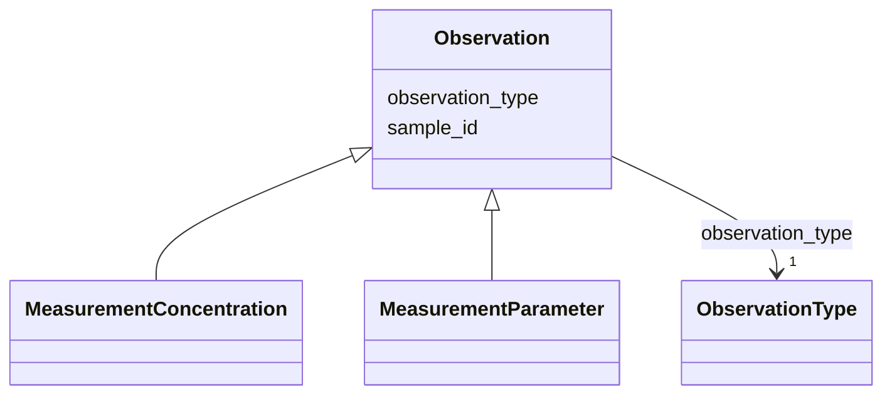

---
search:
  boost: 10.0
---

# Class: Observation 


_Observation - concentration measurement or other parameter_


<div data-search-exclude markdown="1">


* __NOTE__: this is an abstract class and should not be instantiated directly


URI: [cenvo:Observation](https://w3id.org/chemical-exposome/schema/chemicals-outdoor/Observation)





## Inheritance
* **Observation**
    * [MeasurementConcentration](MeasurementConcentration.md) [ [MeasurementBase](MeasurementBase.md)]
    * [MeasurementParameter](MeasurementParameter.md) [ [MeasurementBase](MeasurementBase.md)]


## Slots

| Name | Cardinality and Range | Description | Inheritance |
| ---  | --- | --- | --- |
| [sample_id](sample_id.md) | 1 <br/> [String](String.md) | Unique identifier for the sample | direct |
| [observation_type](observation_type.md) | 1 <br/> [ObservationType](ObservationType.md) | Type of measurement/observation: i) Chemical concentration in the environment... | direct |


## Identifier and Mapping Information


### Schema Source


* from schema: https://w3id.org/chemical-exposome/schema/chemicals-outdoor


## Mappings

| Mapping Type | Mapped Value |
| ---  | ---  |
| self | cenvo:Observation |
| native | cenvo:Observation |


## LinkML Source

<!-- TODO: investigate https://stackoverflow.com/questions/37606292/how-to-create-tabbed-code-blocks-in-mkdocs-or-sphinx -->

### Direct

<details>
```yaml
name: Observation
description: Observation - concentration measurement or other parameter
from_schema: https://w3id.org/chemical-exposome/schema/chemicals-outdoor
abstract: true
slots:
- sample_id
attributes:
  observation_type:
    name: observation_type
    description: 'Type of measurement/observation: i) Chemical concentration in the
      environment or biota - main observation and; ii) Other parameters - they give
      context to the  main measurement. '
    in_subset:
    - mandatory
    from_schema: https://w3id.org/chemical-exposome/schema/chemicals-outdoor
    rank: 1000
    designates_type: true
    domain_of:
    - Observation
    range: ObservationType
    required: true

```
</details>

### Induced

<details>
```yaml
name: Observation
description: Observation - concentration measurement or other parameter
from_schema: https://w3id.org/chemical-exposome/schema/chemicals-outdoor
abstract: true
attributes:
  observation_type:
    name: observation_type
    description: 'Type of measurement/observation: i) Chemical concentration in the
      environment or biota - main observation and; ii) Other parameters - they give
      context to the  main measurement. '
    in_subset:
    - mandatory
    from_schema: https://w3id.org/chemical-exposome/schema/chemicals-outdoor
    rank: 1000
    designates_type: true
    owner: Observation
    domain_of:
    - Observation
    range: ObservationType
    required: true
  sample_id:
    name: sample_id
    description: Unique identifier for the sample
    in_subset:
    - mandatory
    from_schema: https://w3id.org/chemical-exposome/schema/chemicals-outdoor
    rank: 1000
    owner: Observation
    domain_of:
    - Sample
    - Observation
    range: string
    required: true

```
</details></div>