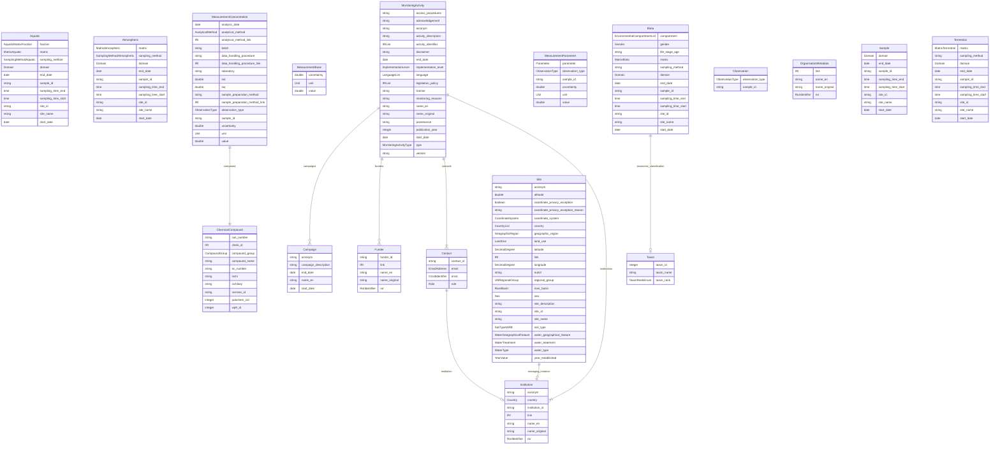

```mermaid
erDiagram
Aquatic {
    AquaticMatrixFraction fraction  
    MatrixAquatic matrix  
    SamplingMethodAquatic sampling_method  
    Domain domain  
    date end_date  
    string sample_id  
    time sampling_time_end  
    time sampling_time_start  
    string site_id  
    string site_name  
    date start_date  
}
Atmospheric {
    MatrixAtmospheric matrix  
    SamplingMethodAtmospheric sampling_method  
    Domain domain  
    date end_date  
    string sample_id  
    time sampling_time_end  
    time sampling_time_start  
    string site_id  
    string site_name  
    date start_date  
}
Biota {
    EnvironmentalCompartmentList compartment  
    Gender gender  
    string life_stage_age  
    MatrixBiota matrix  
    string sampling_method  
    Domain domain  
    date end_date  
    string sample_id  
    time sampling_time_end  
    time sampling_time_start  
    string site_id  
    string site_name  
    date start_date  
}
Campaign {
    string acronym  
    string campaign_description  
    date end_date  
    string name_en  
    date start_date  
}
ChemicalCompound {
    string cas_number  
    IRI chebi_id  
    CompoundGroup compound_group  
    string compound_name  
    string ec_number  
    string inchi  
    string inchikey  
    string norman_id  
    integer pubchem_cid  
    integer wp9_id  
}
Contact {
    string contact_id  
    EmailAddress email  
    OrcidIdentifier orcid  
    Role role  
}
Funder {
    string funder_id  
    IRI link  
    string name_en  
    string name_original  
    RorIdentifier ror  
}
Institution {
    string acronym  
    Country country  
    string institution_id  
    IRI link  
    string name_en  
    string name_original  
    RorIdentifier ror  
}
MeasurementBase {
    double uncertainty  
    Unit unit  
    double value  
}
MeasurementConcentration {
    date analysis_date  
    AnalyticalMethod analytical_method  
    IRI analytical_method_link  
    string batch  
    string data_handling_procedure  
    IRI data_handling_procedure_link  
    string laboratory  
    double lod  
    double loq  
    string sample_preparation_method  
    IRI sample_preparation_method_link  
    ObservationType observation_type  
    string sample_id  
    double uncertainty  
    Unit unit  
    double value  
}
MeasurementParameter {
    Parameter parameter  
    ObservationType observation_type  
    string sample_id  
    double uncertainty  
    Unit unit  
    double value  
}
MonitoringActivity {
    string access_procedures  
    string acknowledgement  
    string acronym  
    string activity_description  
    IRIList activity_identifier  
    string disclaimer  
    date end_date  
    ImplementationLevel implementation_level  
    LanguageList language  
    IRIList legislation_policy  
    string license  
    string monitoring_reasons  
    string name_en  
    string name_original  
    string provenance  
    integer publication_year  
    date start_date  
    MonitoringActivityType type  
    string version  
}
Observation {
    ObservationType observation_type  
    string sample_id  
}
OrganisationMetadata {
    IRI link  
    string name_en  
    string name_original  
    RorIdentifier ror  
}
Sample {
    Domain domain  
    date end_date  
    string sample_id  
    time sampling_time_end  
    time sampling_time_start  
    string site_id  
    string site_name  
    date start_date  
}
Site {
    string acronym  
    double altitude  
    boolean coordinate_privacy_exception  
    string coordinate_privacy_exception_reason  
    CoordinateSystem coordinate_system  
    CountryList country  
    GeographicRegion geographic_region  
    LandUse land_use  
    DecimalDegree latitude  
    IRI link  
    DecimalDegree longitude  
    string nuts3  
    UNRegionalGroup regional_group  
    RiverBasin river_basin  
    Sea sea  
    string site_description  
    string site_id  
    string site_name  
    SoilTypeWRB soil_type  
    WaterGeographicalFeature water_geographical_feature  
    WaterTreatment water_treatment  
    WaterType water_type  
    YearValue year_established  
}
Taxon {
    integer taxon_id  
    string taxon_name  
    TaxonRankEnum taxon_rank  
}
Terrestrial {
    MatrixTerrestrial matrix  
    string sampling_method  
    Domain domain  
    date end_date  
    string sample_id  
    time sampling_time_end  
    time sampling_time_start  
    string site_id  
    string site_name  
    date start_date  
}

Biota ||--|o Taxon : "taxonomic_classification"
Contact ||--|o Institution : "institution"
MeasurementConcentration ||--|| ChemicalCompound : "compound"
MonitoringActivity ||--}o Campaign : "campaigns"
MonitoringActivity ||--}o Funder : "funders"
MonitoringActivity ||--}| Contact : "contacts"
MonitoringActivity ||--}| Institution : "institutions"
Site ||--|o Institution : "managing_instance"

```

