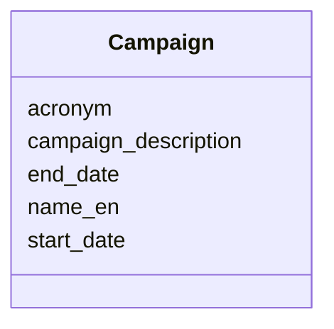
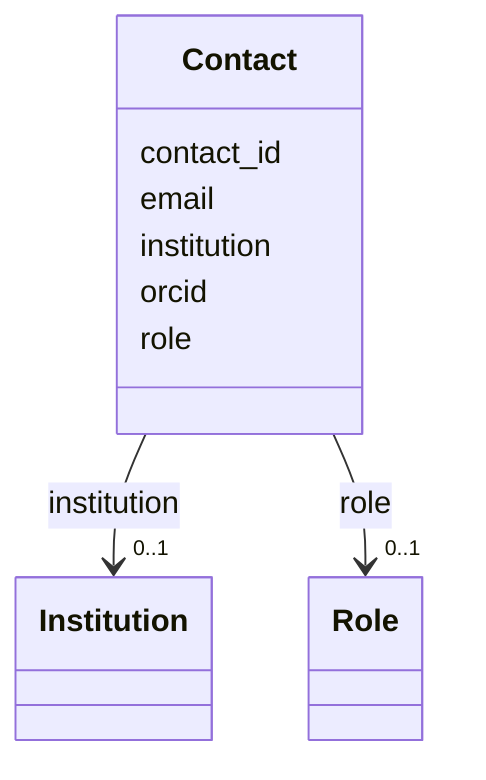
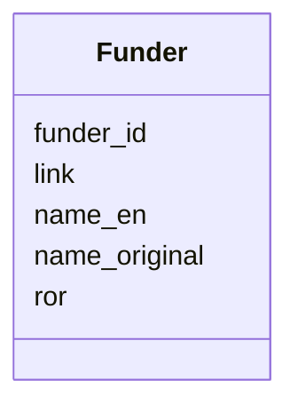
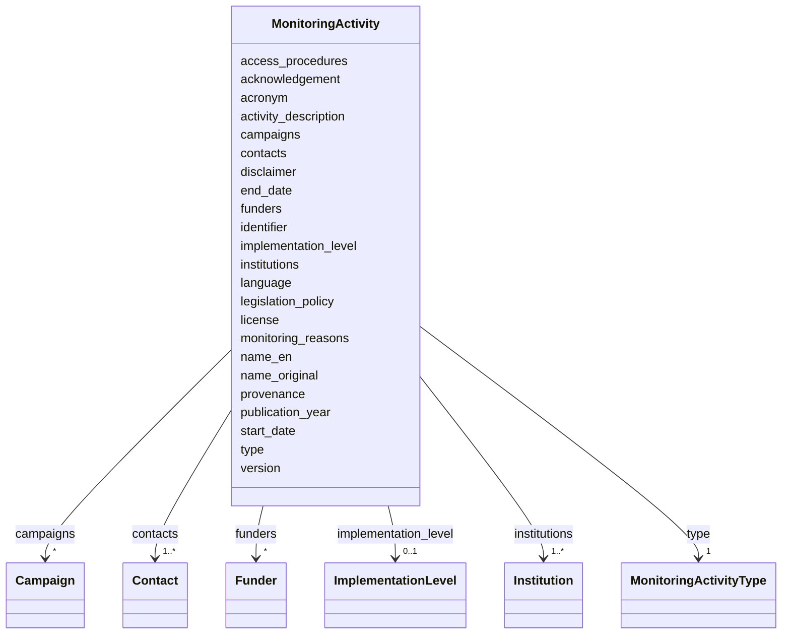

---
search:
  boost: 2.0
---


# Enum: AnalyticalMethod 


_Analytical method used to determine the analyte in the sample. NOTE: Placeholder only — final vocabulary pending._


<div data-search-exclude markdown="1">

URI: [cenvo:AnalyticalMethod](https://w3id.org/chemical-exposome/schema/chemicals-outdoor/AnalyticalMethod)

## Permissible Values
| Value | Meaning | Description |
| --- | --- | --- |
| PLACEHOLDER | None | Placeholder value — final vocabulary pending |


## Identifier and Mapping Information


### Schema Source


* from schema: https://w3id.org/chemical-exposome/schema/chemicals-outdoor


## LinkML Source

<details>
```yaml
name: AnalyticalMethod
description: 'Analytical method used to determine the analyte in the sample. NOTE:
  Placeholder only — final vocabulary pending.'
from_schema: https://w3id.org/chemical-exposome/schema/chemicals-outdoor
rank: 1000
permissible_values:
  PLACEHOLDER:
    text: PLACEHOLDER
    description: Placeholder value — final vocabulary pending. Do not use in production
      data.

```
</details>

</div>---
search:
  boost: 2.0
---


# Enum: AquaticMatrixFraction 


_TBC - might be integrated with the matrix vocabulary_


<div data-search-exclude markdown="1">

URI: [cenvo:AquaticMatrixFraction](https://w3id.org/chemical-exposome/schema/chemicals-outdoor/AquaticMatrixFraction)

## Permissible Values
| Value | Meaning | Description |
| --- | --- | --- |
| PLACEHOLDER | None | Placeholder — do not use in production |
| water_spm | None | Water - Suspended Particulate Matter |
| water_dom | None | Water - Dissolved Organic Matter |
| water_cfree | None | Water - Colloid-free |
| water_dom+cfree | None | water - Dissolved Organic Matter that is also colloid-free |
| water_colloidal_fraction | None | Water - Colloidal fraction |
| sediment_solid_phase | None | Sediment - Solid phase |
| sediment_pore_water | None | Sediment - pore water |
| sediment_colloidal_fraction | None | Sediment - Colloidal fraction |


## Identifier and Mapping Information


### Schema Source


* from schema: https://w3id.org/chemical-exposome/schema/chemicals-outdoor


## LinkML Source

<details>
```yaml
name: AquaticMatrixFraction
description: TBC - might be integrated with the matrix vocabulary
from_schema: https://w3id.org/chemical-exposome/schema/chemicals-outdoor
rank: 1000
permissible_values:
  PLACEHOLDER:
    text: PLACEHOLDER
    description: Placeholder — do not use in production.
  water_spm:
    text: water_spm
    description: Water - Suspended Particulate Matter
  water_dom:
    text: water_dom
    description: Water - Dissolved Organic Matter
  water_cfree:
    text: water_cfree
    description: Water - Colloid-free
  water_dom+cfree:
    text: water_dom+cfree
    description: water - Dissolved Organic Matter that is also colloid-free
  water_colloidal_fraction:
    text: water_colloidal_fraction
    description: Water - Colloidal fraction
  sediment_solid_phase:
    text: sediment_solid_phase
    description: Sediment - Solid phase
  sediment_pore_water:
    text: sediment_pore_water
    description: Sediment - pore water
  sediment_colloidal_fraction:
    text: sediment_colloidal_fraction
    description: Sediment - Colloidal fraction

```
</details>

</div>---
search:
  boost: 2.0
---


# Enum: BiotaCompartment 


_Environmental compartment where a biota organism was sampled_


<div data-search-exclude markdown="1">

URI: [cenvo:BiotaCompartment](https://w3id.org/chemical-exposome/schema/chemicals-outdoor/BiotaCompartment)

## Permissible Values
| Value | Meaning | Description |
| --- | --- | --- |
| aquatic | None |  |
| atmospheric | None |  |
| terrestrial | None |  |


## Identifier and Mapping Information


### Schema Source


* from schema: https://w3id.org/chemical-exposome/schema/chemicals-outdoor


## LinkML Source

<details>
```yaml
name: BiotaCompartment
description: Environmental compartment where a biota organism was sampled
from_schema: https://w3id.org/chemical-exposome/schema/chemicals-outdoor
rank: 1000
permissible_values:
  aquatic:
    text: aquatic
  atmospheric:
    text: atmospheric
  terrestrial:
    text: terrestrial

```
</details>

</div>---
search:
  boost: 1.0
---# Type: Boolean 


_A binary (true or false) value_


<div data-search-exclude markdown="1">

URI: [xsd:boolean](http://www.w3.org/2001/XMLSchema#boolean)

## Type Properties

| Property | Value |
| --- | --- |
| Base | `Bool` |
| Type URI | [xsd:boolean](http://www.w3.org/2001/XMLSchema#boolean) |
| Representation | `bool` |


## Notes

* If you are authoring schemas in LinkML YAML, the type is referenced with the lower case "boolean".


## Identifier and Mapping Information


### Schema Source


* from schema: https://w3id.org/chemical-exposome/schema/chemicals-outdoor


## Mappings

| Mapping Type | Mapped Value |
| ---  | ---  |
| self | xsd:boolean |
| native | cenvo:boolean |
| exact | schema:Boolean |


</div>---
search:
  boost: 10.0
---

# Class: Campaign 


_A time-bounded data collection period within a project or monitoring programme. Mandatory if the campaign exists._


<div data-search-exclude markdown="1">


URI: [cenvo:Campaign](https://w3id.org/chemical-exposome/schema/chemicals-outdoor/Campaign)





<!-- no inheritance hierarchy -->

## Slots

| Name | Cardinality and Range | Description | Inheritance |
| ---  | --- | --- | --- |
| [name_en](name_en.md) | 1 <br/> [String](String.md) | Name or designation in English | direct |
| [acronym](acronym.md) | 1 <br/> [String](String.md) | Short name or acronym | direct |
| [start_date](start_date.md) | 1 <br/> [Date](Date.md) | Start date in format YYYY-MM-DD | direct |
| [end_date](end_date.md) | 1 <br/> [Date](Date.md) | End date in format YYYY-MM-DD | direct |
| [campaign_description](campaign_description.md) | 0..1 <br/> [String](String.md) | Description of the campaign | direct |


## Usages

| used by | used in | type | used |
| ---  | --- | --- | --- |
| [MonitoringActivity](MonitoringActivity.md) | [campaigns](campaigns.md) | range | [Campaign](Campaign.md) |


## Identifier and Mapping Information


### Schema Source


* from schema: https://w3id.org/chemical-exposome/schema/chemicals-outdoor


## Mappings

| Mapping Type | Mapped Value |
| ---  | ---  |
| self | cenvo:Campaign |
| native | cenvo:Campaign |


## LinkML Source

<!-- TODO: investigate https://stackoverflow.com/questions/37606292/how-to-create-tabbed-code-blocks-in-mkdocs-or-sphinx -->

### Direct

<details>
```yaml
name: Campaign
description: A time-bounded data collection period within a project or monitoring
  programme. Mandatory if the campaign exists.
from_schema: https://w3id.org/chemical-exposome/schema/chemicals-outdoor
slots:
- name_en
- acronym
- start_date
- end_date
slot_usage:
  name_en:
    name: name_en
    in_subset:
    - mandatory_if
    required: true
  acronym:
    name: acronym
    in_subset:
    - mandatory_if
    required: true
  end_date:
    name: end_date
    in_subset:
    - mandatory_if
    required: true
attributes:
  campaign_description:
    name: campaign_description
    description: Description of the campaign
    from_schema: https://w3id.org/chemical-exposome/schema/chemicals-outdoor
    rank: 1000
    domain_of:
    - Campaign
    range: string

```
</details>

### Induced

<details>
```yaml
name: Campaign
description: A time-bounded data collection period within a project or monitoring
  programme. Mandatory if the campaign exists.
from_schema: https://w3id.org/chemical-exposome/schema/chemicals-outdoor
slot_usage:
  name_en:
    name: name_en
    in_subset:
    - mandatory_if
    required: true
  acronym:
    name: acronym
    in_subset:
    - mandatory_if
    required: true
  end_date:
    name: end_date
    in_subset:
    - mandatory_if
    required: true
attributes:
  campaign_description:
    name: campaign_description
    description: Description of the campaign
    from_schema: https://w3id.org/chemical-exposome/schema/chemicals-outdoor
    rank: 1000
    owner: Campaign
    domain_of:
    - Campaign
    range: string
  name_en:
    name: name_en
    description: Name or designation in English
    in_subset:
    - mandatory_if
    from_schema: https://w3id.org/chemical-exposome/schema/chemicals-outdoor
    rank: 1000
    owner: Campaign
    domain_of:
    - MonitoringActivity
    - Campaign
    - Institution
    - Funder
    range: string
    required: true
  acronym:
    name: acronym
    description: Short name or acronym.
    in_subset:
    - mandatory_if
    from_schema: https://w3id.org/chemical-exposome/schema/chemicals-outdoor
    rank: 1000
    owner: Campaign
    domain_of:
    - MonitoringActivity
    - Campaign
    - Institution
    range: string
    required: true
  start_date:
    name: start_date
    description: Start date in format YYYY-MM-DD
    in_subset:
    - mandatory
    from_schema: https://w3id.org/chemical-exposome/schema/chemicals-outdoor
    rank: 1000
    owner: Campaign
    domain_of:
    - MonitoringActivity
    - Campaign
    range: date
    required: true
  end_date:
    name: end_date
    description: End date in format YYYY-MM-DD
    in_subset:
    - mandatory_if
    from_schema: https://w3id.org/chemical-exposome/schema/chemicals-outdoor
    rank: 1000
    owner: Campaign
    domain_of:
    - MonitoringActivity
    - Campaign
    range: date
    required: true

```
</details></div>---
search:
  boost: 2.0
---


# Enum: ChemicalCompound 


_Placeholder — do not use in production. The full codelist is developed as a separate controlled vocabulary in PARC and will be adopted  after completion and publication._


<div data-search-exclude markdown="1">

URI: [cenvo:ChemicalCompound](https://w3id.org/chemical-exposome/schema/chemicals-outdoor/ChemicalCompound)

## Permissible Values
| Value | Meaning | Description |
| --- | --- | --- |
| PLACEHOLDER | None | Placeholder — do not use in production |


## Identifier and Mapping Information


### Schema Source


* from schema: https://w3id.org/chemical-exposome/schema/chemicals-outdoor


## LinkML Source

<details>
```yaml
name: ChemicalCompound
description: Placeholder — do not use in production. The full codelist is developed
  as a separate controlled vocabulary in PARC and will be adopted  after completion
  and publication.
from_schema: https://w3id.org/chemical-exposome/schema/chemicals-outdoor
rank: 1000
permissible_values:
  PLACEHOLDER:
    text: PLACEHOLDER
    description: Placeholder — do not use in production.

```
</details>

</div>---
search:
  boost: 2.0
---


# Enum: CompoundGroup 


_Chemical group classification as used in the PARC WP9 compound list. Groups are based on chemical structure and/or regulatory relevance._


<div data-search-exclude markdown="1">

URI: [cenvo:CompoundGroup](https://w3id.org/chemical-exposome/schema/chemicals-outdoor/CompoundGroup)

## Permissible Values
| Value | Meaning | Description |
| --- | --- | --- |
| PFAS | None | Per- and polyfluoroalkyl substances |
| PCBs | None | Polychlorinated biphenyls |
| PBDEs | None | Polybrominated diphenyl ethers |
| PAHs | None | Polycyclic aromatic hydrocarbons |
| OCPs | None | Organochlorine pesticides |
| biocides | None | Biocidal substances |
| pharmaceuticals | None | Pharmaceutical compounds and metabolites |
| hormones | None | Natural and synthetic hormones |
| heavy_metals | None | Heavy metals and metalloids |
| dioxins_furans | None | Dioxins and furans (PCDD/PCDF) |
| HBCDs | None | Hexabromocyclododecanes |
| PFRs | None | Phosphorus flame retardants |
| UV_filters | None | UV filters and stabilizers |
| plasticizers | None | Plasticizers including phthalates |
| siloxanes | None | Siloxanes and silicones |
| musks | None | Synthetic and natural musks |
| pesticides_other | None | Other pesticides not covered above |
| other | None | Other compounds not classified above |


## Identifier and Mapping Information


### Schema Source


* from schema: https://w3id.org/chemical-exposome/schema/chemicals-outdoor


## LinkML Source

<details>
```yaml
name: CompoundGroup
description: Chemical group classification as used in the PARC WP9 compound list.
  Groups are based on chemical structure and/or regulatory relevance.
from_schema: https://w3id.org/chemical-exposome/schema/chemicals-outdoor
rank: 1000
permissible_values:
  PFAS:
    text: PFAS
    description: Per- and polyfluoroalkyl substances
  PCBs:
    text: PCBs
    description: Polychlorinated biphenyls
  PBDEs:
    text: PBDEs
    description: Polybrominated diphenyl ethers
  PAHs:
    text: PAHs
    description: Polycyclic aromatic hydrocarbons
  OCPs:
    text: OCPs
    description: Organochlorine pesticides
  biocides:
    text: biocides
    description: Biocidal substances
  pharmaceuticals:
    text: pharmaceuticals
    description: Pharmaceutical compounds and metabolites
  hormones:
    text: hormones
    description: Natural and synthetic hormones
  heavy_metals:
    text: heavy_metals
    description: Heavy metals and metalloids
  dioxins_furans:
    text: dioxins_furans
    description: Dioxins and furans (PCDD/PCDF)
  HBCDs:
    text: HBCDs
    description: Hexabromocyclododecanes
  PFRs:
    text: PFRs
    description: Phosphorus flame retardants
  UV_filters:
    text: UV_filters
    description: UV filters and stabilizers
  plasticizers:
    text: plasticizers
    description: Plasticizers including phthalates
  siloxanes:
    text: siloxanes
    description: Siloxanes and silicones
  musks:
    text: musks
    description: Synthetic and natural musks
  pesticides_other:
    text: pesticides_other
    description: Other pesticides not covered above
  other:
    text: other
    description: Other compounds not classified above

```
</details>

</div>---
search:
  boost: 10.0
---

# Class: Contact 


_A contact person associated with the monitoring activity._


<div data-search-exclude markdown="1">


URI: [cenvo:Contact](https://w3id.org/chemical-exposome/schema/chemicals-outdoor/Contact)





<!-- no inheritance hierarchy -->

## Slots

| Name | Cardinality and Range | Description | Inheritance |
| ---  | --- | --- | --- |
| [email](email.md) | 1 <br/> [EmailAddress](EmailAddress.md) | Email address of the project contact point | direct |
| [orcid](orcid.md) | 0..1 <br/> [OrcidIdentifier](OrcidIdentifier.md) | ORCID identifier of the contact person | direct |
| [contact_id](contact_id.md) | 1 <br/> [String](String.md) | Unique contact ID | direct |
| [role](role.md) | 0..1 <br/> [Role](Role.md) | Role/function performed by the contact person | direct |
| [institution](institution.md) | 0..1 <br/> [Institution](Institution.md) | Contact's institution | direct |


## Usages

| used by | used in | type | used |
| ---  | --- | --- | --- |
| [MonitoringActivity](MonitoringActivity.md) | [contacts](contacts.md) | range | [Contact](Contact.md) |


## Identifier and Mapping Information


### Schema Source


* from schema: https://w3id.org/chemical-exposome/schema/chemicals-outdoor


## Mappings

| Mapping Type | Mapped Value |
| ---  | ---  |
| self | cenvo:Contact |
| native | cenvo:Contact |


## LinkML Source

<!-- TODO: investigate https://stackoverflow.com/questions/37606292/how-to-create-tabbed-code-blocks-in-mkdocs-or-sphinx -->

### Direct

<details>
```yaml
name: Contact
description: A contact person associated with the monitoring activity.
from_schema: https://w3id.org/chemical-exposome/schema/chemicals-outdoor
slots:
- email
- orcid
attributes:
  contact_id:
    name: contact_id
    description: Unique contact ID
    from_schema: https://w3id.org/chemical-exposome/schema/chemicals-outdoor
    rank: 1000
    identifier: true
    domain_of:
    - Contact
    range: string
    required: true
  role:
    name: role
    description: 'Role/function performed by the contact person. Source: ISO 19115:2003/19139
      and EC Regulation No 1205/2008 (INSPIRE).'
    from_schema: https://w3id.org/chemical-exposome/schema/chemicals-outdoor
    rank: 1000
    domain_of:
    - Contact
    range: Role
    required: false
  institution:
    name: institution
    description: Contact's institution
    from_schema: https://w3id.org/chemical-exposome/schema/chemicals-outdoor
    rank: 1000
    domain_of:
    - Contact
    range: Institution
    required: false

```
</details>

### Induced

<details>
```yaml
name: Contact
description: A contact person associated with the monitoring activity.
from_schema: https://w3id.org/chemical-exposome/schema/chemicals-outdoor
attributes:
  contact_id:
    name: contact_id
    description: Unique contact ID
    from_schema: https://w3id.org/chemical-exposome/schema/chemicals-outdoor
    rank: 1000
    identifier: true
    owner: Contact
    domain_of:
    - Contact
    range: string
    required: true
  role:
    name: role
    description: 'Role/function performed by the contact person. Source: ISO 19115:2003/19139
      and EC Regulation No 1205/2008 (INSPIRE).'
    from_schema: https://w3id.org/chemical-exposome/schema/chemicals-outdoor
    rank: 1000
    owner: Contact
    domain_of:
    - Contact
    range: Role
    required: false
  institution:
    name: institution
    description: Contact's institution
    from_schema: https://w3id.org/chemical-exposome/schema/chemicals-outdoor
    rank: 1000
    owner: Contact
    domain_of:
    - Contact
    range: Institution
    required: false
  email:
    name: email
    description: Email address of the project contact point. Institutional email is
      recommended.
    in_subset:
    - mandatory
    from_schema: https://w3id.org/chemical-exposome/schema/chemicals-outdoor
    rank: 1000
    owner: Contact
    domain_of:
    - Contact
    range: EmailAddress
    required: true
  orcid:
    name: orcid
    description: ORCID identifier of the contact person
    from_schema: https://w3id.org/chemical-exposome/schema/chemicals-outdoor
    rank: 1000
    owner: Contact
    domain_of:
    - Contact
    range: OrcidIdentifier

```
</details></div>---
search:
  boost: 2.0
---


# Enum: CoordinateSystem 


_Coordinate reference system used for geographic coordinates_


<div data-search-exclude markdown="1">

URI: [cenvo:CoordinateSystem](https://w3id.org/chemical-exposome/schema/chemicals-outdoor/CoordinateSystem)

## Permissible Values
| Value | Meaning | Description |
| --- | --- | --- |
| WGS84 | None | World Geodetic System 1984 |


## Identifier and Mapping Information


### Schema Source


* from schema: https://w3id.org/chemical-exposome/schema/chemicals-outdoor


## LinkML Source

<details>
```yaml
name: CoordinateSystem
description: Coordinate reference system used for geographic coordinates
from_schema: https://w3id.org/chemical-exposome/schema/chemicals-outdoor
rank: 1000
permissible_values:
  WGS84:
    text: WGS84
    description: World Geodetic System 1984. Global coordinate system widely used
      for GPS navigation.

```
</details>

</div>---
search:
  boost: 1.0
---# Type: Curie 


_a compact URI_


<div data-search-exclude markdown="1">

URI: [xsd:string](http://www.w3.org/2001/XMLSchema#string)

## Type Properties

| Property | Value |
| --- | --- |
| Base | `Curie` |
| Type URI | [xsd:string](http://www.w3.org/2001/XMLSchema#string) |
| Representation | `str` |


## Comments

* in RDF serializations this MUST be expanded to a URI
* in non-RDF serializations MAY be serialized as the compact representation

## Notes

* If you are authoring schemas in LinkML YAML, the type is referenced with the lower case "curie".


## Identifier and Mapping Information


### Schema Source


* from schema: https://w3id.org/chemical-exposome/schema/chemicals-outdoor


## Mappings

| Mapping Type | Mapped Value |
| ---  | ---  |
| self | xsd:string |
| native | cenvo:curie |


</div>---
search:
  boost: 1.0
---# Type: Date 


_a date (year, month and day) in an idealized calendar_


<div data-search-exclude markdown="1">

URI: [xsd:date](http://www.w3.org/2001/XMLSchema#date)

## Type Properties

| Property | Value |
| --- | --- |
| Base | `XSDDate` |
| Type URI | [xsd:date](http://www.w3.org/2001/XMLSchema#date) |
| Representation | `str` |


## Notes

* URI is dateTime because OWL reasoners don't work with straight date or time
* If you are authoring schemas in LinkML YAML, the type is referenced with the lower case "date".


## Identifier and Mapping Information


### Schema Source


* from schema: https://w3id.org/chemical-exposome/schema/chemicals-outdoor


## Mappings

| Mapping Type | Mapped Value |
| ---  | ---  |
| self | xsd:date |
| native | cenvo:date |
| exact | schema:Date |


</div>---
search:
  boost: 1.0
---# Type: DateOrDatetime 


_Either a date or a datetime_


<div data-search-exclude markdown="1">

URI: [linkml:DateOrDatetime](https://w3id.org/linkml/DateOrDatetime)

## Type Properties

| Property | Value |
| --- | --- |
| Base | `str` |
| Type URI | [linkml:DateOrDatetime](https://w3id.org/linkml/DateOrDatetime) |
| Representation | `str` |


## Notes

* If you are authoring schemas in LinkML YAML, the type is referenced with the lower case "date_or_datetime".


## Identifier and Mapping Information


### Schema Source


* from schema: https://w3id.org/chemical-exposome/schema/chemicals-outdoor


## Mappings

| Mapping Type | Mapped Value |
| ---  | ---  |
| self | linkml:DateOrDatetime |
| native | cenvo:date_or_datetime |


</div>---
search:
  boost: 1.0
---# Type: Datetime 


_The combination of a date and time_


<div data-search-exclude markdown="1">

URI: [xsd:dateTime](http://www.w3.org/2001/XMLSchema#dateTime)

## Type Properties

| Property | Value |
| --- | --- |
| Base | `XSDDateTime` |
| Type URI | [xsd:dateTime](http://www.w3.org/2001/XMLSchema#dateTime) |
| Representation | `str` |


## Notes

* If you are authoring schemas in LinkML YAML, the type is referenced with the lower case "datetime".


## Identifier and Mapping Information


### Schema Source


* from schema: https://w3id.org/chemical-exposome/schema/chemicals-outdoor


## Mappings

| Mapping Type | Mapped Value |
| ---  | ---  |
| self | xsd:dateTime |
| native | cenvo:datetime |
| exact | schema:DateTime |


</div>---
search:
  boost: 1.0
---# Type: Decimal 


_A real number with arbitrary precision that conforms to the xsd:decimal specification_


<div data-search-exclude markdown="1">

URI: [xsd:decimal](http://www.w3.org/2001/XMLSchema#decimal)

## Type Properties

| Property | Value |
| --- | --- |
| Base | `Decimal` |
| Type URI | [xsd:decimal](http://www.w3.org/2001/XMLSchema#decimal) |


## Notes

* If you are authoring schemas in LinkML YAML, the type is referenced with the lower case "decimal".


## Identifier and Mapping Information


### Schema Source


* from schema: https://w3id.org/chemical-exposome/schema/chemicals-outdoor


## Mappings

| Mapping Type | Mapped Value |
| ---  | ---  |
| self | xsd:decimal |
| native | cenvo:decimal |
| broad | schema:Number |


</div>---
search:
  boost: 1.0
---# Type: DecimalDegree 


_A decimal degree coordinate value_


<div data-search-exclude markdown="1">

URI: [xsd:decimal](http://www.w3.org/2001/XMLSchema#decimal)

## Type Properties

| Property | Value |
| --- | --- |
| Base | `double` |
| Type URI | [xsd:decimal](http://www.w3.org/2001/XMLSchema#decimal) |


## Identifier and Mapping Information


### Schema Source


* from schema: https://w3id.org/chemical-exposome/schema/chemicals-outdoor


## Mappings

| Mapping Type | Mapped Value |
| ---  | ---  |
| self | xsd:decimal |
| native | cenvo:DecimalDegree |


</div>---
search:
  boost: 1.0
---# Type: Double 


_A real number that conforms to the xsd:double specification_


<div data-search-exclude markdown="1">

URI: [xsd:double](http://www.w3.org/2001/XMLSchema#double)

## Type Properties

| Property | Value |
| --- | --- |
| Base | `float` |
| Type URI | [xsd:double](http://www.w3.org/2001/XMLSchema#double) |


## Notes

* If you are authoring schemas in LinkML YAML, the type is referenced with the lower case "double".


## Identifier and Mapping Information


### Schema Source


* from schema: https://w3id.org/chemical-exposome/schema/chemicals-outdoor


## Mappings

| Mapping Type | Mapped Value |
| ---  | ---  |
| self | xsd:double |
| native | cenvo:double |
| close | schema:Float |


</div>---
search:
  boost: 1.0
---# Type: EmailAddress 


_A valid email address_


<div data-search-exclude markdown="1">

URI: [xsd:string](http://www.w3.org/2001/XMLSchema#string)

## Type Properties

| Property | Value |
| --- | --- |
| Base | `str` |
| Type URI | [xsd:string](http://www.w3.org/2001/XMLSchema#string) |
## Value Constraints

| Property | Value |
| --- | --- |
| Regex Pattern | `^[\w.+-]+@[\w-]+\.[\w.]+$` |


## Identifier and Mapping Information


### Schema Source


* from schema: https://w3id.org/chemical-exposome/schema/chemicals-outdoor


## Mappings

| Mapping Type | Mapped Value |
| ---  | ---  |
| self | xsd:string |
| native | cenvo:EmailAddress |


</div>---
search:
  boost: 1.0
---# Type: Float 


_A real number that conforms to the xsd:float specification_


<div data-search-exclude markdown="1">

URI: [xsd:float](http://www.w3.org/2001/XMLSchema#float)

## Type Properties

| Property | Value |
| --- | --- |
| Base | `float` |
| Type URI | [xsd:float](http://www.w3.org/2001/XMLSchema#float) |


## Notes

* If you are authoring schemas in LinkML YAML, the type is referenced with the lower case "float".


## Identifier and Mapping Information


### Schema Source


* from schema: https://w3id.org/chemical-exposome/schema/chemicals-outdoor


## Mappings

| Mapping Type | Mapped Value |
| ---  | ---  |
| self | xsd:float |
| native | cenvo:float |
| exact | schema:Float |


</div>---
search:
  boost: 10.0
---

# Class: Funder 


_A funding entity supporting the monitoring activity._


<div data-search-exclude markdown="1">


URI: [cenvo:Funder](https://w3id.org/chemical-exposome/schema/chemicals-outdoor/Funder)





<!-- no inheritance hierarchy -->

## Slots

| Name | Cardinality and Range | Description | Inheritance |
| ---  | --- | --- | --- |
| [ror](ror.md) | 0..1 <br/> [RorIdentifier](RorIdentifier.md) | ROR identifier of the institution (format ror | direct |
| [name_en](name_en.md) | 1 <br/> [String](String.md) | Name or designation in English | direct |
| [name_original](name_original.md) | 1 <br/> [String](String.md) | Name of the entity in the original language of the  institution/site/project | direct |
| [link](link.md) | 0..1 <br/> [IRI](IRI.md) | URL with information about the institution | direct |
| [funder_id](funder_id.md) | 1 <br/> [String](String.md) | Unique funder ID | direct |


## Usages

| used by | used in | type | used |
| ---  | --- | --- | --- |
| [MonitoringActivity](MonitoringActivity.md) | [funders](funders.md) | range | [Funder](Funder.md) |


## Identifier and Mapping Information


### Schema Source


* from schema: https://w3id.org/chemical-exposome/schema/chemicals-outdoor


## Mappings

| Mapping Type | Mapped Value |
| ---  | ---  |
| self | cenvo:Funder |
| native | cenvo:Funder |


## LinkML Source

<!-- TODO: investigate https://stackoverflow.com/questions/37606292/how-to-create-tabbed-code-blocks-in-mkdocs-or-sphinx -->

### Direct

<details>
```yaml
name: Funder
description: A funding entity supporting the monitoring activity.
from_schema: https://w3id.org/chemical-exposome/schema/chemicals-outdoor
slots:
- ror
- name_en
- name_original
- link
attributes:
  funder_id:
    name: funder_id
    description: Unique funder ID
    from_schema: https://w3id.org/chemical-exposome/schema/chemicals-outdoor
    rank: 1000
    identifier: true
    domain_of:
    - Funder
    range: string
    required: true

```
</details>

### Induced

<details>
```yaml
name: Funder
description: A funding entity supporting the monitoring activity.
from_schema: https://w3id.org/chemical-exposome/schema/chemicals-outdoor
attributes:
  funder_id:
    name: funder_id
    description: Unique funder ID
    from_schema: https://w3id.org/chemical-exposome/schema/chemicals-outdoor
    rank: 1000
    identifier: true
    owner: Funder
    domain_of:
    - Funder
    range: string
    required: true
  ror:
    name: ror
    description: ROR identifier of the institution (format ror.org/xxxxxxxx)
    from_schema: https://w3id.org/chemical-exposome/schema/chemicals-outdoor
    rank: 1000
    owner: Funder
    domain_of:
    - Institution
    - Funder
    range: RorIdentifier
  name_en:
    name: name_en
    description: Name or designation in English
    in_subset:
    - mandatory_if
    from_schema: https://w3id.org/chemical-exposome/schema/chemicals-outdoor
    rank: 1000
    owner: Funder
    domain_of:
    - MonitoringActivity
    - Campaign
    - Institution
    - Funder
    range: string
    required: true
  name_original:
    name: name_original
    description: Name of the entity in the original language of the  institution/site/project.
      Use the local official name.
    in_subset:
    - mandatory
    from_schema: https://w3id.org/chemical-exposome/schema/chemicals-outdoor
    rank: 1000
    owner: Funder
    domain_of:
    - MonitoringActivity
    - Institution
    - Funder
    range: string
    required: true
  link:
    name: link
    description: URL with information about the institution
    from_schema: https://w3id.org/chemical-exposome/schema/chemicals-outdoor
    rank: 1000
    owner: Funder
    domain_of:
    - Institution
    - Funder
    range: IRI

```
</details></div>---
search:
  boost: 2.0
---


# Enum: Gender 


_Biological sex of a sampled organism_


<div data-search-exclude markdown="1">

URI: [cenvo:Gender](https://w3id.org/chemical-exposome/schema/chemicals-outdoor/Gender)

## Permissible Values
| Value | Meaning | Description |
| --- | --- | --- |
| male | None |  |
| female | None |  |
| hermaphrodite | None |  |
| not_specified | None |  |
| not_relevant | None |  |


## Identifier and Mapping Information


### Schema Source


* from schema: https://w3id.org/chemical-exposome/schema/chemicals-outdoor


## LinkML Source

<details>
```yaml
name: Gender
description: Biological sex of a sampled organism
from_schema: https://w3id.org/chemical-exposome/schema/chemicals-outdoor
rank: 1000
permissible_values:
  male:
    text: male
  female:
    text: female
  hermaphrodite:
    text: hermaphrodite
  not_specified:
    text: not_specified
  not_relevant:
    text: not_relevant

```
</details>

</div>---
search:
  boost: 2.0
---


# Enum: GeographicRegion 


_UN M49 geographic region. Source: https://unstats.un.org/unsd/methodology/m49/_


<div data-search-exclude markdown="1">

URI: [cenvo:GeographicRegion](https://w3id.org/chemical-exposome/schema/chemicals-outdoor/GeographicRegion)

## Permissible Values
| Value | Meaning | Description |
| --- | --- | --- |
| Africa | None |  |
| Americas | None |  |
| Asia | None |  |
| Europe | None |  |
| Oceania | None |  |


## See Also

* [https://unstats.un.org/unsd/methodology/m49/](https://unstats.un.org/unsd/methodology/m49/)


## Identifier and Mapping Information


### Schema Source


* from schema: https://w3id.org/chemical-exposome/schema/chemicals-outdoor


## LinkML Source

<details>
```yaml
name: GeographicRegion
description: 'UN M49 geographic region. Source: https://unstats.un.org/unsd/methodology/m49/'
from_schema: https://w3id.org/chemical-exposome/schema/chemicals-outdoor
see_also:
- https://unstats.un.org/unsd/methodology/m49/
rank: 1000
permissible_values:
  Africa:
    text: Africa
  Americas:
    text: Americas
  Asia:
    text: Asia
  Europe:
    text: Europe
  Oceania:
    text: Oceania

```
</details>

</div>---
search:
  boost: 1.0
---# Type: IRI 


_An Internationalized Resource Identifier (IRI). All URIs are valid IRIs, so both URI and IRI values are accepted._


<div data-search-exclude markdown="1">

URI: [xsd:anyURI](http://www.w3.org/2001/XMLSchema#anyURI)

## Type Properties

| Property | Value |
| --- | --- |
| Base | `str` |
| Type URI | [xsd:anyURI](http://www.w3.org/2001/XMLSchema#anyURI) |


## Identifier and Mapping Information


### Schema Source


* from schema: https://w3id.org/chemical-exposome/schema/chemicals-outdoor


## Mappings

| Mapping Type | Mapped Value |
| ---  | ---  |
| self | xsd:anyURI |
| native | cenvo:IRI |


</div>---
search:
  boost: 2.0
---


# Enum: ImplementationLevel 


_The geographic scale of the monitoring coverage  (e.g. international, national, regional, or local)._


<div data-search-exclude markdown="1">

URI: [cenvo:ImplementationLevel](https://w3id.org/chemical-exposome/schema/chemicals-outdoor/ImplementationLevel)

## Permissible Values
| Value | Meaning | Description |
| --- | --- | --- |
| international | None |  |
| national | None |  |
| regional | None |  |
| local | None |  |


## Slots

| Name | Description |
| ---  | --- |
| [implementation_level](implementation_level.md) | The geographic scale of the monitoring coverage (international, national, reg... |


## Identifier and Mapping Information


### Schema Source


* from schema: https://w3id.org/chemical-exposome/schema/chemicals-outdoor


## LinkML Source

<details>
```yaml
name: ImplementationLevel
description: The geographic scale of the monitoring coverage  (e.g. international,
  national, regional, or local).
from_schema: https://w3id.org/chemical-exposome/schema/chemicals-outdoor
rank: 1000
permissible_values:
  international:
    text: international
  national:
    text: national
  regional:
    text: regional
  local:
    text: local

```
</details>

</div>---
search:
  boost: 5.0
---

# Slot: institution 


_Contact's institution_


<div data-search-exclude markdown="1">


URI: [cenvo:institution](https://w3id.org/chemical-exposome/schema/chemicals-outdoor/institution)
<!-- no inheritance hierarchy -->


## Applicable Classes

| Name | Description | Modifies Slot |
| --- | --- | --- |
| [Contact](Contact.md) | A contact person associated with the monitoring activity |  no  |


## Properties

### Type and Range

| Property | Value |
| --- | --- |
| Range | [Institution](Institution.md) |
| Domain Of | [Contact](Contact.md) |

### Cardinality and Requirements

| Property | Value |
| --- | --- |
### Slot Characteristics

| Property | Value |
| --- | --- |
| Owner | [Contact](Contact.md) |


## Identifier and Mapping Information


### Schema Source


* from schema: https://w3id.org/chemical-exposome/schema/chemicals-outdoor


## Mappings

| Mapping Type | Mapped Value |
| ---  | ---  |
| self | cenvo:institution |
| native | cenvo:institution |


## LinkML Source

<details>
```yaml
name: institution
description: Contact's institution
from_schema: https://w3id.org/chemical-exposome/schema/chemicals-outdoor
rank: 1000
owner: Contact
domain_of:
- Contact
range: Institution
required: false

```
</details></div>---
search:
  boost: 1.0
---# Type: Integer 


_An integer_


<div data-search-exclude markdown="1">

URI: [xsd:integer](http://www.w3.org/2001/XMLSchema#integer)

## Type Properties

| Property | Value |
| --- | --- |
| Base | `int` |
| Type URI | [xsd:integer](http://www.w3.org/2001/XMLSchema#integer) |


## Notes

* If you are authoring schemas in LinkML YAML, the type is referenced with the lower case "integer".


## Identifier and Mapping Information


### Schema Source


* from schema: https://w3id.org/chemical-exposome/schema/chemicals-outdoor


## Mappings

| Mapping Type | Mapped Value |
| ---  | ---  |
| self | xsd:integer |
| native | cenvo:integer |
| exact | schema:Integer |


</div>---
search:
  boost: 1.0
---# Type: Jsonpath 


_A string encoding a JSON Path. The value of the string MUST conform to JSON Point syntax and SHOULD dereference to zero or more valid objects within the current instance document when encoded in tree form._


<div data-search-exclude markdown="1">

URI: [xsd:string](http://www.w3.org/2001/XMLSchema#string)

## Type Properties

| Property | Value |
| --- | --- |
| Base | `str` |
| Type URI | [xsd:string](http://www.w3.org/2001/XMLSchema#string) |
| Representation | `str` |


## Notes

* If you are authoring schemas in LinkML YAML, the type is referenced with the lower case "jsonpath".


## Identifier and Mapping Information


### Schema Source


* from schema: https://w3id.org/chemical-exposome/schema/chemicals-outdoor


## Mappings

| Mapping Type | Mapped Value |
| ---  | ---  |
| self | xsd:string |
| native | cenvo:jsonpath |


</div>---
search:
  boost: 1.0
---# Type: Jsonpointer 


_A string encoding a JSON Pointer. The value of the string MUST conform to JSON Point syntax and SHOULD dereference to a valid object within the current instance document when encoded in tree form._


<div data-search-exclude markdown="1">

URI: [xsd:string](http://www.w3.org/2001/XMLSchema#string)

## Type Properties

| Property | Value |
| --- | --- |
| Base | `str` |
| Type URI | [xsd:string](http://www.w3.org/2001/XMLSchema#string) |
| Representation | `str` |


## Notes

* If you are authoring schemas in LinkML YAML, the type is referenced with the lower case "jsonpointer".


## Identifier and Mapping Information


### Schema Source


* from schema: https://w3id.org/chemical-exposome/schema/chemicals-outdoor


## Mappings

| Mapping Type | Mapped Value |
| ---  | ---  |
| self | xsd:string |
| native | cenvo:jsonpointer |


</div>---
search:
  boost: 2.0
---


# Enum: LandUse 


_CORINE Land Cover (CLC) land use classification. Coordination of Information on the Environment Land Cover inventory, coordinated by the European Environment Agency (EEA)._


<div data-search-exclude markdown="1">

URI: [cenvo:LandUse](https://w3id.org/chemical-exposome/schema/chemicals-outdoor/LandUse)

## Permissible Values
| Value | Meaning | Description |
| --- | --- | --- |
| continuous_urban_fabric | http://www.w3.org/2015/03/corine#clc111 | Continuous urban fabric (CLC 111) |
| discontinuous_urban_fabric | http://www.w3.org/2015/03/corine#clc112 | Discontinuous urban fabric (CLC 112) |
| industrial_or_commercial_units | http://www.w3.org/2015/03/corine#clc121 | Industrial or commercial units (CLC 121) |
| road_and_rail_networks | http://www.w3.org/2015/03/corine#clc122 | Road and rail networks and associated land (CLC 122) |
| port_areas | http://www.w3.org/2015/03/corine#clc123 | Port areas (CLC 123) |
| airports | http://www.w3.org/2015/03/corine#clc124 | Airports (CLC 124) |
| mineral_extraction_sites | http://www.w3.org/2015/03/corine#clc131 | Mineral extraction sites (CLC 131) |
| dump_sites | http://www.w3.org/2015/03/corine#clc132 | Dump sites (CLC 132) |
| construction_sites | http://www.w3.org/2015/03/corine#clc133 | Construction sites (CLC 133) |
| green_urban_areas | http://www.w3.org/2015/03/corine#clc141 | Green urban areas (CLC 141) |
| sport_and_leisure_facilities | http://www.w3.org/2015/03/corine#clc142 | Sport and leisure facilities (CLC 142) |
| non_irrigated_arable_land | http://www.w3.org/2015/03/corine#clc211 | Non-irrigated arable land (CLC 211) |
| permanently_irrigated_land | http://www.w3.org/2015/03/corine#clc212 | Permanently irrigated land (CLC 212) |
| fruit_trees_and_berry_plantations | http://www.w3.org/2015/03/corine#clc222 | Fruit trees and berry plantations (CLC 222) |
| olive_groves | http://www.w3.org/2015/03/corine#clc223 | Olive groves (CLC 223) |
| pastures | http://www.w3.org/2015/03/corine#clc231 | Pastures (CLC 231) |
| annual_crops_associated_with_permanent_crops | http://www.w3.org/2015/03/corine#clc241 | Annual crops associated with permanent crops (CLC 241) |
| complex_cultivation_patterns | http://www.w3.org/2015/03/corine#clc242 | Complex cultivation patterns (CLC 242) |
| land_principally_occupied_by_agriculture | http://www.w3.org/2015/03/corine#clc243 | Land principally occupied by agriculture, with significant areas of natural v... |
| agro_forestry_areas | http://www.w3.org/2015/03/corine#clc244 | Agro-forestry areas (CLC 244) |
| broad_leaved_forest | http://www.w3.org/2015/03/corine#clc311 | Broad-leaved forest (CLC 311) |
| coniferous_forest | http://www.w3.org/2015/03/corine#clc312 | Coniferous forest (CLC 312) |
| mixed_forest | http://www.w3.org/2015/03/corine#clc313 | Mixed forest (CLC 313) |
| natural_grasslands | http://www.w3.org/2015/03/corine#clc321 | Natural grasslands (CLC 321) |
| moors_and_heathland | http://www.w3.org/2015/03/corine#clc322 | Moors and heathland (CLC 322) |
| sclerophyllous_vegetation | http://www.w3.org/2015/03/corine#clc323 | Sclerophyllous vegetation (CLC 323) |
| transitional_woodland_shrub | http://www.w3.org/2015/03/corine#clc324 | Transitional woodland-shrub (CLC 324) |
| beaches_dunes_sands | http://www.w3.org/2015/03/corine#clc331 | Beaches, dunes, sands (CLC 331) |
| bare_rocks | http://www.w3.org/2015/03/corine#clc332 | Bare rocks (CLC 332) |
| sparsely_vegetated_areas | http://www.w3.org/2015/03/corine#clc333 | Sparsely vegetated areas (CLC 333) |
| burnt_areas | http://www.w3.org/2015/03/corine#clc334 | Burnt areas (CLC 334) |
| glaciers_and_perpetual_snow | http://www.w3.org/2015/03/corine#clc335 | Glaciers and perpetual snow (CLC 335) |
| inland_marshes | http://www.w3.org/2015/03/corine#clc411 | Inland marshes (CLC 411) |
| peat_bogs | http://www.w3.org/2015/03/corine#clc412 | Peat bogs (CLC 412) |
| salt_marshes | http://www.w3.org/2015/03/corine#clc421 | Salt marshes (CLC 421) |
| salines | http://www.w3.org/2015/03/corine#clc422 | Salines (CLC 422) |
| intertidal_flats | http://www.w3.org/2015/03/corine#clc423 | Intertidal flats (CLC 423) |
| water_courses | http://www.w3.org/2015/03/corine#clc511 | Water courses (CLC 511) |
| water_bodies | http://www.w3.org/2015/03/corine#clc512 | Water bodies (CLC 512) |
| coastal_lagoons | http://www.w3.org/2015/03/corine#clc521 | Coastal lagoons (CLC 521) |
| estuaries | http://www.w3.org/2015/03/corine#clc522 | Estuaries (CLC 522) |
| sea_and_ocean | http://www.w3.org/2015/03/corine#clc523 | Sea and ocean (CLC 523) |
| unclassified_land_surface | None | Unclassified land surface (CLC 990) |
| unclassified_water_bodies | None | Unclassified water bodies (CLC 995) |
| no_data | None | No data (CLC 999) |


## See Also

* [https://www.w3.org/2015/03/corine](https://www.w3.org/2015/03/corine)
* [https://land.copernicus.eu/pan-european/corine-land-cover](https://land.copernicus.eu/pan-european/corine-land-cover)


## Identifier and Mapping Information


### Schema Source


* from schema: https://w3id.org/chemical-exposome/schema/chemicals-outdoor


## LinkML Source

<details>
```yaml
name: LandUse
description: CORINE Land Cover (CLC) land use classification. Coordination of Information
  on the Environment Land Cover inventory, coordinated by the European Environment
  Agency (EEA).
from_schema: https://w3id.org/chemical-exposome/schema/chemicals-outdoor
see_also:
- https://www.w3.org/2015/03/corine
- https://land.copernicus.eu/pan-european/corine-land-cover
rank: 1000
permissible_values:
  continuous_urban_fabric:
    text: continuous_urban_fabric
    description: Continuous urban fabric (CLC 111)
    meaning: http://www.w3.org/2015/03/corine#clc111
  discontinuous_urban_fabric:
    text: discontinuous_urban_fabric
    description: Discontinuous urban fabric (CLC 112)
    meaning: http://www.w3.org/2015/03/corine#clc112
  industrial_or_commercial_units:
    text: industrial_or_commercial_units
    description: Industrial or commercial units (CLC 121)
    meaning: http://www.w3.org/2015/03/corine#clc121
  road_and_rail_networks:
    text: road_and_rail_networks
    description: Road and rail networks and associated land (CLC 122)
    meaning: http://www.w3.org/2015/03/corine#clc122
  port_areas:
    text: port_areas
    description: Port areas (CLC 123)
    meaning: http://www.w3.org/2015/03/corine#clc123
  airports:
    text: airports
    description: Airports (CLC 124)
    meaning: http://www.w3.org/2015/03/corine#clc124
  mineral_extraction_sites:
    text: mineral_extraction_sites
    description: Mineral extraction sites (CLC 131)
    meaning: http://www.w3.org/2015/03/corine#clc131
  dump_sites:
    text: dump_sites
    description: Dump sites (CLC 132)
    meaning: http://www.w3.org/2015/03/corine#clc132
  construction_sites:
    text: construction_sites
    description: Construction sites (CLC 133)
    meaning: http://www.w3.org/2015/03/corine#clc133
  green_urban_areas:
    text: green_urban_areas
    description: Green urban areas (CLC 141)
    meaning: http://www.w3.org/2015/03/corine#clc141
  sport_and_leisure_facilities:
    text: sport_and_leisure_facilities
    description: Sport and leisure facilities (CLC 142)
    meaning: http://www.w3.org/2015/03/corine#clc142
  non_irrigated_arable_land:
    text: non_irrigated_arable_land
    description: Non-irrigated arable land (CLC 211)
    meaning: http://www.w3.org/2015/03/corine#clc211
  permanently_irrigated_land:
    text: permanently_irrigated_land
    description: Permanently irrigated land (CLC 212)
    meaning: http://www.w3.org/2015/03/corine#clc212
  fruit_trees_and_berry_plantations:
    text: fruit_trees_and_berry_plantations
    description: Fruit trees and berry plantations (CLC 222)
    meaning: http://www.w3.org/2015/03/corine#clc222
  olive_groves:
    text: olive_groves
    description: Olive groves (CLC 223)
    meaning: http://www.w3.org/2015/03/corine#clc223
  pastures:
    text: pastures
    description: Pastures (CLC 231)
    meaning: http://www.w3.org/2015/03/corine#clc231
  annual_crops_associated_with_permanent_crops:
    text: annual_crops_associated_with_permanent_crops
    description: Annual crops associated with permanent crops (CLC 241)
    meaning: http://www.w3.org/2015/03/corine#clc241
  complex_cultivation_patterns:
    text: complex_cultivation_patterns
    description: Complex cultivation patterns (CLC 242)
    meaning: http://www.w3.org/2015/03/corine#clc242
  land_principally_occupied_by_agriculture:
    text: land_principally_occupied_by_agriculture
    description: Land principally occupied by agriculture, with significant areas
      of natural vegetation (CLC 243)
    meaning: http://www.w3.org/2015/03/corine#clc243
  agro_forestry_areas:
    text: agro_forestry_areas
    description: Agro-forestry areas (CLC 244)
    meaning: http://www.w3.org/2015/03/corine#clc244
  broad_leaved_forest:
    text: broad_leaved_forest
    description: Broad-leaved forest (CLC 311)
    meaning: http://www.w3.org/2015/03/corine#clc311
  coniferous_forest:
    text: coniferous_forest
    description: Coniferous forest (CLC 312)
    meaning: http://www.w3.org/2015/03/corine#clc312
  mixed_forest:
    text: mixed_forest
    description: Mixed forest (CLC 313)
    meaning: http://www.w3.org/2015/03/corine#clc313
  natural_grasslands:
    text: natural_grasslands
    description: Natural grasslands (CLC 321)
    meaning: http://www.w3.org/2015/03/corine#clc321
  moors_and_heathland:
    text: moors_and_heathland
    description: Moors and heathland (CLC 322)
    meaning: http://www.w3.org/2015/03/corine#clc322
  sclerophyllous_vegetation:
    text: sclerophyllous_vegetation
    description: Sclerophyllous vegetation (CLC 323)
    meaning: http://www.w3.org/2015/03/corine#clc323
  transitional_woodland_shrub:
    text: transitional_woodland_shrub
    description: Transitional woodland-shrub (CLC 324)
    meaning: http://www.w3.org/2015/03/corine#clc324
  beaches_dunes_sands:
    text: beaches_dunes_sands
    description: Beaches, dunes, sands (CLC 331)
    meaning: http://www.w3.org/2015/03/corine#clc331
  bare_rocks:
    text: bare_rocks
    description: Bare rocks (CLC 332)
    meaning: http://www.w3.org/2015/03/corine#clc332
  sparsely_vegetated_areas:
    text: sparsely_vegetated_areas
    description: Sparsely vegetated areas (CLC 333)
    meaning: http://www.w3.org/2015/03/corine#clc333
  burnt_areas:
    text: burnt_areas
    description: Burnt areas (CLC 334)
    meaning: http://www.w3.org/2015/03/corine#clc334
  glaciers_and_perpetual_snow:
    text: glaciers_and_perpetual_snow
    description: Glaciers and perpetual snow (CLC 335)
    meaning: http://www.w3.org/2015/03/corine#clc335
  inland_marshes:
    text: inland_marshes
    description: Inland marshes (CLC 411)
    meaning: http://www.w3.org/2015/03/corine#clc411
  peat_bogs:
    text: peat_bogs
    description: Peat bogs (CLC 412)
    meaning: http://www.w3.org/2015/03/corine#clc412
  salt_marshes:
    text: salt_marshes
    description: Salt marshes (CLC 421)
    meaning: http://www.w3.org/2015/03/corine#clc421
  salines:
    text: salines
    description: Salines (CLC 422)
    meaning: http://www.w3.org/2015/03/corine#clc422
  intertidal_flats:
    text: intertidal_flats
    description: Intertidal flats (CLC 423)
    meaning: http://www.w3.org/2015/03/corine#clc423
  water_courses:
    text: water_courses
    description: Water courses (CLC 511)
    meaning: http://www.w3.org/2015/03/corine#clc511
  water_bodies:
    text: water_bodies
    description: Water bodies (CLC 512)
    meaning: http://www.w3.org/2015/03/corine#clc512
  coastal_lagoons:
    text: coastal_lagoons
    description: Coastal lagoons (CLC 521)
    meaning: http://www.w3.org/2015/03/corine#clc521
  estuaries:
    text: estuaries
    description: Estuaries (CLC 522)
    meaning: http://www.w3.org/2015/03/corine#clc522
  sea_and_ocean:
    text: sea_and_ocean
    description: Sea and ocean (CLC 523)
    meaning: http://www.w3.org/2015/03/corine#clc523
  unclassified_land_surface:
    text: unclassified_land_surface
    description: Unclassified land surface (CLC 990)
  unclassified_water_bodies:
    text: unclassified_water_bodies
    description: Unclassified water bodies (CLC 995)
  no_data:
    text: no_data
    description: No data (CLC 999)

```
</details>

</div>---
search:
  boost: 1.0
---


# Subset: Mandatory 


_Fields that are required for all record types._


<div data-search-exclude markdown="1">

URI: [Mandatory](Mandatory.md)


## Identifier and Mapping Information


### Schema Source


* from schema: https://w3id.org/chemical-exposome/schema/chemicals-outdoor


        

        


        


        

        


        


        


        


        


        


        

        


        


## Slots in subset

| Slot | Description |
| --- | --- |
| [access_procedures](access_procedures.md) | Information on procedure to obtain access to the dataset |
| [acknowledgement](acknowledgement.md) | Text for acknowledgement which should be reported when using/re-using the dat... |
| [activity_description](activity_description.md) | A brief summary with the most important details summarising the project (obje... |
| [contacts](contacts.md) | Contact person(s) for the monitoring activity |
| [country](country.md) | Country where the site, institution or project is located, according to ISO 3... |
| [email](email.md) | Email address of the project contact point |
| [institutions](institutions.md) | Institution(s) responsible for implementing the monitoring activity |
| [license](license.md) | License or terms for data reuse |
| [name_original](name_original.md) | Name of the entity in the original language of the  institution/site/project |
| [sample_id](sample_id.md) | Unique identifier for the sample |
| [start_date](start_date.md) | Start date in format YYYY-MM-DD |
| [type](type.md) | Type of monitoring activity |
| [unit](unit.md) | Unit of measurement |


</div>---
search:
  boost: 1.0
---


# Subset: MandatoryIf 


_Fields that are required conditionally - see class rules for details_


<div data-search-exclude markdown="1">

URI: [MandatoryIf](MandatoryIf.md)


## Identifier and Mapping Information


### Schema Source


* from schema: https://w3id.org/chemical-exposome/schema/chemicals-outdoor


        


        


        

        


## Slots in subset

| Slot | Description |
| --- | --- |
| [acronym](acronym.md) | Short name or acronym |
| [legislation_policy](legislation_policy.md) | Link(s) to policy, convention, or legislation underpinning the monitoring act... |
| [monitoring_reasons](monitoring_reasons.md) | Primary reasons for performing monitoring (e |
| [name_en](name_en.md) | Name or designation in English |


</div>---
search:
  boost: 2.0
---


# Enum: Matrix 


_Placeholder — do not use in production. The full codelist is developed as a separate controlled vocabulary in PARC and will be adopted  after completion and publication._


<div data-search-exclude markdown="1">

URI: [cenvo:Matrix](https://w3id.org/chemical-exposome/schema/chemicals-outdoor/Matrix)

## Permissible Values
| Value | Meaning | Description |
| --- | --- | --- |
| PLACEHOLDER | None | Placeholder — do not use in production |


## Identifier and Mapping Information


### Schema Source


* from schema: https://w3id.org/chemical-exposome/schema/chemicals-outdoor


## LinkML Source

<details>
```yaml
name: Matrix
description: Placeholder — do not use in production. The full codelist is developed
  as a separate controlled vocabulary in PARC and will be adopted  after completion
  and publication.
from_schema: https://w3id.org/chemical-exposome/schema/chemicals-outdoor
rank: 1000
permissible_values:
  PLACEHOLDER:
    text: PLACEHOLDER
    description: Placeholder — do not use in production.

```
</details>

</div>---
search:
  boost: 10.0
---

# Class: MonitoringActivity 


_A research project or monitoring programme collecting environmental data on chemicals in the outdoor environment (air, water, sediment, soil, biota)_


<div data-search-exclude markdown="1">


URI: [cenvo:MonitoringActivity](https://w3id.org/chemical-exposome/schema/chemicals-outdoor/MonitoringActivity)





<!-- no inheritance hierarchy -->

## Slots

| Name | Cardinality and Range | Description | Inheritance |
| ---  | --- | --- | --- |
| [name_en](name_en.md) | 1 <br/> [String](String.md) | Name or designation in English | direct |
| [name_original](name_original.md) | 1 <br/> [String](String.md) | Name of the entity in the original language of the  institution/site/project | direct |
| [acronym](acronym.md) | 0..1 <br/> [String](String.md) | Short name or acronym | direct |
| [type](type.md) | 1 <br/> [MonitoringActivityType](MonitoringActivityType.md) | Type of monitoring activity | direct |
| [activity_description](activity_description.md) | 1 <br/> [String](String.md) | A brief summary with the most important details summarising the project (obje... | direct |
| [identifier](identifier.md) | * <br/> [IRI](IRI.md) | Project/monitoring programme identifier provided as URL (GUPRI) | direct |
| [monitoring_reasons](monitoring_reasons.md) | 0..1 <br/> [String](String.md) | Primary reasons for performing monitoring (e | direct |
| [legislation_policy](legislation_policy.md) | * <br/> [IRI](IRI.md) | Link(s) to policy, convention, or legislation underpinning the monitoring act... | direct |
| [implementation_level](implementation_level.md) | 0..1 <br/> [ImplementationLevel](ImplementationLevel.md) | The geographic scale of the monitoring coverage (international, national, reg... | direct |
| [language](language.md) | * <br/> [String](String.md) | Language(s) used, as 2-letter codes according to ISO 639-1 | direct |
| [start_date](start_date.md) | 1 <br/> [Date](Date.md) | The beginning (or previewed starting) date of the monitoring programme/projec... | direct |
| [end_date](end_date.md) | 0..1 <br/> [Date](Date.md) | End date of the project/monitoring programme | direct |
| [campaigns](campaigns.md) | * <br/> [Campaign](Campaign.md) | If an Environmental Monitoring Programme/Project has a long-term perspective ... | direct |
| [institutions](institutions.md) | 1..* <br/> [Institution](Institution.md) | Institution(s) responsible for implementing the monitoring activity | direct |
| [contacts](contacts.md) | 1..* <br/> [Contact](Contact.md) | Contact person(s) for the monitoring activity | direct |
| [funders](funders.md) | * <br/> [Funder](Funder.md) | Funding entity/entities supporting the monitoring activity | direct |
| [access_procedures](access_procedures.md) | 1 <br/> [String](String.md) | Information on procedure to obtain access to the dataset | direct |
| [acknowledgement](acknowledgement.md) | 1 <br/> [String](String.md) | Text for acknowledgement which should be reported when using/re-using the dat... | direct |
| [license](license.md) | 1 <br/> [String](String.md) | License or terms for data reuse | direct |
| [disclaimer](disclaimer.md) | 0..1 <br/> [String](String.md) | Text for disclaimer when using/re-using the data | direct |
| [version](version.md) | 0..1 <br/> [String](String.md) | Version of the dataset | direct |
| [publication_year](publication_year.md) | 0..1 <br/> [Integer](Integer.md) | Year when the dataset was or will be made publicly available | direct |
| [provenance](provenance.md) | 0..1 <br/> [String](String.md) | A statement about the lineage of the dataset | direct |


## Rules


### monitoring_reasons_required_for_monitoring_programme

| Rule Applied | Preconditions | Postconditions | Elseconditions |
|--------------|---------------|----------------|----------------|
| slot_conditions |```{'type': {'equals_string': 'monitoring_programme'}}``` |```{'monitoring_reasons': {'required': True}}``` | |


### legislation_policy_required_for_monitoring_programme

| Rule Applied | Preconditions | Postconditions | Elseconditions |
|--------------|---------------|----------------|----------------|
| slot_conditions |```{'type': {'equals_string': 'monitoring_programme'}}``` |```{'legislation_policy': {'required': True, 'minimum_cardinality': 1}}``` | |


## Identifier and Mapping Information


### Schema Source


* from schema: https://w3id.org/chemical-exposome/schema/chemicals-outdoor


## Mappings

| Mapping Type | Mapped Value |
| ---  | ---  |
| self | cenvo:MonitoringActivity |
| native | cenvo:MonitoringActivity |


## LinkML Source

<!-- TODO: investigate https://stackoverflow.com/questions/37606292/how-to-create-tabbed-code-blocks-in-mkdocs-or-sphinx -->

### Direct

<details>
```yaml
name: MonitoringActivity
description: A research project or monitoring programme collecting environmental data
  on chemicals in the outdoor environment (air, water, sediment, soil, biota)
from_schema: https://w3id.org/chemical-exposome/schema/chemicals-outdoor
slots:
- name_en
- name_original
- acronym
attributes:
  type:
    name: type
    description: Type of monitoring activity
    in_subset:
    - mandatory
    from_schema: https://w3id.org/chemical-exposome/schema/chemicals-outdoor
    rank: 1000
    domain_of:
    - MonitoringActivity
    range: MonitoringActivityType
    required: true
  activity_description:
    name: activity_description
    description: A brief summary with the most important details summarising the project
      (objectives, scope, target group, key aspects, design, methods).
    in_subset:
    - mandatory
    from_schema: https://w3id.org/chemical-exposome/schema/chemicals-outdoor
    rank: 1000
    domain_of:
    - MonitoringActivity
    range: string
    required: true
  identifier:
    name: identifier
    description: Project/monitoring programme identifier provided as URL (GUPRI).
      At least one identifier required.
    from_schema: https://w3id.org/chemical-exposome/schema/chemicals-outdoor
    rank: 1000
    domain_of:
    - MonitoringActivity
    range: IRI
    multivalued: true
  monitoring_reasons:
    name: monitoring_reasons
    description: Primary reasons for performing monitoring (e.g. regulatory requirements).
      Mandatory for monitoring programmes; optional for projects if relevant.
    in_subset:
    - mandatory_if
    from_schema: https://w3id.org/chemical-exposome/schema/chemicals-outdoor
    rank: 1000
    domain_of:
    - MonitoringActivity
    range: string
  legislation_policy:
    name: legislation_policy
    description: 'Link(s) to policy, convention, or legislation underpinning the monitoring
      activity. Mandatory for monitoring programmes; optional for projects if relevant. '
    in_subset:
    - mandatory_if
    from_schema: https://w3id.org/chemical-exposome/schema/chemicals-outdoor
    rank: 1000
    domain_of:
    - MonitoringActivity
    range: IRI
    multivalued: true
  implementation_level:
    name: implementation_level
    description: The geographic scale of the monitoring coverage (international, national,
      regional, or local).
    from_schema: https://w3id.org/chemical-exposome/schema/chemicals-outdoor
    rank: 1000
    domain_of:
    - MonitoringActivity
    range: ImplementationLevel
  language:
    name: language
    description: Language(s) used, as 2-letter codes according to ISO 639-1.
    from_schema: https://w3id.org/chemical-exposome/schema/chemicals-outdoor
    rank: 1000
    domain_of:
    - MonitoringActivity
    range: string
    multivalued: true
  start_date:
    name: start_date
    description: The beginning (or previewed starting) date of the monitoring programme/project.
    in_subset:
    - mandatory
    from_schema: https://w3id.org/chemical-exposome/schema/chemicals-outdoor
    domain_of:
    - MonitoringActivity
    - Campaign
    range: date
    required: true
  end_date:
    name: end_date
    description: End date of the project/monitoring programme.
    from_schema: https://w3id.org/chemical-exposome/schema/chemicals-outdoor
    domain_of:
    - MonitoringActivity
    - Campaign
    range: date
    required: false
  campaigns:
    name: campaigns
    description: If an Environmental Monitoring Programme/Project has a long-term
      perspective of at least  a few years, it may be necessary to input data at suitable
      time intervals. For this time period,  is used the term "Campaign". A Campaign
      is defined by its start and end, and it is recommended  to name it within the
      project using a consistent style.
    from_schema: https://w3id.org/chemical-exposome/schema/chemicals-outdoor
    rank: 1000
    domain_of:
    - MonitoringActivity
    range: Campaign
    multivalued: true
    inlined_as_list: true
  institutions:
    name: institutions
    description: Institution(s) responsible for implementing the monitoring activity.
    in_subset:
    - mandatory
    from_schema: https://w3id.org/chemical-exposome/schema/chemicals-outdoor
    rank: 1000
    domain_of:
    - MonitoringActivity
    range: Institution
    required: true
    multivalued: true
    inlined_as_list: true
    minimum_cardinality: 1
  contacts:
    name: contacts
    description: Contact person(s) for the monitoring activity.
    in_subset:
    - mandatory
    from_schema: https://w3id.org/chemical-exposome/schema/chemicals-outdoor
    rank: 1000
    domain_of:
    - MonitoringActivity
    range: Contact
    required: true
    multivalued: true
    inlined_as_list: true
    minimum_cardinality: 1
  funders:
    name: funders
    description: Funding entity/entities supporting the monitoring activity.
    from_schema: https://w3id.org/chemical-exposome/schema/chemicals-outdoor
    rank: 1000
    domain_of:
    - MonitoringActivity
    range: Funder
    required: false
    multivalued: true
    inlined_as_list: true
  access_procedures:
    name: access_procedures
    description: Information on procedure to obtain access to the dataset.
    in_subset:
    - mandatory
    from_schema: https://w3id.org/chemical-exposome/schema/chemicals-outdoor
    rank: 1000
    domain_of:
    - MonitoringActivity
    range: string
    required: true
  acknowledgement:
    name: acknowledgement
    description: Text for acknowledgement which should be reported when using/re-using
      the data.
    in_subset:
    - mandatory
    from_schema: https://w3id.org/chemical-exposome/schema/chemicals-outdoor
    rank: 1000
    domain_of:
    - MonitoringActivity
    range: string
    required: true
  license:
    name: license
    description: License or terms for data reuse.
    in_subset:
    - mandatory
    from_schema: https://w3id.org/chemical-exposome/schema/chemicals-outdoor
    rank: 1000
    domain_of:
    - MonitoringActivity
    range: string
    required: true
  disclaimer:
    name: disclaimer
    description: Text for disclaimer when using/re-using the data.
    from_schema: https://w3id.org/chemical-exposome/schema/chemicals-outdoor
    rank: 1000
    domain_of:
    - MonitoringActivity
    range: string
  version:
    name: version
    description: Version of the dataset.
    from_schema: https://w3id.org/chemical-exposome/schema/chemicals-outdoor
    rank: 1000
    domain_of:
    - MonitoringActivity
    range: string
    required: false
  publication_year:
    name: publication_year
    description: Year when the dataset was or will be made publicly available.
    from_schema: https://w3id.org/chemical-exposome/schema/chemicals-outdoor
    rank: 1000
    domain_of:
    - MonitoringActivity
    range: integer
    required: false
  provenance:
    name: provenance
    description: A statement about the lineage of the dataset.
    from_schema: https://w3id.org/chemical-exposome/schema/chemicals-outdoor
    rank: 1000
    domain_of:
    - MonitoringActivity
    range: string
    required: false
rules:
- preconditions:
    slot_conditions:
      type:
        name: type
        equals_string: monitoring_programme
  postconditions:
    slot_conditions:
      monitoring_reasons:
        name: monitoring_reasons
        required: true
  description: Monitoring reasons are mandatory when the monitoring activity type
    is a monitoring programme, as it is driven by legislative requirements that must
    be explicitly documented.
  title: monitoring_reasons_required_for_monitoring_programme
- preconditions:
    slot_conditions:
      type:
        name: type
        equals_string: monitoring_programme
  postconditions:
    slot_conditions:
      legislation_policy:
        name: legislation_policy
        required: true
        minimum_cardinality: 1
  description: At least one link to legislation or policy is mandatory when the activity
    type is a monitoring programme.
  title: legislation_policy_required_for_monitoring_programme

```
</details>

### Induced

<details>
```yaml
name: MonitoringActivity
description: A research project or monitoring programme collecting environmental data
  on chemicals in the outdoor environment (air, water, sediment, soil, biota)
from_schema: https://w3id.org/chemical-exposome/schema/chemicals-outdoor
attributes:
  type:
    name: type
    description: Type of monitoring activity
    in_subset:
    - mandatory
    from_schema: https://w3id.org/chemical-exposome/schema/chemicals-outdoor
    rank: 1000
    owner: MonitoringActivity
    domain_of:
    - MonitoringActivity
    range: MonitoringActivityType
    required: true
  activity_description:
    name: activity_description
    description: A brief summary with the most important details summarising the project
      (objectives, scope, target group, key aspects, design, methods).
    in_subset:
    - mandatory
    from_schema: https://w3id.org/chemical-exposome/schema/chemicals-outdoor
    rank: 1000
    owner: MonitoringActivity
    domain_of:
    - MonitoringActivity
    range: string
    required: true
  identifier:
    name: identifier
    description: Project/monitoring programme identifier provided as URL (GUPRI).
      At least one identifier required.
    from_schema: https://w3id.org/chemical-exposome/schema/chemicals-outdoor
    rank: 1000
    owner: MonitoringActivity
    domain_of:
    - MonitoringActivity
    range: IRI
    multivalued: true
  monitoring_reasons:
    name: monitoring_reasons
    description: Primary reasons for performing monitoring (e.g. regulatory requirements).
      Mandatory for monitoring programmes; optional for projects if relevant.
    in_subset:
    - mandatory_if
    from_schema: https://w3id.org/chemical-exposome/schema/chemicals-outdoor
    rank: 1000
    owner: MonitoringActivity
    domain_of:
    - MonitoringActivity
    range: string
  legislation_policy:
    name: legislation_policy
    description: 'Link(s) to policy, convention, or legislation underpinning the monitoring
      activity. Mandatory for monitoring programmes; optional for projects if relevant. '
    in_subset:
    - mandatory_if
    from_schema: https://w3id.org/chemical-exposome/schema/chemicals-outdoor
    rank: 1000
    owner: MonitoringActivity
    domain_of:
    - MonitoringActivity
    range: IRI
    multivalued: true
  implementation_level:
    name: implementation_level
    description: The geographic scale of the monitoring coverage (international, national,
      regional, or local).
    from_schema: https://w3id.org/chemical-exposome/schema/chemicals-outdoor
    rank: 1000
    owner: MonitoringActivity
    domain_of:
    - MonitoringActivity
    range: ImplementationLevel
  language:
    name: language
    description: Language(s) used, as 2-letter codes according to ISO 639-1.
    from_schema: https://w3id.org/chemical-exposome/schema/chemicals-outdoor
    rank: 1000
    owner: MonitoringActivity
    domain_of:
    - MonitoringActivity
    range: string
    multivalued: true
  start_date:
    name: start_date
    description: The beginning (or previewed starting) date of the monitoring programme/project.
    in_subset:
    - mandatory
    from_schema: https://w3id.org/chemical-exposome/schema/chemicals-outdoor
    owner: MonitoringActivity
    domain_of:
    - MonitoringActivity
    - Campaign
    range: date
    required: true
  end_date:
    name: end_date
    description: End date of the project/monitoring programme.
    from_schema: https://w3id.org/chemical-exposome/schema/chemicals-outdoor
    owner: MonitoringActivity
    domain_of:
    - MonitoringActivity
    - Campaign
    range: date
    required: false
  campaigns:
    name: campaigns
    description: If an Environmental Monitoring Programme/Project has a long-term
      perspective of at least  a few years, it may be necessary to input data at suitable
      time intervals. For this time period,  is used the term "Campaign". A Campaign
      is defined by its start and end, and it is recommended  to name it within the
      project using a consistent style.
    from_schema: https://w3id.org/chemical-exposome/schema/chemicals-outdoor
    rank: 1000
    owner: MonitoringActivity
    domain_of:
    - MonitoringActivity
    range: Campaign
    multivalued: true
    inlined: true
    inlined_as_list: true
  institutions:
    name: institutions
    description: Institution(s) responsible for implementing the monitoring activity.
    in_subset:
    - mandatory
    from_schema: https://w3id.org/chemical-exposome/schema/chemicals-outdoor
    rank: 1000
    owner: MonitoringActivity
    domain_of:
    - MonitoringActivity
    range: Institution
    required: true
    multivalued: true
    inlined: true
    inlined_as_list: true
    minimum_cardinality: 1
  contacts:
    name: contacts
    description: Contact person(s) for the monitoring activity.
    in_subset:
    - mandatory
    from_schema: https://w3id.org/chemical-exposome/schema/chemicals-outdoor
    rank: 1000
    owner: MonitoringActivity
    domain_of:
    - MonitoringActivity
    range: Contact
    required: true
    multivalued: true
    inlined: true
    inlined_as_list: true
    minimum_cardinality: 1
  funders:
    name: funders
    description: Funding entity/entities supporting the monitoring activity.
    from_schema: https://w3id.org/chemical-exposome/schema/chemicals-outdoor
    rank: 1000
    owner: MonitoringActivity
    domain_of:
    - MonitoringActivity
    range: Funder
    required: false
    multivalued: true
    inlined: true
    inlined_as_list: true
  access_procedures:
    name: access_procedures
    description: Information on procedure to obtain access to the dataset.
    in_subset:
    - mandatory
    from_schema: https://w3id.org/chemical-exposome/schema/chemicals-outdoor
    rank: 1000
    owner: MonitoringActivity
    domain_of:
    - MonitoringActivity
    range: string
    required: true
  acknowledgement:
    name: acknowledgement
    description: Text for acknowledgement which should be reported when using/re-using
      the data.
    in_subset:
    - mandatory
    from_schema: https://w3id.org/chemical-exposome/schema/chemicals-outdoor
    rank: 1000
    owner: MonitoringActivity
    domain_of:
    - MonitoringActivity
    range: string
    required: true
  license:
    name: license
    description: License or terms for data reuse.
    in_subset:
    - mandatory
    from_schema: https://w3id.org/chemical-exposome/schema/chemicals-outdoor
    rank: 1000
    owner: MonitoringActivity
    domain_of:
    - MonitoringActivity
    range: string
    required: true
  disclaimer:
    name: disclaimer
    description: Text for disclaimer when using/re-using the data.
    from_schema: https://w3id.org/chemical-exposome/schema/chemicals-outdoor
    rank: 1000
    owner: MonitoringActivity
    domain_of:
    - MonitoringActivity
    range: string
  version:
    name: version
    description: Version of the dataset.
    from_schema: https://w3id.org/chemical-exposome/schema/chemicals-outdoor
    rank: 1000
    owner: MonitoringActivity
    domain_of:
    - MonitoringActivity
    range: string
    required: false
  publication_year:
    name: publication_year
    description: Year when the dataset was or will be made publicly available.
    from_schema: https://w3id.org/chemical-exposome/schema/chemicals-outdoor
    rank: 1000
    owner: MonitoringActivity
    domain_of:
    - MonitoringActivity
    range: integer
    required: false
  provenance:
    name: provenance
    description: A statement about the lineage of the dataset.
    from_schema: https://w3id.org/chemical-exposome/schema/chemicals-outdoor
    rank: 1000
    owner: MonitoringActivity
    domain_of:
    - MonitoringActivity
    range: string
    required: false
  name_en:
    name: name_en
    description: Name or designation in English
    in_subset:
    - mandatory_if
    from_schema: https://w3id.org/chemical-exposome/schema/chemicals-outdoor
    rank: 1000
    owner: MonitoringActivity
    domain_of:
    - MonitoringActivity
    - Campaign
    - Institution
    - Funder
    range: string
    required: true
  name_original:
    name: name_original
    description: Name of the entity in the original language of the  institution/site/project.
      Use the local official name.
    in_subset:
    - mandatory
    from_schema: https://w3id.org/chemical-exposome/schema/chemicals-outdoor
    rank: 1000
    owner: MonitoringActivity
    domain_of:
    - MonitoringActivity
    - Institution
    - Funder
    range: string
    required: true
  acronym:
    name: acronym
    description: Short name or acronym.
    in_subset:
    - mandatory_if
    from_schema: https://w3id.org/chemical-exposome/schema/chemicals-outdoor
    rank: 1000
    owner: MonitoringActivity
    domain_of:
    - MonitoringActivity
    - Campaign
    - Institution
    range: string
rules:
- preconditions:
    slot_conditions:
      type:
        name: type
        equals_string: monitoring_programme
  postconditions:
    slot_conditions:
      monitoring_reasons:
        name: monitoring_reasons
        required: true
  description: Monitoring reasons are mandatory when the monitoring activity type
    is a monitoring programme, as it is driven by legislative requirements that must
    be explicitly documented.
  title: monitoring_reasons_required_for_monitoring_programme
- preconditions:
    slot_conditions:
      type:
        name: type
        equals_string: monitoring_programme
  postconditions:
    slot_conditions:
      legislation_policy:
        name: legislation_policy
        required: true
        minimum_cardinality: 1
  description: At least one link to legislation or policy is mandatory when the activity
    type is a monitoring programme.
  title: legislation_policy_required_for_monitoring_programme

```
</details></div>---
search:
  boost: 2.0
---


# Enum: MonitoringActivityType 


_Type of monitoring activity_


<div data-search-exclude markdown="1">

URI: [cenvo:MonitoringActivityType](https://w3id.org/chemical-exposome/schema/chemicals-outdoor/MonitoringActivityType)

## Permissible Values
| Value | Meaning | Description |
| --- | --- | --- |
| scientific_project | None | Usually a time-limited initiative focused on the collection,  analysis, and i... |
| monitoring_programme | None | A systematic and long-term observation of specific parameters,  organized bas... |


## Slots

| Name | Description |
| ---  | --- |
| [type](type.md) | Type of monitoring activity |


## Identifier and Mapping Information


### Schema Source


* from schema: https://w3id.org/chemical-exposome/schema/chemicals-outdoor


## LinkML Source

<details>
```yaml
name: MonitoringActivityType
description: Type of monitoring activity
from_schema: https://w3id.org/chemical-exposome/schema/chemicals-outdoor
rank: 1000
permissible_values:
  scientific_project:
    text: scientific_project
    description: Usually a time-limited initiative focused on the collection,  analysis,
      and interpretation of data to answer specific scientific  questions in the field
      of environmental studies. These projects are  led by scientists and aim at advancing
      knowledge, verifying hypotheses,  or testing new methodologies. Data collected
      in research projects  are driven by the pursuit of scientific understanding
      rather than  by legislative requirements.
  monitoring_programme:
    text: monitoring_programme
    description: A systematic and long-term observation of specific parameters,  organized
      based on legislative requirements. The purpose  of a monitoring programme is
      to collect data necessary for assessing  the state or trends of the environment
      and to ensure compliance with  regulatory standards. Its primary motivation
      is fulfilling obligations  set by laws, directives, or international agreements.

```
</details>

</div>---
search:
  boost: 2.0
---


# Enum: NUTS3 


_NUTS3 region code. Placeholder — do not use in production. The full codelist is for now handled via a string attribute with pattern validation. Might be defined as enum(?)_


<div data-search-exclude markdown="1">

URI: [cenvo:NUTS3](https://w3id.org/chemical-exposome/schema/chemicals-outdoor/NUTS3)

## Permissible Values
| Value | Meaning | Description |
| --- | --- | --- |
| PLACEHOLDER | None | Placeholder — do not use in production |


## Identifier and Mapping Information


### Schema Source


* from schema: https://w3id.org/chemical-exposome/schema/chemicals-outdoor


## LinkML Source

<details>
```yaml
name: NUTS3
description: NUTS3 region code. Placeholder — do not use in production. The full codelist
  is for now handled via a string attribute with pattern validation. Might be defined
  as enum(?)
from_schema: https://w3id.org/chemical-exposome/schema/chemicals-outdoor
rank: 1000
permissible_values:
  PLACEHOLDER:
    text: PLACEHOLDER
    description: Placeholder — do not use in production.

```
</details>

</div>---
search:
  boost: 1.0
---# Type: Ncname 


_Prefix part of CURIE_


<div data-search-exclude markdown="1">

URI: [xsd:string](http://www.w3.org/2001/XMLSchema#string)

## Type Properties

| Property | Value |
| --- | --- |
| Base | `NCName` |
| Type URI | [xsd:string](http://www.w3.org/2001/XMLSchema#string) |
| Representation | `str` |


## Notes

* If you are authoring schemas in LinkML YAML, the type is referenced with the lower case "ncname".


## Identifier and Mapping Information


### Schema Source


* from schema: https://w3id.org/chemical-exposome/schema/chemicals-outdoor


## Mappings

| Mapping Type | Mapped Value |
| ---  | ---  |
| self | xsd:string |
| native | cenvo:ncname |


</div>---
search:
  boost: 1.0
---# Type: Nodeidentifier 


_A URI, CURIE or BNODE that represents a node in a model._


<div data-search-exclude markdown="1">

URI: [shex:nonLiteral](http://www.w3.org/ns/shex#nonLiteral)

## Type Properties

| Property | Value |
| --- | --- |
| Base | `NodeIdentifier` |
| Type URI | [shex:nonLiteral](http://www.w3.org/ns/shex#nonLiteral) |
| Representation | `str` |


## Notes

* If you are authoring schemas in LinkML YAML, the type is referenced with the lower case "nodeidentifier".


## Identifier and Mapping Information


### Schema Source


* from schema: https://w3id.org/chemical-exposome/schema/chemicals-outdoor


## Mappings

| Mapping Type | Mapped Value |
| ---  | ---  |
| self | shex:nonLiteral |
| native | cenvo:nodeidentifier |


</div>---
search:
  boost: 1.0
---# Type: Objectidentifier 


_A URI or CURIE that represents an object in the model._


<div data-search-exclude markdown="1">

URI: [shex:iri](http://www.w3.org/ns/shex#iri)

## Type Properties

| Property | Value |
| --- | --- |
| Base | `ElementIdentifier` |
| Type URI | [shex:iri](http://www.w3.org/ns/shex#iri) |
| Representation | `str` |


## Comments

* Used for inheritance and type checking

## Notes

* If you are authoring schemas in LinkML YAML, the type is referenced with the lower case "objectidentifier".


## Identifier and Mapping Information


### Schema Source


* from schema: https://w3id.org/chemical-exposome/schema/chemicals-outdoor


## Mappings

| Mapping Type | Mapped Value |
| ---  | ---  |
| self | shex:iri |
| native | cenvo:objectidentifier |


</div>---
search:
  boost: 1.0
---# Type: OrcidIdentifier 


_An ORCID identifier in the format 0000-0000-0000-0000_


<div data-search-exclude markdown="1">

URI: [xsd:string](http://www.w3.org/2001/XMLSchema#string)

## Type Properties

| Property | Value |
| --- | --- |
| Base | `str` |
| Type URI | [xsd:string](http://www.w3.org/2001/XMLSchema#string) |
## Value Constraints

| Property | Value |
| --- | --- |
| Regex Pattern | `^\d{4}-\d{4}-\d{4}-\d{3}[\dX]$` |


## Identifier and Mapping Information


### Schema Source


* from schema: https://w3id.org/chemical-exposome/schema/chemicals-outdoor


## Mappings

| Mapping Type | Mapped Value |
| ---  | ---  |
| self | xsd:string |
| native | cenvo:OrcidIdentifier |


</div>---
search:
  boost: 2.0
---


# Enum: Parameter 


_Parameters measured alongside chemical concentrations in environmental samples or at site. Covers air, water, sediment, soil and biota matrices. The applicable environment is indicated in each parameter description._


<div data-search-exclude markdown="1">

URI: [cenvo:Parameter](https://w3id.org/chemical-exposome/schema/chemicals-outdoor/Parameter)

## Permissible Values
| Value | Meaning | Description |
| --- | --- | --- |
| volume | None | Volume of sample collected (air; m3) |
| height | None | Height of measurement (air; m) |
| PM10 | None | Particulate Matter 10 (air; ug/m3) |
| PM10_2m | None | Particulate Matter 10 at 2m height (air; ug/m3) |
| PM25 | None | Particulate Matter 2 |
| NO2 | None | NO2 concentration — height not specified (air; ug/m3) |
| NO2_1_5m | None | NO2 measured at 1 |
| wind_speed | None | Wind speed (air; m/s) |
| wind_direction | None | Wind direction (air; degrees) |
| sea_level_pressure | None | Sea level pressure (air; kPa) |
| dew_point_temperature | None | Dew point temperature (air; deg C) |
| water_vapor_mixing_ratio | None | Water vapor mixing ratio (air; kg/kg) |
| depth_from | None | Depth from which the sample was collected (water; m) |
| depth_to | None | Depth to which the sample was collected (water; m) |
| depth | None | Depth of the sample (water; m) |
| salinity | None | Salinity (water; PSU) |
| pH | None | pH (water, soil, sediment; dimensionless) |
| dissolved_inorganic_carbon | None | Dissolved inorganic carbon (water; ng/l) |
| dissolved_organic_carbon | None | Dissolved organic carbon (water; ng/l) |
| total_inorganic_carbon | None | Total inorganic carbon (water; ng/l) |
| total_dissolved_solids | None | Total dissolved solids (water; mg/l) |
| ions_chlorides | None | Chloride ions (water; mg/l) |
| ions_hydrogencarbonates | None | Hydrogencarbonate ions (water; mg/l) |
| ions_sulphates | None | Sulphate ions (water; mg/l) |
| ions_Al | None | Aluminium cation (water; ug/l) |
| ions_Ba | None | Barium cation (water; ug/l) |
| ions_Ca | None | Calcium cation (water; mg/l) |
| ions_Fe | None | Iron cation (water; ug/l) |
| ions_K | None | Potassium cation (water; mg/l) |
| ions_Mg | None | Magnesium cation (water; mg/l) |
| ions_Mn | None | Manganese cation (water; ug/l) |
| ions_Na | None | Sodium cation (water; mg/l) |
| sample_depth_from | None | Sample depth from (sediment, soil; cm) |
| sample_depth_to | None | Sample depth to (sediment, soil; cm) |
| dry_mass | None | Dry mass (sediment; %) |
| sil_Al2O3 | None | Silicate Al2O3 (sediment; %) |
| sil_CaO | None | Silicate CaO (sediment; %) |
| sil_Co2 | None | Silicate CO2 (sediment; %) |
| sil_Fe2O3 | None | Silicate Fe2O3 (sediment; %) |
| sil_K2O | None | Silicate K2O (sediment; %) |
| sil_Li2O | None | Silicate Li2O (sediment; %) |
| sil_MgO | None | Silicate MgO (sediment; %) |
| sil_MnO | None | Silicate MnO (sediment; %) |
| sil_Na2O | None | Silicate Na2O (sediment; %) |
| sil_P2O5 | None | Silicate P2O5 (sediment; %) |
| sil_SiO2 | None | Silicate SiO2 (sediment; %) |
| sil_SO3 | None | Silicate SO3 (sediment; %) |
| sil_TiO2 | None | Silicate TiO2 (sediment; %) |
| sil_combined_water | None | Silicate combined water (sediment; %) |
| sil_ignition_loss | None | Silicate ignition loss (sediment; %) |
| absorbency | None | Absorbency (soil; %) |
| airiness | None | Airiness (soil; %) |
| capillar_capacity | None | Capillar capacity (soil; %) |
| humidity | None | Humidity (soil; %) |
| minimum_air_capacity | None | Minimum air capacity (soil; %) |
| porosity | None | Porosity (soil; %) |
| volume_mass | None | Volume mass (soil; g/cm3) |
| volume_mass_reduced | None | Volume mass reduced (soil; g/cm3) |
| dissolved_organic_compounds | None | Dissolved organic compounds (soil; %) |
| fulvic_acids | None | Fulvic acids (soil; %) |
| humic_acids | None | Humic acids (soil; %) |
| HA_FA | None | HA/FA ratio (soil; dimensionless) |
| Q4_6 | None | Q4/6 ratio (soil; dimensionless) |
| saturation | None | Saturation (soil; %) |
| total_carbonates | None | Total carbonates (soil; %) |
| total_nitrogen | None | Total nitrogen (soil; %) |
| granularity_clay_1_10um | None | Granularity clay 1-10 um (soil; %) |
| granularity_clay_lt1um | None | Granularity clay < 1 um (soil; %) |
| granularity_clay_lt2um | None | Granularity clay < 2 um (soil; %) |
| granularity_clay_lt6um | None | Granularity clay < 6 um (soil; %) |
| granularity_clay_lt10um | None | Granularity clay < 10 um (soil; %) |
| granularity_silt_10_50um | None | Granularity silt 10-50 um (soil; %) |
| granularity_sand_50_100um | None | Granularity sand 50-100 um (soil; %) |
| granularity_sand_100_2000um | None | Granularity sand 100-2000 um (soil; %) |
| granularity_sand_50_250um | None | Granularity sand 50-250 um (soil; %) |
| granularity_sand_250_2000um | None | Granularity sand 250-2000 um (soil; %) |
| pH_CaCl2 | None | pH in CaCl2 solution (soil; dimensionless) |
| pH_H2O | None | pH in water (soil; dimensionless) |
| pH_KCl | None | pH in KCl solution (soil; dimensionless) |
| total_organic_carbon | None | Total organic carbon (sediment, soil; %) |
| cec | None | Cation exchange capacity (CEC) (sediment, soil; meq/kg) |
| cec_t | None | Total (Effective) Cation Exchange Capacity (CEC) (soil; meq/kg) |
| cec_Meh_Ca | None | Exchangeable calcium extracted by Mehlich method (sediment, soil; meq/kg) |
| cec_Meh_H | None | Exchangeable hydrogen extracted by Mehlich method (sediment, soil; meq/kg) |
| cec_Meh_K | None | Exchangeable potassium extracted by Mehlich method (sediment, soil; meq/kg) |
| cec_Meh_Mg | None | Exchangeable magnesium extracted by Mehlich method (sediment, soil; meq/kg) |
| cec_Meh_P | None | Extractable phosphorus extracted by Mehlich method (soil; meq/kg) |
| cec_exchange_Al | None | Exchangeable aluminium fraction of cation exchange capacity (soil; meq/kg) |
| cec_exchange_Ca | None | Exchangeable calcium fraction of cation exchange capacity (soil; meq/kg) |
| cec_exchange_Fe | None | Exchangeable iron fraction of cation exchange capacity (soil; meq/kg) |
| cec_exchange_K | None | Exchangeable potassium fraction of cation exchange capacity (soil; meq/kg) |
| cec_exchange_Mg | None | Exchangeable magnesium fraction of cation exchange capacity (soil; meq/kg) |
| cec_exchange_Mn | None | Exchangeable manganese fraction of cation exchange capacity (soil; meq/kg) |
| cec_exchange_Na | None | Exchangeable sodium fraction of cation exchange capacity (soil; meq/kg) |
| temperature | None | Temperature (air, water; deg C) |
| sample_weight | None | Weight of sample (air ug/m3; water g/l) |
| creatinine | None | Creatinine (biota; mg/dl) |
| specific_gravity | None | Specific gravity (biota; dimensionless) |
| dry_weight | None | Dry weight (biota; g) |
| wet_weight | None | Wet weight (biota; g) |
| lipid_weight | None | Lipid weight — tissue lipid content (biota; g) |
| density | None | Density (soil; g/cm3) |


## Identifier and Mapping Information


### Schema Source


* from schema: https://w3id.org/chemical-exposome/schema/chemicals-outdoor


## LinkML Source

<details>
```yaml
name: Parameter
description: Parameters measured alongside chemical concentrations in environmental
  samples or at site. Covers air, water, sediment, soil and biota matrices. The applicable
  environment is indicated in each parameter description.
from_schema: https://w3id.org/chemical-exposome/schema/chemicals-outdoor
rank: 1000
permissible_values:
  volume:
    text: volume
    description: Volume of sample collected (air; m3)
  height:
    text: height
    description: Height of measurement (air; m)
  PM10:
    text: PM10
    description: Particulate Matter 10 (air; ug/m3)
  PM10_2m:
    text: PM10_2m
    description: Particulate Matter 10 at 2m height (air; ug/m3)
  PM25:
    text: PM25
    description: Particulate Matter 2.5 (air; ug/m3)
  NO2:
    text: NO2
    description: NO2 concentration — height not specified (air; ug/m3)
  NO2_1_5m:
    text: NO2_1_5m
    description: NO2 measured at 1.5m height (air; ug/m3)
  wind_speed:
    text: wind_speed
    description: Wind speed (air; m/s)
  wind_direction:
    text: wind_direction
    description: Wind direction (air; degrees)
  sea_level_pressure:
    text: sea_level_pressure
    description: Sea level pressure (air; kPa)
  dew_point_temperature:
    text: dew_point_temperature
    description: Dew point temperature (air; deg C)
  water_vapor_mixing_ratio:
    text: water_vapor_mixing_ratio
    description: Water vapor mixing ratio (air; kg/kg)
  depth_from:
    text: depth_from
    description: Depth from which the sample was collected (water; m)
  depth_to:
    text: depth_to
    description: Depth to which the sample was collected (water; m)
  depth:
    text: depth
    description: Depth of the sample (water; m)
  salinity:
    text: salinity
    description: Salinity (water; PSU)
  pH:
    text: pH
    description: pH (water, soil, sediment; dimensionless)
  dissolved_inorganic_carbon:
    text: dissolved_inorganic_carbon
    description: Dissolved inorganic carbon (water; ng/l)
  dissolved_organic_carbon:
    text: dissolved_organic_carbon
    description: Dissolved organic carbon (water; ng/l)
  total_inorganic_carbon:
    text: total_inorganic_carbon
    description: Total inorganic carbon (water; ng/l)
  total_dissolved_solids:
    text: total_dissolved_solids
    description: Total dissolved solids (water; mg/l)
  ions_chlorides:
    text: ions_chlorides
    description: Chloride ions (water; mg/l)
  ions_hydrogencarbonates:
    text: ions_hydrogencarbonates
    description: Hydrogencarbonate ions (water; mg/l)
  ions_sulphates:
    text: ions_sulphates
    description: Sulphate ions (water; mg/l)
  ions_Al:
    text: ions_Al
    description: Aluminium cation (water; ug/l)
  ions_Ba:
    text: ions_Ba
    description: Barium cation (water; ug/l)
  ions_Ca:
    text: ions_Ca
    description: Calcium cation (water; mg/l)
  ions_Fe:
    text: ions_Fe
    description: Iron cation (water; ug/l)
  ions_K:
    text: ions_K
    description: Potassium cation (water; mg/l)
  ions_Mg:
    text: ions_Mg
    description: Magnesium cation (water; mg/l)
  ions_Mn:
    text: ions_Mn
    description: Manganese cation (water; ug/l)
  ions_Na:
    text: ions_Na
    description: Sodium cation (water; mg/l)
  sample_depth_from:
    text: sample_depth_from
    description: Sample depth from (sediment, soil; cm)
  sample_depth_to:
    text: sample_depth_to
    description: Sample depth to (sediment, soil; cm)
  dry_mass:
    text: dry_mass
    description: Dry mass (sediment; %)
  sil_Al2O3:
    text: sil_Al2O3
    description: Silicate Al2O3 (sediment; %)
  sil_CaO:
    text: sil_CaO
    description: Silicate CaO (sediment; %)
  sil_Co2:
    text: sil_Co2
    description: Silicate CO2 (sediment; %)
  sil_Fe2O3:
    text: sil_Fe2O3
    description: Silicate Fe2O3 (sediment; %)
  sil_K2O:
    text: sil_K2O
    description: Silicate K2O (sediment; %)
  sil_Li2O:
    text: sil_Li2O
    description: Silicate Li2O (sediment; %)
  sil_MgO:
    text: sil_MgO
    description: Silicate MgO (sediment; %)
  sil_MnO:
    text: sil_MnO
    description: Silicate MnO (sediment; %)
  sil_Na2O:
    text: sil_Na2O
    description: Silicate Na2O (sediment; %)
  sil_P2O5:
    text: sil_P2O5
    description: Silicate P2O5 (sediment; %)
  sil_SiO2:
    text: sil_SiO2
    description: Silicate SiO2 (sediment; %)
  sil_SO3:
    text: sil_SO3
    description: Silicate SO3 (sediment; %)
  sil_TiO2:
    text: sil_TiO2
    description: Silicate TiO2 (sediment; %)
  sil_combined_water:
    text: sil_combined_water
    description: Silicate combined water (sediment; %)
  sil_ignition_loss:
    text: sil_ignition_loss
    description: Silicate ignition loss (sediment; %)
  absorbency:
    text: absorbency
    description: Absorbency (soil; %)
  airiness:
    text: airiness
    description: Airiness (soil; %)
  capillar_capacity:
    text: capillar_capacity
    description: Capillar capacity (soil; %)
  humidity:
    text: humidity
    description: Humidity (soil; %)
  minimum_air_capacity:
    text: minimum_air_capacity
    description: Minimum air capacity (soil; %)
  porosity:
    text: porosity
    description: Porosity (soil; %)
  volume_mass:
    text: volume_mass
    description: Volume mass (soil; g/cm3)
  volume_mass_reduced:
    text: volume_mass_reduced
    description: Volume mass reduced (soil; g/cm3)
  dissolved_organic_compounds:
    text: dissolved_organic_compounds
    description: Dissolved organic compounds (soil; %)
  fulvic_acids:
    text: fulvic_acids
    description: Fulvic acids (soil; %)
  humic_acids:
    text: humic_acids
    description: Humic acids (soil; %)
  HA_FA:
    text: HA_FA
    description: HA/FA ratio (soil; dimensionless)
  Q4_6:
    text: Q4_6
    description: Q4/6 ratio (soil; dimensionless)
  saturation:
    text: saturation
    description: Saturation (soil; %)
  total_carbonates:
    text: total_carbonates
    description: Total carbonates (soil; %)
  total_nitrogen:
    text: total_nitrogen
    description: Total nitrogen (soil; %)
  granularity_clay_1_10um:
    text: granularity_clay_1_10um
    description: Granularity clay 1-10 um (soil; %)
  granularity_clay_lt1um:
    text: granularity_clay_lt1um
    description: Granularity clay < 1 um (soil; %)
  granularity_clay_lt2um:
    text: granularity_clay_lt2um
    description: Granularity clay < 2 um (soil; %)
  granularity_clay_lt6um:
    text: granularity_clay_lt6um
    description: Granularity clay < 6 um (soil; %)
  granularity_clay_lt10um:
    text: granularity_clay_lt10um
    description: Granularity clay < 10 um (soil; %)
  granularity_silt_10_50um:
    text: granularity_silt_10_50um
    description: Granularity silt 10-50 um (soil; %)
  granularity_sand_50_100um:
    text: granularity_sand_50_100um
    description: Granularity sand 50-100 um (soil; %)
  granularity_sand_100_2000um:
    text: granularity_sand_100_2000um
    description: Granularity sand 100-2000 um (soil; %)
  granularity_sand_50_250um:
    text: granularity_sand_50_250um
    description: Granularity sand 50-250 um (soil; %)
  granularity_sand_250_2000um:
    text: granularity_sand_250_2000um
    description: Granularity sand 250-2000 um (soil; %)
  pH_CaCl2:
    text: pH_CaCl2
    description: pH in CaCl2 solution (soil; dimensionless)
  pH_H2O:
    text: pH_H2O
    description: pH in water (soil; dimensionless)
  pH_KCl:
    text: pH_KCl
    description: pH in KCl solution (soil; dimensionless)
  total_organic_carbon:
    text: total_organic_carbon
    description: Total organic carbon (sediment, soil; %)
  cec:
    text: cec
    description: Cation exchange capacity (CEC) (sediment, soil; meq/kg)
  cec_t:
    text: cec_t
    description: Total (Effective) Cation Exchange Capacity (CEC) (soil; meq/kg)
  cec_Meh_Ca:
    text: cec_Meh_Ca
    description: Exchangeable calcium extracted by Mehlich method (sediment, soil;
      meq/kg)
  cec_Meh_H:
    text: cec_Meh_H
    description: Exchangeable hydrogen extracted by Mehlich method (sediment, soil;
      meq/kg)
  cec_Meh_K:
    text: cec_Meh_K
    description: Exchangeable potassium extracted by Mehlich method (sediment, soil;
      meq/kg)
  cec_Meh_Mg:
    text: cec_Meh_Mg
    description: Exchangeable magnesium extracted by Mehlich method (sediment, soil;
      meq/kg)
  cec_Meh_P:
    text: cec_Meh_P
    description: Extractable phosphorus extracted by Mehlich method (soil; meq/kg)
  cec_exchange_Al:
    text: cec_exchange_Al
    description: Exchangeable aluminium fraction of cation exchange capacity (soil;
      meq/kg)
  cec_exchange_Ca:
    text: cec_exchange_Ca
    description: Exchangeable calcium fraction of cation exchange capacity (soil;
      meq/kg)
  cec_exchange_Fe:
    text: cec_exchange_Fe
    description: Exchangeable iron fraction of cation exchange capacity (soil; meq/kg)
  cec_exchange_K:
    text: cec_exchange_K
    description: Exchangeable potassium fraction of cation exchange capacity (soil;
      meq/kg)
  cec_exchange_Mg:
    text: cec_exchange_Mg
    description: Exchangeable magnesium fraction of cation exchange capacity (soil;
      meq/kg)
  cec_exchange_Mn:
    text: cec_exchange_Mn
    description: Exchangeable manganese fraction of cation exchange capacity (soil;
      meq/kg)
  cec_exchange_Na:
    text: cec_exchange_Na
    description: Exchangeable sodium fraction of cation exchange capacity (soil; meq/kg)
  temperature:
    text: temperature
    description: Temperature (air, water; deg C)
  sample_weight:
    text: sample_weight
    description: Weight of sample (air ug/m3; water g/l)
  creatinine:
    text: creatinine
    description: Creatinine (biota; mg/dl)
  specific_gravity:
    text: specific_gravity
    description: Specific gravity (biota; dimensionless)
  dry_weight:
    text: dry_weight
    description: Dry weight (biota; g)
  wet_weight:
    text: wet_weight
    description: Wet weight (biota; g)
  lipid_weight:
    text: lipid_weight
    description: Lipid weight — tissue lipid content (biota; g)
  density:
    text: density
    description: Density (soil; g/cm3)

```
</details>

</div>---
search:
  boost: 2.0
---


# Enum: RiverBasin 


_Major European river basins. Based on the EEA river basin districts dataset. Only the most significant river basins have been included. Additional entries may be added to the code list if needed._


<div data-search-exclude markdown="1">

URI: [cenvo:RiverBasin](https://w3id.org/chemical-exposome/schema/chemicals-outdoor/RiverBasin)

## Permissible Values
| Value | Meaning | Description |
| --- | --- | --- |
| danube | None | Danube river basin |
| rhine | None | Rhine river basin |
| elbe | None | Elbe river basin |
| oder | None | Oder river basin |
| vistula | None | Vistula river basin |
| neman | None | Neman river basin |
| dnieper | None | Dnieper river basin |
| po | None | Po river basin |
| ebro | None | Ebro river basin |
| loire | None | Loire river basin |
| thames | None | Thames river basin |
| seine | None | Seine river basin |
| tagus | None | Tagus river basin |
| garonne | None | Garonne river basin |
| daugava | None | Daugava river basin |
| tisza | None | Tisza river basin |
| maritsa | None | Maritsa river basin |
| sava | None | Sava river basin |
| morava | None | Morava river basin |
| drava | None | Drava river basin |


## See Also

* [https://www.eea.europa.eu/en/datahub/datahubitem-view/dc1b1cdf-5fa0-4535-8c89-10cc051e00db](https://www.eea.europa.eu/en/datahub/datahubitem-view/dc1b1cdf-5fa0-4535-8c89-10cc051e00db)


## Identifier and Mapping Information


### Schema Source


* from schema: https://w3id.org/chemical-exposome/schema/chemicals-outdoor


## LinkML Source

<details>
```yaml
name: RiverBasin
description: Major European river basins. Based on the EEA river basin districts dataset.
  Only the most significant river basins have been included. Additional entries may
  be added to the code list if needed.
from_schema: https://w3id.org/chemical-exposome/schema/chemicals-outdoor
see_also:
- https://www.eea.europa.eu/en/datahub/datahubitem-view/dc1b1cdf-5fa0-4535-8c89-10cc051e00db
rank: 1000
permissible_values:
  danube:
    text: danube
    description: Danube river basin
  rhine:
    text: rhine
    description: Rhine river basin
  elbe:
    text: elbe
    description: Elbe river basin
  oder:
    text: oder
    description: Oder river basin
  vistula:
    text: vistula
    description: Vistula river basin
  neman:
    text: neman
    description: Neman river basin
  dnieper:
    text: dnieper
    description: Dnieper river basin
  po:
    text: po
    description: Po river basin
  ebro:
    text: ebro
    description: Ebro river basin
  loire:
    text: loire
    description: Loire river basin
  thames:
    text: thames
    description: Thames river basin
  seine:
    text: seine
    description: Seine river basin
  tagus:
    text: tagus
    description: Tagus river basin
  garonne:
    text: garonne
    description: Garonne river basin
  daugava:
    text: daugava
    description: Daugava river basin
  tisza:
    text: tisza
    description: Tisza river basin
  maritsa:
    text: maritsa
    description: Maritsa river basin
  sava:
    text: sava
    description: Sava river basin
  morava:
    text: morava
    description: Morava river basin
  drava:
    text: drava
    description: Drava river basin

```
</details>

</div>---
search:
  boost: 1.0
---# Type: RorIdentifier 


_A ROR identifier in the format ror.org/xxxxxxxxx_


<div data-search-exclude markdown="1">

URI: [xsd:string](http://www.w3.org/2001/XMLSchema#string)

## Type Properties

| Property | Value |
| --- | --- |
| Base | `str` |
| Type URI | [xsd:string](http://www.w3.org/2001/XMLSchema#string) |
## Value Constraints

| Property | Value |
| --- | --- |
| Regex Pattern | `^ror\.org/[a-z0-9]{9}$` |


## Identifier and Mapping Information


### Schema Source


* from schema: https://w3id.org/chemical-exposome/schema/chemicals-outdoor


## Mappings

| Mapping Type | Mapped Value |
| ---  | ---  |
| self | xsd:string |
| native | cenvo:RorIdentifier |


</div>---
search:
  boost: 2.0
---


# Enum: SamplingMethod 


_Placeholder — do not use in production. The full codelist is developed as a separate controlled vocabulary in PARC and will be adopted  after completion and publication._


<div data-search-exclude markdown="1">

URI: [cenvo:SamplingMethod](https://w3id.org/chemical-exposome/schema/chemicals-outdoor/SamplingMethod)

## Permissible Values
| Value | Meaning | Description |
| --- | --- | --- |
| PLACEHOLDER | None | Placeholder — do not use in production |


## Identifier and Mapping Information


### Schema Source


* from schema: https://w3id.org/chemical-exposome/schema/chemicals-outdoor


## LinkML Source

<details>
```yaml
name: SamplingMethod
description: Placeholder — do not use in production. The full codelist is developed
  as a separate controlled vocabulary in PARC and will be adopted  after completion
  and publication.
from_schema: https://w3id.org/chemical-exposome/schema/chemicals-outdoor
rank: 1000
permissible_values:
  PLACEHOLDER:
    text: PLACEHOLDER
    description: Placeholder — do not use in production.

```
</details>

</div>---
search:
  boost: 2.0
---


# Enum: Sea 


_Major seas and oceans. Based on the Marine Regions Gazetteer (marineregions.org). Only the most significant items have been included. Additional entries may be added to the code list if needed._


<div data-search-exclude markdown="1">

URI: [cenvo:Sea](https://w3id.org/chemical-exposome/schema/chemicals-outdoor/Sea)

## Permissible Values
| Value | Meaning | Description |
| --- | --- | --- |
| pacific_ocean | None | Pacific Ocean |
| atlantic_ocean | None | Atlantic Ocean |
| indian_ocean | None | Indian Ocean |
| arctic_ocean | None | Arctic Ocean |
| southern_ocean | None | Southern Ocean |
| caribbean_sea | None | Caribbean Sea |
| south_china_sea | None | South China Sea |
| arabian_sea | None | Arabian Sea |
| bering_sea | None | Bering Sea |
| red_sea | None | Red Sea |
| mediterranean_sea | None | Mediterranean Sea |
| alboran_sea | None | Alboran Sea |
| balearic_sea | None | Balearic Sea |
| ligurian_sea | None | Ligurian Sea |
| tyrrhenian_sea | None | Tyrrhenian Sea |
| adriatic_sea | None | Adriatic Sea |
| ionian_sea | None | Ionian Sea |
| aegean_sea | None | Aegean Sea |
| cretan_sea | None | Cretan Sea |
| black_sea | None | Black Sea |
| sea_of_azov | None | Sea of Azov |
| baltic_sea | None | Baltic Sea |
| north_sea | None | North Sea |
| norwegian_sea | None | Norwegian Sea |
| barents_sea | None | Barents Sea |
| white_sea | None | White Sea |
| irish_sea | None | Irish Sea |
| celtic_sea | None | Celtic Sea |


## See Also

* [https://www.marineregions.org](https://www.marineregions.org)


## Identifier and Mapping Information


### Schema Source


* from schema: https://w3id.org/chemical-exposome/schema/chemicals-outdoor


## LinkML Source

<details>
```yaml
name: Sea
description: Major seas and oceans. Based on the Marine Regions Gazetteer (marineregions.org).
  Only the most significant items have been included. Additional entries may be added
  to the code list if needed.
from_schema: https://w3id.org/chemical-exposome/schema/chemicals-outdoor
see_also:
- https://www.marineregions.org
rank: 1000
permissible_values:
  pacific_ocean:
    text: pacific_ocean
    description: Pacific Ocean
  atlantic_ocean:
    text: atlantic_ocean
    description: Atlantic Ocean
  indian_ocean:
    text: indian_ocean
    description: Indian Ocean
  arctic_ocean:
    text: arctic_ocean
    description: Arctic Ocean
  southern_ocean:
    text: southern_ocean
    description: Southern Ocean
  caribbean_sea:
    text: caribbean_sea
    description: Caribbean Sea
  south_china_sea:
    text: south_china_sea
    description: South China Sea
  arabian_sea:
    text: arabian_sea
    description: Arabian Sea
  bering_sea:
    text: bering_sea
    description: Bering Sea
  red_sea:
    text: red_sea
    description: Red Sea
  mediterranean_sea:
    text: mediterranean_sea
    description: Mediterranean Sea
  alboran_sea:
    text: alboran_sea
    description: Alboran Sea
  balearic_sea:
    text: balearic_sea
    description: Balearic Sea
  ligurian_sea:
    text: ligurian_sea
    description: Ligurian Sea
  tyrrhenian_sea:
    text: tyrrhenian_sea
    description: Tyrrhenian Sea
  adriatic_sea:
    text: adriatic_sea
    description: Adriatic Sea
  ionian_sea:
    text: ionian_sea
    description: Ionian Sea
  aegean_sea:
    text: aegean_sea
    description: Aegean Sea
  cretan_sea:
    text: cretan_sea
    description: Cretan Sea
  black_sea:
    text: black_sea
    description: Black Sea
  sea_of_azov:
    text: sea_of_azov
    description: Sea of Azov
  baltic_sea:
    text: baltic_sea
    description: Baltic Sea
  north_sea:
    text: north_sea
    description: North Sea
  norwegian_sea:
    text: norwegian_sea
    description: Norwegian Sea
  barents_sea:
    text: barents_sea
    description: Barents Sea
  white_sea:
    text: white_sea
    description: White Sea
  irish_sea:
    text: irish_sea
    description: Irish Sea
  celtic_sea:
    text: celtic_sea
    description: Celtic Sea

```
</details>

</div>---
search:
  boost: 2.0
---


# Enum: SoilTypeWRB 


_World Reference Base for Soil Resources (WRB) 2006/2007 Reference Soil Groups (RSGs). The WRB is the international standard for soil classification endorsed by the International Union of Soil Sciences (IUSS). The 2006/2007 edition is the version legally binding under INSPIRE._


<div data-search-exclude markdown="1">

URI: [cenvo:SoilTypeWRB](https://w3id.org/chemical-exposome/schema/chemicals-outdoor/SoilTypeWRB)

## Permissible Values
| Value | Meaning | Description |
| --- | --- | --- |
| albeluvisols | http://w3id.org/glosis/model/codelists/wrb2006rsgCode-Albeluvisols | Albeluvisols — soils with a clay-enriched subsoil and albic material intrudin... |
| acrisols | http://w3id.org/glosis/model/codelists/wrb2006rsgCode-Acrisols | Acrisols — strongly weathered soils with a clay-enriched subsoil and low base... |
| alisols | http://w3id.org/glosis/model/codelists/wrb2006rsgCode-Alisols | Alisols — strongly weathered soils with a clay-enriched subsoil, high alumini... |
| andosols | http://w3id.org/glosis/model/codelists/wrb2006rsgCode-Andosols | Andosols — soils formed from volcanic materials with andic soil properties |
| arenosols | http://w3id.org/glosis/model/codelists/wrb2006rsgCode-Arenosols | Arenosols — sandy soils with little profile development |
| anthrosols | http://w3id.org/glosis/model/codelists/wrb2006rsgCode-Anthrosols | Anthrosols — soils profoundly modified by long-term human activities such as ... |
| calcisols | http://w3id.org/glosis/model/codelists/wrb2006rsgCode-Calcisols | Calcisols — soils with substantial secondary accumulation of calcium carbonat... |
| cambisols | http://w3id.org/glosis/model/codelists/wrb2006rsgCode-Cambisols | Cambisols — moderately developed soils showing evidence of alteration in the ... |
| cryosols | http://w3id.org/glosis/model/codelists/wrb2006rsgCode-Cryosols | Cryosols — soils affected by permafrost |
| durisols | http://w3id.org/glosis/model/codelists/wrb2006rsgCode-Durisols | Durisols — soils with substantial secondary accumulation of silica |
| fluvisols | http://w3id.org/glosis/model/codelists/wrb2006rsgCode-Fluvisols | Fluvisols — young soils in fluvial, marine or lacustrine deposits |
| ferralsols | http://w3id.org/glosis/model/codelists/wrb2006rsgCode-Ferralsols | Ferralsols — highly weathered soils dominated by kaolinite, oxides and hydrox... |
| gleysols | http://w3id.org/glosis/model/codelists/wrb2006rsgCode-Gleysols | Gleysols — soils with permanent or temporary waterlogging at shallow depth |
| gypsisols | http://w3id.org/glosis/model/codelists/wrb2006rsgCode-Gypsisols | Gypsisols — soils with substantial secondary accumulation of gypsum |
| histosols | http://w3id.org/glosis/model/codelists/wrb2006rsgCode-Histosols | Histosols — organic soils (peat soils and mucks) |
| chernozems | http://w3id.org/glosis/model/codelists/wrb2006rsgCode-Chernozems | Chernozems — soils with a thick, dark, humus-rich topsoil and high base satur... |
| kastanozems | http://w3id.org/glosis/model/codelists/wrb2006rsgCode-Kastanozems | Kastanozems — soils with a dark brown, humus-rich topsoil and secondary carbo... |
| leptosols | http://w3id.org/glosis/model/codelists/wrb2006rsgCode-Leptosols | Leptosols — very shallow soils over hard rock or with extremely gravelly mate... |
| luvisols | http://w3id.org/glosis/model/codelists/wrb2006rsgCode-Luvisols | Luvisols — soils with a clay-enriched subsoil and high base saturation with h... |
| lixisols | http://w3id.org/glosis/model/codelists/wrb2006rsgCode-Lixisols | Lixisols — soils with a clay-enriched subsoil and high base saturation with l... |
| nitisols | http://w3id.org/glosis/model/codelists/wrb2006rsgCode-Nitisols | Nitisols — deep, well-drained, red, tropical soils with a nitic horizon |
| phaeozems | http://w3id.org/glosis/model/codelists/wrb2006rsgCode-Phaeozems | Phaeozems — soils with a dark, humus-rich topsoil and high base saturation in... |
| planosols | http://w3id.org/glosis/model/codelists/wrb2006rsgCode-Planosols | Planosols — soils with an abrupt textural change to a slowly permeable subsoi... |
| plinthosols | http://w3id.org/glosis/model/codelists/wrb2006rsgCode-Plinthosols | Plinthosols — soils with plinthite, petroplinthite or pisoplinthite near the ... |
| podzols | http://w3id.org/glosis/model/codelists/wrb2006rsgCode-Podzols | Podzols — soils with a subsoil accumulation of organic matter and aluminium a... |
| regosols | http://w3id.org/glosis/model/codelists/wrb2006rsgCode-Regosols | Regosols — soils with no significant profile development other than an ochric... |
| solonchaks | http://w3id.org/glosis/model/codelists/wrb2006rsgCode-Solonchaks | Solonchaks — soils with a high concentration of soluble salts |
| solonetz | http://w3id.org/glosis/model/codelists/wrb2006rsgCode-Solonetz | Solonetz — soils with a natric horizon with high sodium saturation |
| stagnosols | http://w3id.org/glosis/model/codelists/wrb2006rsgCode-Stagnosols | Stagnosols — soils with periodic surface waterlogging due to a slowly permeab... |
| technosols | http://w3id.org/glosis/model/codelists/wrb2006rsgCode-Technosols | Technosols — soils whose properties and pedogenesis are dominated by technica... |
| umbrisols | http://w3id.org/glosis/model/codelists/wrb2006rsgCode-Umbrisols | Umbrisols — soils with a dark, acidic, humus-rich topsoil and low base satura... |
| vertisols | http://w3id.org/glosis/model/codelists/wrb2006rsgCode-Vertisols | Vertisols — clay-rich soils with high shrink-swell capacity, forming wide cra... |


## See Also

* [https://www.fao.org/soils-portal/data-hub/soil-classification/world-reference-base/en/](https://www.fao.org/soils-portal/data-hub/soil-classification/world-reference-base/en/)
* [https://www.isric.org/explore/wrb](https://www.isric.org/explore/wrb)


## Identifier and Mapping Information


### Schema Source


* from schema: https://w3id.org/chemical-exposome/schema/chemicals-outdoor


## LinkML Source

<details>
```yaml
name: SoilTypeWRB
description: World Reference Base for Soil Resources (WRB) 2006/2007 Reference Soil
  Groups (RSGs). The WRB is the international standard for soil classification endorsed
  by the International Union of Soil Sciences (IUSS). The 2006/2007 edition is the
  version legally binding under INSPIRE.
from_schema: https://w3id.org/chemical-exposome/schema/chemicals-outdoor
see_also:
- https://www.fao.org/soils-portal/data-hub/soil-classification/world-reference-base/en/
- https://www.isric.org/explore/wrb
rank: 1000
permissible_values:
  albeluvisols:
    text: albeluvisols
    description: Albeluvisols — soils with a clay-enriched subsoil and albic material
      intruding into the argic horizon.
    meaning: http://w3id.org/glosis/model/codelists/wrb2006rsgCode-Albeluvisols
  acrisols:
    text: acrisols
    description: Acrisols — strongly weathered soils with a clay-enriched subsoil
      and low base saturation.
    meaning: http://w3id.org/glosis/model/codelists/wrb2006rsgCode-Acrisols
  alisols:
    text: alisols
    description: Alisols — strongly weathered soils with a clay-enriched subsoil,
      high aluminium saturation and high-activity clay.
    meaning: http://w3id.org/glosis/model/codelists/wrb2006rsgCode-Alisols
  andosols:
    text: andosols
    description: Andosols — soils formed from volcanic materials with andic soil properties.
    meaning: http://w3id.org/glosis/model/codelists/wrb2006rsgCode-Andosols
  arenosols:
    text: arenosols
    description: Arenosols — sandy soils with little profile development.
    meaning: http://w3id.org/glosis/model/codelists/wrb2006rsgCode-Arenosols
  anthrosols:
    text: anthrosols
    description: Anthrosols — soils profoundly modified by long-term human activities
      such as irrigation, addition of organic materials or deep cultivation.
    meaning: http://w3id.org/glosis/model/codelists/wrb2006rsgCode-Anthrosols
  calcisols:
    text: calcisols
    description: Calcisols — soils with substantial secondary accumulation of calcium
      carbonate.
    meaning: http://w3id.org/glosis/model/codelists/wrb2006rsgCode-Calcisols
  cambisols:
    text: cambisols
    description: Cambisols — moderately developed soils showing evidence of alteration
      in the subsoil.
    meaning: http://w3id.org/glosis/model/codelists/wrb2006rsgCode-Cambisols
  cryosols:
    text: cryosols
    description: Cryosols — soils affected by permafrost.
    meaning: http://w3id.org/glosis/model/codelists/wrb2006rsgCode-Cryosols
  durisols:
    text: durisols
    description: Durisols — soils with substantial secondary accumulation of silica.
    meaning: http://w3id.org/glosis/model/codelists/wrb2006rsgCode-Durisols
  fluvisols:
    text: fluvisols
    description: Fluvisols — young soils in fluvial, marine or lacustrine deposits.
    meaning: http://w3id.org/glosis/model/codelists/wrb2006rsgCode-Fluvisols
  ferralsols:
    text: ferralsols
    description: Ferralsols — highly weathered soils dominated by kaolinite, oxides
      and hydroxides of iron and aluminium.
    meaning: http://w3id.org/glosis/model/codelists/wrb2006rsgCode-Ferralsols
  gleysols:
    text: gleysols
    description: Gleysols — soils with permanent or temporary waterlogging at shallow
      depth.
    meaning: http://w3id.org/glosis/model/codelists/wrb2006rsgCode-Gleysols
  gypsisols:
    text: gypsisols
    description: Gypsisols — soils with substantial secondary accumulation of gypsum.
    meaning: http://w3id.org/glosis/model/codelists/wrb2006rsgCode-Gypsisols
  histosols:
    text: histosols
    description: Histosols — organic soils (peat soils and mucks).
    meaning: http://w3id.org/glosis/model/codelists/wrb2006rsgCode-Histosols
  chernozems:
    text: chernozems
    description: Chernozems — soils with a thick, dark, humus-rich topsoil and high
      base saturation.
    meaning: http://w3id.org/glosis/model/codelists/wrb2006rsgCode-Chernozems
  kastanozems:
    text: kastanozems
    description: Kastanozems — soils with a dark brown, humus-rich topsoil and secondary
      carbonate accumulation in drier conditions than Chernozems.
    meaning: http://w3id.org/glosis/model/codelists/wrb2006rsgCode-Kastanozems
  leptosols:
    text: leptosols
    description: Leptosols — very shallow soils over hard rock or with extremely gravelly
      material.
    meaning: http://w3id.org/glosis/model/codelists/wrb2006rsgCode-Leptosols
  luvisols:
    text: luvisols
    description: Luvisols — soils with a clay-enriched subsoil and high base saturation
      with high-activity clay.
    meaning: http://w3id.org/glosis/model/codelists/wrb2006rsgCode-Luvisols
  lixisols:
    text: lixisols
    description: Lixisols — soils with a clay-enriched subsoil and high base saturation
      with low-activity clay.
    meaning: http://w3id.org/glosis/model/codelists/wrb2006rsgCode-Lixisols
  nitisols:
    text: nitisols
    description: Nitisols — deep, well-drained, red, tropical soils with a nitic horizon.
    meaning: http://w3id.org/glosis/model/codelists/wrb2006rsgCode-Nitisols
  phaeozems:
    text: phaeozems
    description: Phaeozems — soils with a dark, humus-rich topsoil and high base saturation
      in more humid conditions than Chernozems.
    meaning: http://w3id.org/glosis/model/codelists/wrb2006rsgCode-Phaeozems
  planosols:
    text: planosols
    description: Planosols — soils with an abrupt textural change to a slowly permeable
      subsoil causing periodic waterlogging.
    meaning: http://w3id.org/glosis/model/codelists/wrb2006rsgCode-Planosols
  plinthosols:
    text: plinthosols
    description: Plinthosols — soils with plinthite, petroplinthite or pisoplinthite
      near the surface.
    meaning: http://w3id.org/glosis/model/codelists/wrb2006rsgCode-Plinthosols
  podzols:
    text: podzols
    description: Podzols — soils with a subsoil accumulation of organic matter and
      aluminium and/or iron.
    meaning: http://w3id.org/glosis/model/codelists/wrb2006rsgCode-Podzols
  regosols:
    text: regosols
    description: Regosols — soils with no significant profile development other than
      an ochric topsoil.
    meaning: http://w3id.org/glosis/model/codelists/wrb2006rsgCode-Regosols
  solonchaks:
    text: solonchaks
    description: Solonchaks — soils with a high concentration of soluble salts.
    meaning: http://w3id.org/glosis/model/codelists/wrb2006rsgCode-Solonchaks
  solonetz:
    text: solonetz
    description: Solonetz — soils with a natric horizon with high sodium saturation.
    meaning: http://w3id.org/glosis/model/codelists/wrb2006rsgCode-Solonetz
  stagnosols:
    text: stagnosols
    description: Stagnosols — soils with periodic surface waterlogging due to a slowly
      permeable layer.
    meaning: http://w3id.org/glosis/model/codelists/wrb2006rsgCode-Stagnosols
  technosols:
    text: technosols
    description: Technosols — soils whose properties and pedogenesis are dominated
      by technical material of human origin.
    meaning: http://w3id.org/glosis/model/codelists/wrb2006rsgCode-Technosols
  umbrisols:
    text: umbrisols
    description: Umbrisols — soils with a dark, acidic, humus-rich topsoil and low
      base saturation.
    meaning: http://w3id.org/glosis/model/codelists/wrb2006rsgCode-Umbrisols
  vertisols:
    text: vertisols
    description: Vertisols — clay-rich soils with high shrink-swell capacity, forming
      wide cracks when dry.
    meaning: http://w3id.org/glosis/model/codelists/wrb2006rsgCode-Vertisols

```
</details>

</div>---
search:
  boost: 1.0
---# Type: Sparqlpath 


_A string encoding a SPARQL Property Path. The value of the string MUST conform to SPARQL syntax and SHOULD dereference to zero or more valid objects within the current instance document when encoded as RDF._


<div data-search-exclude markdown="1">

URI: [xsd:string](http://www.w3.org/2001/XMLSchema#string)

## Type Properties

| Property | Value |
| --- | --- |
| Base | `str` |
| Type URI | [xsd:string](http://www.w3.org/2001/XMLSchema#string) |
| Representation | `str` |


## Notes

* If you are authoring schemas in LinkML YAML, the type is referenced with the lower case "sparqlpath".


## Identifier and Mapping Information


### Schema Source


* from schema: https://w3id.org/chemical-exposome/schema/chemicals-outdoor


## Mappings

| Mapping Type | Mapped Value |
| ---  | ---  |
| self | xsd:string |
| native | cenvo:sparqlpath |


</div>---
search:
  boost: 1.0
---# Type: String 


_A character string_


<div data-search-exclude markdown="1">

URI: [xsd:string](http://www.w3.org/2001/XMLSchema#string)

## Type Properties

| Property | Value |
| --- | --- |
| Base | `str` |
| Type URI | [xsd:string](http://www.w3.org/2001/XMLSchema#string) |


## Notes

* In RDF serializations, a slot with range of string is treated as a literal or type xsd:string. If you are authoring schemas in LinkML YAML, the type is referenced with the lower case "string".


## Identifier and Mapping Information


### Schema Source


* from schema: https://w3id.org/chemical-exposome/schema/chemicals-outdoor


## Mappings

| Mapping Type | Mapped Value |
| ---  | ---  |
| self | xsd:string |
| native | cenvo:string |
| exact | schema:Text |


</div>---
search:
  boost: 1.0
---# Type: Time 


_A time object represents a (local) time of day, independent of any particular day_


<div data-search-exclude markdown="1">

URI: [xsd:time](http://www.w3.org/2001/XMLSchema#time)

## Type Properties

| Property | Value |
| --- | --- |
| Base | `XSDTime` |
| Type URI | [xsd:time](http://www.w3.org/2001/XMLSchema#time) |
| Representation | `str` |


## Notes

* URI is dateTime because OWL reasoners do not work with straight date or time
* If you are authoring schemas in LinkML YAML, the type is referenced with the lower case "time".


## Identifier and Mapping Information


### Schema Source


* from schema: https://w3id.org/chemical-exposome/schema/chemicals-outdoor


## Mappings

| Mapping Type | Mapped Value |
| ---  | ---  |
| self | xsd:time |
| native | cenvo:time |
| exact | schema:Time |


</div>---
search:
  boost: 2.0
---


# Enum: UNRegionalGroup 


_Regional groups of United Nations member states_


<div data-search-exclude markdown="1">

URI: [cenvo:UNRegionalGroup](https://w3id.org/chemical-exposome/schema/chemicals-outdoor/UNRegionalGroup)

## Permissible Values
| Value | Meaning | Description |
| --- | --- | --- |
| African | None |  |
| Asia_Pacific | None |  |
| Eastern_European | None |  |
| GRULAC | None | Group of Latin American and Caribbean Countries |
| WEOG | None | Western European and Others Group |


## Identifier and Mapping Information


### Schema Source


* from schema: https://w3id.org/chemical-exposome/schema/chemicals-outdoor


## LinkML Source

<details>
```yaml
name: UNRegionalGroup
description: Regional groups of United Nations member states
from_schema: https://w3id.org/chemical-exposome/schema/chemicals-outdoor
rank: 1000
permissible_values:
  African:
    text: African
  Asia_Pacific:
    text: Asia_Pacific
  Eastern_European:
    text: Eastern_European
  GRULAC:
    text: GRULAC
    description: Group of Latin American and Caribbean Countries
  WEOG:
    text: WEOG
    description: Western European and Others Group

```
</details>

</div>---
search:
  boost: 1.0
---# Type: Uri 


_a complete URI_


<div data-search-exclude markdown="1">

URI: [xsd:anyURI](http://www.w3.org/2001/XMLSchema#anyURI)

## Type Properties

| Property | Value |
| --- | --- |
| Base | `URI` |
| Type URI | [xsd:anyURI](http://www.w3.org/2001/XMLSchema#anyURI) |
| Representation | `str` |


## Comments

* in RDF serializations a slot with range of uri is treated as a literal or type xsd:anyURI unless it is an identifier or a reference to an identifier, in which case it is translated directly to a node

## Notes

* If you are authoring schemas in LinkML YAML, the type is referenced with the lower case "uri".


## Identifier and Mapping Information


### Schema Source


* from schema: https://w3id.org/chemical-exposome/schema/chemicals-outdoor


## Mappings

| Mapping Type | Mapped Value |
| ---  | ---  |
| self | xsd:anyURI |
| native | cenvo:uri |
| close | schema:URL |


</div>---
search:
  boost: 1.0
---# Type: Uriorcurie 


_a URI or a CURIE_


<div data-search-exclude markdown="1">

URI: [xsd:anyURI](http://www.w3.org/2001/XMLSchema#anyURI)

## Type Properties

| Property | Value |
| --- | --- |
| Base | `URIorCURIE` |
| Type URI | [xsd:anyURI](http://www.w3.org/2001/XMLSchema#anyURI) |
| Representation | `str` |


## Notes

* If you are authoring schemas in LinkML YAML, the type is referenced with the lower case "uriorcurie".


## Identifier and Mapping Information


### Schema Source


* from schema: https://w3id.org/chemical-exposome/schema/chemicals-outdoor


## Mappings

| Mapping Type | Mapped Value |
| ---  | ---  |
| self | xsd:anyURI |
| native | cenvo:uriorcurie |


</div>---
search:
  boost: 2.0
---


# Enum: WaterGeographicalFeature 


_Geographical water feature type_


<div data-search-exclude markdown="1">

URI: [cenvo:WaterGeographicalFeature](https://w3id.org/chemical-exposome/schema/chemicals-outdoor/WaterGeographicalFeature)

## Permissible Values
| Value | Meaning | Description |
| --- | --- | --- |
| not_relevant | None | Geographical water feature type is not relevant for this record |
| not_reported | None | Geographical water feature type was not reported |
| river_stream_canal | None | River, stream or canal |
| lake_pond_pool_reservoir | None | Lake, pond, pool or reservoir |
| ocean_sea_territorial_waters | None | Ocean, sea and/or territorial waters |
| coastal_fjord | None | Coastal waters or fjords |
| drainage_sewer_artificial_water | None | Drainage, sewer or artificial water |
| swamp_wetland | None | Swamp or wetland |
| groundwater_aquifer | None | Groundwater or aquifer |
| other | None | Other feature |


## Identifier and Mapping Information


### Schema Source


* from schema: https://w3id.org/chemical-exposome/schema/chemicals-outdoor


## LinkML Source

<details>
```yaml
name: WaterGeographicalFeature
description: Geographical water feature type
from_schema: https://w3id.org/chemical-exposome/schema/chemicals-outdoor
rank: 1000
permissible_values:
  not_relevant:
    text: not_relevant
    description: Geographical water feature type is not relevant for this record
  not_reported:
    text: not_reported
    description: Geographical water feature type was not reported
  river_stream_canal:
    text: river_stream_canal
    description: River, stream or canal
  lake_pond_pool_reservoir:
    text: lake_pond_pool_reservoir
    description: Lake, pond, pool or reservoir
  ocean_sea_territorial_waters:
    text: ocean_sea_territorial_waters
    description: Ocean, sea and/or territorial waters
  coastal_fjord:
    text: coastal_fjord
    description: Coastal waters or fjords
  drainage_sewer_artificial_water:
    text: drainage_sewer_artificial_water
    description: Drainage, sewer or artificial water
  swamp_wetland:
    text: swamp_wetland
    description: Swamp or wetland
  groundwater_aquifer:
    text: groundwater_aquifer
    description: Groundwater or aquifer
  other:
    text: other
    description: Other feature

```
</details>

</div>---
search:
  boost: 2.0
---


# Enum: WaterTreatment 


_Water treatment status_


<div data-search-exclude markdown="1">

URI: [cenvo:WaterTreatment](https://w3id.org/chemical-exposome/schema/chemicals-outdoor/WaterTreatment)

## Permissible Values
| Value | Meaning | Description |
| --- | --- | --- |
| pre_treatment | None |  |
| post_treatment | None |  |


## Identifier and Mapping Information


### Schema Source


* from schema: https://w3id.org/chemical-exposome/schema/chemicals-outdoor


## LinkML Source

<details>
```yaml
name: WaterTreatment
description: Water treatment status
from_schema: https://w3id.org/chemical-exposome/schema/chemicals-outdoor
rank: 1000
permissible_values:
  pre_treatment:
    text: pre_treatment
  post_treatment:
    text: post_treatment

```
</details>

</div>---
search:
  boost: 2.0
---


# Enum: WaterType 


_Type of water body_


<div data-search-exclude markdown="1">

URI: [cenvo:WaterType](https://w3id.org/chemical-exposome/schema/chemicals-outdoor/WaterType)

## Permissible Values
| Value | Meaning | Description |
| --- | --- | --- |
| salt_marine | None | Salt or marine water |
| transitional_brackish | None | Transitional or brackish water |
| fresh_surface | None | Fresh or surface water |
| ground | None | Groundwater |
| sludge_waste | None | Sludge or waste water |
| liquid_growth_medium | None | Liquid growth medium |
| stormwater | None | Stormwater |
| leachate | None | A liquid that is created when water percolates through permeable materials li... |
| not_relevant | None | Water type is not relevant for this record |
| not_reported | None | Water type was not reported |


## Identifier and Mapping Information


### Schema Source


* from schema: https://w3id.org/chemical-exposome/schema/chemicals-outdoor


## LinkML Source

<details>
```yaml
name: WaterType
description: Type of water body
from_schema: https://w3id.org/chemical-exposome/schema/chemicals-outdoor
rank: 1000
permissible_values:
  salt_marine:
    text: salt_marine
    description: Salt or marine water
  transitional_brackish:
    text: transitional_brackish
    description: Transitional or brackish water
  fresh_surface:
    text: fresh_surface
    description: Fresh or surface water
  ground:
    text: ground
    description: Groundwater
  sludge_waste:
    text: sludge_waste
    description: Sludge or waste water
  liquid_growth_medium:
    text: liquid_growth_medium
    description: Liquid growth medium
  stormwater:
    text: stormwater
    description: Stormwater
  leachate:
    text: leachate
    description: A liquid that is created when water percolates through permeable
      materials like soil, waste, or compost
  not_relevant:
    text: not_relevant
    description: Water type is not relevant for this record
  not_reported:
    text: not_reported
    description: Water type was not reported

```
</details>

</div>---
search:
  boost: 1.0
---# Type: YearValue 


_A year value in YYYY format_


<div data-search-exclude markdown="1">

URI: [xsd:gYear](http://www.w3.org/2001/XMLSchema#gYear)

## Type Properties

| Property | Value |
| --- | --- |
| Base | `int` |
| Type URI | [xsd:gYear](http://www.w3.org/2001/XMLSchema#gYear) |


## Identifier and Mapping Information


### Schema Source


* from schema: https://w3id.org/chemical-exposome/schema/chemicals-outdoor


## Mappings

| Mapping Type | Mapped Value |
| ---  | ---  |
| self | xsd:gYear |
| native | cenvo:YearValue |


</div>---
search:
  boost: 5.0
---

# Slot: access_procedures 


_Information on procedure to obtain access to the dataset._


<div data-search-exclude markdown="1">


URI: [cenvo:access_procedures](https://w3id.org/chemical-exposome/schema/chemicals-outdoor/access_procedures)
<!-- no inheritance hierarchy -->


## Applicable Classes

| Name | Description | Modifies Slot |
| --- | --- | --- |
| [MonitoringActivity](MonitoringActivity.md) | A research project or monitoring programme collecting environmental data on c... |  no  |


## Properties

### Type and Range

| Property | Value |
| --- | --- |
| Range | [String](String.md) |
| Domain Of | [MonitoringActivity](MonitoringActivity.md) |

### Cardinality and Requirements

| Property | Value |
| --- | --- |
| Required | Yes |
### Slot Characteristics

| Property | Value |
| --- | --- |
| Owner | [MonitoringActivity](MonitoringActivity.md) |


## In Subsets


* [Mandatory](Mandatory.md)


## Identifier and Mapping Information


### Schema Source


* from schema: https://w3id.org/chemical-exposome/schema/chemicals-outdoor


## Mappings

| Mapping Type | Mapped Value |
| ---  | ---  |
| self | cenvo:access_procedures |
| native | cenvo:access_procedures |


## LinkML Source

<details>
```yaml
name: access_procedures
description: Information on procedure to obtain access to the dataset.
in_subset:
- mandatory
from_schema: https://w3id.org/chemical-exposome/schema/chemicals-outdoor
rank: 1000
owner: MonitoringActivity
domain_of:
- MonitoringActivity
range: string
required: true

```
</details></div>---
search:
  boost: 5.0
---

# Slot: acknowledgement 


_Text for acknowledgement which should be reported when using/re-using the data._


<div data-search-exclude markdown="1">


URI: [cenvo:acknowledgement](https://w3id.org/chemical-exposome/schema/chemicals-outdoor/acknowledgement)
<!-- no inheritance hierarchy -->


## Applicable Classes

| Name | Description | Modifies Slot |
| --- | --- | --- |
| [MonitoringActivity](MonitoringActivity.md) | A research project or monitoring programme collecting environmental data on c... |  no  |


## Properties

### Type and Range

| Property | Value |
| --- | --- |
| Range | [String](String.md) |
| Domain Of | [MonitoringActivity](MonitoringActivity.md) |

### Cardinality and Requirements

| Property | Value |
| --- | --- |
| Required | Yes |
### Slot Characteristics

| Property | Value |
| --- | --- |
| Owner | [MonitoringActivity](MonitoringActivity.md) |


## In Subsets


* [Mandatory](Mandatory.md)


## Identifier and Mapping Information


### Schema Source


* from schema: https://w3id.org/chemical-exposome/schema/chemicals-outdoor


## Mappings

| Mapping Type | Mapped Value |
| ---  | ---  |
| self | cenvo:acknowledgement |
| native | cenvo:acknowledgement |


## LinkML Source

<details>
```yaml
name: acknowledgement
description: Text for acknowledgement which should be reported when using/re-using
  the data.
in_subset:
- mandatory
from_schema: https://w3id.org/chemical-exposome/schema/chemicals-outdoor
rank: 1000
owner: MonitoringActivity
domain_of:
- MonitoringActivity
range: string
required: true

```
</details></div>---
search:
  boost: 5.0
---

# Slot: acronym 


_Short name or acronym._


<div data-search-exclude markdown="1">


URI: [cenvo:acronym](https://w3id.org/chemical-exposome/schema/chemicals-outdoor/acronym)
<!-- no inheritance hierarchy -->


## Applicable Classes

| Name | Description | Modifies Slot |
| --- | --- | --- |
| [MonitoringActivity](MonitoringActivity.md) | A research project or monitoring programme collecting environmental data on c... |  no  |
| [Campaign](Campaign.md) | A time-bounded data collection period within a project or monitoring programm... |  yes  |
| [Institution](Institution.md) | An organisation or institution involved in the monitoring activity |  no  |


## Properties

### Type and Range

| Property | Value |
| --- | --- |
| Range | [String](String.md) |
| Domain Of | [MonitoringActivity](MonitoringActivity.md), [Campaign](Campaign.md), [Institution](Institution.md) |

### Cardinality and Requirements

| Property | Value |
| --- | --- |


## In Subsets


* [MandatoryIf](MandatoryIf.md)


## Identifier and Mapping Information


### Schema Source


* from schema: https://w3id.org/chemical-exposome/schema/chemicals-outdoor


## Mappings

| Mapping Type | Mapped Value |
| ---  | ---  |
| self | cenvo:acronym |
| native | cenvo:acronym |


## LinkML Source

<details>
```yaml
name: acronym
description: Short name or acronym.
in_subset:
- mandatory_if
from_schema: https://w3id.org/chemical-exposome/schema/chemicals-outdoor
rank: 1000
domain_of:
- MonitoringActivity
- Campaign
- Institution
range: string

```
</details></div>---
search:
  boost: 5.0
---

# Slot: activity_description 


_A brief summary with the most important details summarising the project (objectives, scope, target group, key aspects, design, methods)._


<div data-search-exclude markdown="1">


URI: [cenvo:activity_description](https://w3id.org/chemical-exposome/schema/chemicals-outdoor/activity_description)
<!-- no inheritance hierarchy -->


## Applicable Classes

| Name | Description | Modifies Slot |
| --- | --- | --- |
| [MonitoringActivity](MonitoringActivity.md) | A research project or monitoring programme collecting environmental data on c... |  no  |


## Properties

### Type and Range

| Property | Value |
| --- | --- |
| Range | [String](String.md) |
| Domain Of | [MonitoringActivity](MonitoringActivity.md) |

### Cardinality and Requirements

| Property | Value |
| --- | --- |
| Required | Yes |
### Slot Characteristics

| Property | Value |
| --- | --- |
| Owner | [MonitoringActivity](MonitoringActivity.md) |


## In Subsets


* [Mandatory](Mandatory.md)


## Identifier and Mapping Information


### Schema Source


* from schema: https://w3id.org/chemical-exposome/schema/chemicals-outdoor


## Mappings

| Mapping Type | Mapped Value |
| ---  | ---  |
| self | cenvo:activity_description |
| native | cenvo:activity_description |


## LinkML Source

<details>
```yaml
name: activity_description
description: A brief summary with the most important details summarising the project
  (objectives, scope, target group, key aspects, design, methods).
in_subset:
- mandatory
from_schema: https://w3id.org/chemical-exposome/schema/chemicals-outdoor
rank: 1000
owner: MonitoringActivity
domain_of:
- MonitoringActivity
range: string
required: true

```
</details></div>---
search:
  boost: 5.0
---

# Slot: campaign_description 


_Description of the campaign_


<div data-search-exclude markdown="1">


URI: [cenvo:campaign_description](https://w3id.org/chemical-exposome/schema/chemicals-outdoor/campaign_description)
<!-- no inheritance hierarchy -->


## Applicable Classes

| Name | Description | Modifies Slot |
| --- | --- | --- |
| [Campaign](Campaign.md) | A time-bounded data collection period within a project or monitoring programm... |  no  |


## Properties

### Type and Range

| Property | Value |
| --- | --- |
| Range | [String](String.md) |
| Domain Of | [Campaign](Campaign.md) |

### Cardinality and Requirements

| Property | Value |
| --- | --- |
### Slot Characteristics

| Property | Value |
| --- | --- |
| Owner | [Campaign](Campaign.md) |


## Identifier and Mapping Information


### Schema Source


* from schema: https://w3id.org/chemical-exposome/schema/chemicals-outdoor


## Mappings

| Mapping Type | Mapped Value |
| ---  | ---  |
| self | cenvo:campaign_description |
| native | cenvo:campaign_description |


## LinkML Source

<details>
```yaml
name: campaign_description
description: Description of the campaign
from_schema: https://w3id.org/chemical-exposome/schema/chemicals-outdoor
rank: 1000
owner: Campaign
domain_of:
- Campaign
range: string

```
</details></div>---
search:
  boost: 5.0
---

# Slot: campaigns 


_If an Environmental Monitoring Programme/Project has a long-term perspective of at least  a few years, it may be necessary to input data at suitable time intervals. For this time period,  is used the term "Campaign". A Campaign is defined by its start and end, and it is recommended  to name it within the project using a consistent style._


<div data-search-exclude markdown="1">


URI: [cenvo:campaigns](https://w3id.org/chemical-exposome/schema/chemicals-outdoor/campaigns)
<!-- no inheritance hierarchy -->


## Applicable Classes

| Name | Description | Modifies Slot |
| --- | --- | --- |
| [MonitoringActivity](MonitoringActivity.md) | A research project or monitoring programme collecting environmental data on c... |  no  |


## Properties

### Type and Range

| Property | Value |
| --- | --- |
| Range | [Campaign](Campaign.md) |
| Domain Of | [MonitoringActivity](MonitoringActivity.md) |

### Cardinality and Requirements

| Property | Value |
| --- | --- |
| Multivalued | Yes |
### Slot Characteristics

| Property | Value |
| --- | --- |
| Owner | [MonitoringActivity](MonitoringActivity.md) |


## Identifier and Mapping Information


### Schema Source


* from schema: https://w3id.org/chemical-exposome/schema/chemicals-outdoor


## Mappings

| Mapping Type | Mapped Value |
| ---  | ---  |
| self | cenvo:campaigns |
| native | cenvo:campaigns |


## LinkML Source

<details>
```yaml
name: campaigns
description: If an Environmental Monitoring Programme/Project has a long-term perspective
  of at least  a few years, it may be necessary to input data at suitable time intervals.
  For this time period,  is used the term "Campaign". A Campaign is defined by its
  start and end, and it is recommended  to name it within the project using a consistent
  style.
from_schema: https://w3id.org/chemical-exposome/schema/chemicals-outdoor
rank: 1000
owner: MonitoringActivity
domain_of:
- MonitoringActivity
range: Campaign
multivalued: true
inlined: true
inlined_as_list: true

```
</details></div># chemicals-outdoor-schema 

This metadata schema represents the minimum metadata community standard for reporting data concerning  the occurrence of chemicals in the outdoor environment (environmental monitoring data) as discussed and agreed upon  by the European Partnership for the Assessment of Risks from Chemicals. The schema contains metadata elements and associated codelists to describe a project or monitoring programme that generated the data, elements to describe the monitoring site, sample,  concentration and other parameters, and the associated codelists. Atmospheric, terrestrial, and aquatic environments,  as well as in biota, are covered.

URI: https://w3id.org/chemical-exposome/schema/chemicals-outdoor---
search:
  boost: 5.0
---

# Slot: contact_id 


_Unique contact ID_


<div data-search-exclude markdown="1">


URI: [cenvo:contact_id](https://w3id.org/chemical-exposome/schema/chemicals-outdoor/contact_id)
<!-- no inheritance hierarchy -->


## Applicable Classes

| Name | Description | Modifies Slot |
| --- | --- | --- |
| [Contact](Contact.md) | A contact person associated with the monitoring activity |  no  |


## Properties

### Type and Range

| Property | Value |
| --- | --- |
| Range | [String](String.md) |
| Domain Of | [Contact](Contact.md) |

### Cardinality and Requirements

| Property | Value |
| --- | --- |
| Required | Yes |
### Slot Characteristics

| Property | Value |
| --- | --- |
| Identifier | Yes |
| Owner | [Contact](Contact.md) |


## Identifier and Mapping Information


### Schema Source


* from schema: https://w3id.org/chemical-exposome/schema/chemicals-outdoor


## Mappings

| Mapping Type | Mapped Value |
| ---  | ---  |
| self | cenvo:contact_id |
| native | cenvo:contact_id |


## LinkML Source

<details>
```yaml
name: contact_id
description: Unique contact ID
from_schema: https://w3id.org/chemical-exposome/schema/chemicals-outdoor
rank: 1000
identifier: true
owner: Contact
domain_of:
- Contact
range: string
required: true

```
</details></div>---
search:
  boost: 5.0
---

# Slot: contacts 


_Contact person(s) for the monitoring activity._


<div data-search-exclude markdown="1">


URI: [cenvo:contacts](https://w3id.org/chemical-exposome/schema/chemicals-outdoor/contacts)
<!-- no inheritance hierarchy -->


## Applicable Classes

| Name | Description | Modifies Slot |
| --- | --- | --- |
| [MonitoringActivity](MonitoringActivity.md) | A research project or monitoring programme collecting environmental data on c... |  no  |


## Properties

### Type and Range

| Property | Value |
| --- | --- |
| Range | [Contact](Contact.md) |
| Domain Of | [MonitoringActivity](MonitoringActivity.md) |

### Cardinality and Requirements

| Property | Value |
| --- | --- |
| Required | Yes |
| Multivalued | Yes |
| Minimum Cardinality | 1 |
### Slot Characteristics

| Property | Value |
| --- | --- |
| Owner | [MonitoringActivity](MonitoringActivity.md) |


## In Subsets


* [Mandatory](Mandatory.md)


## Identifier and Mapping Information


### Schema Source


* from schema: https://w3id.org/chemical-exposome/schema/chemicals-outdoor


## Mappings

| Mapping Type | Mapped Value |
| ---  | ---  |
| self | cenvo:contacts |
| native | cenvo:contacts |


## LinkML Source

<details>
```yaml
name: contacts
description: Contact person(s) for the monitoring activity.
in_subset:
- mandatory
from_schema: https://w3id.org/chemical-exposome/schema/chemicals-outdoor
rank: 1000
owner: MonitoringActivity
domain_of:
- MonitoringActivity
range: Contact
required: true
multivalued: true
inlined: true
inlined_as_list: true
minimum_cardinality: 1

```
</details></div>---
search:
  boost: 2.0
---


# Enum: Country 


_Country codes according to ISO 3166-1 alpha-2 (two-letter uppercase codes). URIs from OMG Languages, Countries and Codes (LCC) ontology, which provides the authoritative linked data representation of ISO 3166-1 since neither ISO nor UN Statistics Division publish official RDF vocabularies._


<div data-search-exclude markdown="1">

URI: [cenvo:Country](https://w3id.org/chemical-exposome/schema/chemicals-outdoor/Country)

## Permissible Values
| Value | Meaning | Description |
| --- | --- | --- |
| AF | https://www.omg.org/spec/LCC/Countries/ISO3166-1-CountryCodes/AF | Afghanistan |
| AX | https://www.omg.org/spec/LCC/Countries/ISO3166-1-CountryCodes/AX | Aland Islands |
| AL | https://www.omg.org/spec/LCC/Countries/ISO3166-1-CountryCodes/AL | Albania |
| DZ | https://www.omg.org/spec/LCC/Countries/ISO3166-1-CountryCodes/DZ | Algeria |
| AS | https://www.omg.org/spec/LCC/Countries/ISO3166-1-CountryCodes/AS | American Samoa |
| AD | https://www.omg.org/spec/LCC/Countries/ISO3166-1-CountryCodes/AD | Andorra |
| AO | https://www.omg.org/spec/LCC/Countries/ISO3166-1-CountryCodes/AO | Angola |
| AI | https://www.omg.org/spec/LCC/Countries/ISO3166-1-CountryCodes/AI | Anguilla |
| AQ | https://www.omg.org/spec/LCC/Countries/ISO3166-1-CountryCodes/AQ | Antarctica |
| AG | https://www.omg.org/spec/LCC/Countries/ISO3166-1-CountryCodes/AG | Antigua and Barbuda |
| AR | https://www.omg.org/spec/LCC/Countries/ISO3166-1-CountryCodes/AR | Argentina |
| AM | https://www.omg.org/spec/LCC/Countries/ISO3166-1-CountryCodes/AM | Armenia |
| AW | https://www.omg.org/spec/LCC/Countries/ISO3166-1-CountryCodes/AW | Aruba |
| AU | https://www.omg.org/spec/LCC/Countries/ISO3166-1-CountryCodes/AU | Australia |
| AT | https://www.omg.org/spec/LCC/Countries/ISO3166-1-CountryCodes/AT | Austria |
| AZ | https://www.omg.org/spec/LCC/Countries/ISO3166-1-CountryCodes/AZ | Azerbaijan |
| BS | https://www.omg.org/spec/LCC/Countries/ISO3166-1-CountryCodes/BS | Bahamas |
| BH | https://www.omg.org/spec/LCC/Countries/ISO3166-1-CountryCodes/BH | Bahrain |
| BD | https://www.omg.org/spec/LCC/Countries/ISO3166-1-CountryCodes/BD | Bangladesh |
| BB | https://www.omg.org/spec/LCC/Countries/ISO3166-1-CountryCodes/BB | Barbados |
| BY | https://www.omg.org/spec/LCC/Countries/ISO3166-1-CountryCodes/BY | Belarus |
| BE | https://www.omg.org/spec/LCC/Countries/ISO3166-1-CountryCodes/BE | Belgium |
| BZ | https://www.omg.org/spec/LCC/Countries/ISO3166-1-CountryCodes/BZ | Belize |
| BJ | https://www.omg.org/spec/LCC/Countries/ISO3166-1-CountryCodes/BJ | Benin |
| BM | https://www.omg.org/spec/LCC/Countries/ISO3166-1-CountryCodes/BM | Bermuda |
| BT | https://www.omg.org/spec/LCC/Countries/ISO3166-1-CountryCodes/BT | Bhutan |
| BO | https://www.omg.org/spec/LCC/Countries/ISO3166-1-CountryCodes/BO | Bolivia |
| BA | https://www.omg.org/spec/LCC/Countries/ISO3166-1-CountryCodes/BA | Bosnia and Herzegovina |
| BW | https://www.omg.org/spec/LCC/Countries/ISO3166-1-CountryCodes/BW | Botswana |
| BV | https://www.omg.org/spec/LCC/Countries/ISO3166-1-CountryCodes/BV | Bouvet Island |
| BR | https://www.omg.org/spec/LCC/Countries/ISO3166-1-CountryCodes/BR | Brazil |
| IO | https://www.omg.org/spec/LCC/Countries/ISO3166-1-CountryCodes/IO | British Indian Ocean Territory |
| BN | https://www.omg.org/spec/LCC/Countries/ISO3166-1-CountryCodes/BN | Brunei Darussalam |
| BG | https://www.omg.org/spec/LCC/Countries/ISO3166-1-CountryCodes/BG | Bulgaria |
| BF | https://www.omg.org/spec/LCC/Countries/ISO3166-1-CountryCodes/BF | Burkina Faso |
| BI | https://www.omg.org/spec/LCC/Countries/ISO3166-1-CountryCodes/BI | Burundi |
| KH | https://www.omg.org/spec/LCC/Countries/ISO3166-1-CountryCodes/KH | Cambodia |
| CM | https://www.omg.org/spec/LCC/Countries/ISO3166-1-CountryCodes/CM | Cameroon |
| CA | https://www.omg.org/spec/LCC/Countries/ISO3166-1-CountryCodes/CA | Canada |
| CV | https://www.omg.org/spec/LCC/Countries/ISO3166-1-CountryCodes/CV | Cape Verde |
| KY | https://www.omg.org/spec/LCC/Countries/ISO3166-1-CountryCodes/KY | Cayman Islands |
| CF | https://www.omg.org/spec/LCC/Countries/ISO3166-1-CountryCodes/CF | Central African Republic |
| TD | https://www.omg.org/spec/LCC/Countries/ISO3166-1-CountryCodes/TD | Chad |
| CL | https://www.omg.org/spec/LCC/Countries/ISO3166-1-CountryCodes/CL | Chile |
| CN | https://www.omg.org/spec/LCC/Countries/ISO3166-1-CountryCodes/CN | China |
| CX | https://www.omg.org/spec/LCC/Countries/ISO3166-1-CountryCodes/CX | Christmas Island |
| CC | https://www.omg.org/spec/LCC/Countries/ISO3166-1-CountryCodes/CC | Cocos (Keeling) Islands |
| CO | https://www.omg.org/spec/LCC/Countries/ISO3166-1-CountryCodes/CO | Colombia |
| KM | https://www.omg.org/spec/LCC/Countries/ISO3166-1-CountryCodes/KM | Comoros |
| CG | https://www.omg.org/spec/LCC/Countries/ISO3166-1-CountryCodes/CG | Congo |
| CD | https://www.omg.org/spec/LCC/Countries/ISO3166-1-CountryCodes/CD | Congo, The Democratic Republic Of The |
| CK | https://www.omg.org/spec/LCC/Countries/ISO3166-1-CountryCodes/CK | Cook Islands |
| CR | https://www.omg.org/spec/LCC/Countries/ISO3166-1-CountryCodes/CR | Costa Rica |
| CI | https://www.omg.org/spec/LCC/Countries/ISO3166-1-CountryCodes/CI | Cote d'Ivoire |
| HR | https://www.omg.org/spec/LCC/Countries/ISO3166-1-CountryCodes/HR | Croatia |
| CU | https://www.omg.org/spec/LCC/Countries/ISO3166-1-CountryCodes/CU | Cuba |
| CY | https://www.omg.org/spec/LCC/Countries/ISO3166-1-CountryCodes/CY | Cyprus |
| CZ | https://www.omg.org/spec/LCC/Countries/ISO3166-1-CountryCodes/CZ | Czech Republic |
| DK | https://www.omg.org/spec/LCC/Countries/ISO3166-1-CountryCodes/DK | Denmark |
| DJ | https://www.omg.org/spec/LCC/Countries/ISO3166-1-CountryCodes/DJ | Djibouti |
| DM | https://www.omg.org/spec/LCC/Countries/ISO3166-1-CountryCodes/DM | Dominica |
| DO | https://www.omg.org/spec/LCC/Countries/ISO3166-1-CountryCodes/DO | Dominican Republic |
| EC | https://www.omg.org/spec/LCC/Countries/ISO3166-1-CountryCodes/EC | Ecuador |
| EG | https://www.omg.org/spec/LCC/Countries/ISO3166-1-CountryCodes/EG | Egypt |
| SV | https://www.omg.org/spec/LCC/Countries/ISO3166-1-CountryCodes/SV | El Salvador |
| GQ | https://www.omg.org/spec/LCC/Countries/ISO3166-1-CountryCodes/GQ | Equatorial Guinea |
| ER | https://www.omg.org/spec/LCC/Countries/ISO3166-1-CountryCodes/ER | Eritrea |
| EE | https://www.omg.org/spec/LCC/Countries/ISO3166-1-CountryCodes/EE | Estonia |
| ET | https://www.omg.org/spec/LCC/Countries/ISO3166-1-CountryCodes/ET | Ethiopia |
| FK | https://www.omg.org/spec/LCC/Countries/ISO3166-1-CountryCodes/FK | Falkland Islands (Malvinas) |
| FO | https://www.omg.org/spec/LCC/Countries/ISO3166-1-CountryCodes/FO | Faroe Islands |
| FJ | https://www.omg.org/spec/LCC/Countries/ISO3166-1-CountryCodes/FJ | Fiji |
| FI | https://www.omg.org/spec/LCC/Countries/ISO3166-1-CountryCodes/FI | Finland |
| FR | https://www.omg.org/spec/LCC/Countries/ISO3166-1-CountryCodes/FR | France |
| GF | https://www.omg.org/spec/LCC/Countries/ISO3166-1-CountryCodes/GF | French Guiana |
| PF | https://www.omg.org/spec/LCC/Countries/ISO3166-1-CountryCodes/PF | French Polynesia |
| TF | https://www.omg.org/spec/LCC/Countries/ISO3166-1-CountryCodes/TF | French Southern Territories |
| GA | https://www.omg.org/spec/LCC/Countries/ISO3166-1-CountryCodes/GA | Gabon |
| GM | https://www.omg.org/spec/LCC/Countries/ISO3166-1-CountryCodes/GM | Gambia |
| GE | https://www.omg.org/spec/LCC/Countries/ISO3166-1-CountryCodes/GE | Georgia |
| DE | https://www.omg.org/spec/LCC/Countries/ISO3166-1-CountryCodes/DE | Germany |
| GH | https://www.omg.org/spec/LCC/Countries/ISO3166-1-CountryCodes/GH | Ghana |
| GI | https://www.omg.org/spec/LCC/Countries/ISO3166-1-CountryCodes/GI | Gibraltar |
| GR | https://www.omg.org/spec/LCC/Countries/ISO3166-1-CountryCodes/GR | Greece |
| GL | https://www.omg.org/spec/LCC/Countries/ISO3166-1-CountryCodes/GL | Greenland |
| GD | https://www.omg.org/spec/LCC/Countries/ISO3166-1-CountryCodes/GD | Grenada |
| GP | https://www.omg.org/spec/LCC/Countries/ISO3166-1-CountryCodes/GP | Guadeloupe |
| GU | https://www.omg.org/spec/LCC/Countries/ISO3166-1-CountryCodes/GU | Guam |
| GT | https://www.omg.org/spec/LCC/Countries/ISO3166-1-CountryCodes/GT | Guatemala |
| GG | https://www.omg.org/spec/LCC/Countries/ISO3166-1-CountryCodes/GG | Guernsey |
| GN | https://www.omg.org/spec/LCC/Countries/ISO3166-1-CountryCodes/GN | Guinea |
| GW | https://www.omg.org/spec/LCC/Countries/ISO3166-1-CountryCodes/GW | Guinea-Bissau |
| GY | https://www.omg.org/spec/LCC/Countries/ISO3166-1-CountryCodes/GY | Guyana |
| HT | https://www.omg.org/spec/LCC/Countries/ISO3166-1-CountryCodes/HT | Haiti |
| HM | https://www.omg.org/spec/LCC/Countries/ISO3166-1-CountryCodes/HM | Heard Island and Mcdonald Islands |
| VA | https://www.omg.org/spec/LCC/Countries/ISO3166-1-CountryCodes/VA | Holy See (Vatican City State) |
| HN | https://www.omg.org/spec/LCC/Countries/ISO3166-1-CountryCodes/HN | Honduras |
| HK | https://www.omg.org/spec/LCC/Countries/ISO3166-1-CountryCodes/HK | Hong Kong |
| HU | https://www.omg.org/spec/LCC/Countries/ISO3166-1-CountryCodes/HU | Hungary |
| IS | https://www.omg.org/spec/LCC/Countries/ISO3166-1-CountryCodes/IS | Iceland |
| IN | https://www.omg.org/spec/LCC/Countries/ISO3166-1-CountryCodes/IN | India |
| ID | https://www.omg.org/spec/LCC/Countries/ISO3166-1-CountryCodes/ID | Indonesia |
| IR | https://www.omg.org/spec/LCC/Countries/ISO3166-1-CountryCodes/IR | Iran, Islamic Republic Of |
| IQ | https://www.omg.org/spec/LCC/Countries/ISO3166-1-CountryCodes/IQ | Iraq |
| IE | https://www.omg.org/spec/LCC/Countries/ISO3166-1-CountryCodes/IE | Ireland |
| IM | https://www.omg.org/spec/LCC/Countries/ISO3166-1-CountryCodes/IM | Isle Of Man |
| IL | https://www.omg.org/spec/LCC/Countries/ISO3166-1-CountryCodes/IL | Israel |
| IT | https://www.omg.org/spec/LCC/Countries/ISO3166-1-CountryCodes/IT | Italy |
| JM | https://www.omg.org/spec/LCC/Countries/ISO3166-1-CountryCodes/JM | Jamaica |
| JP | https://www.omg.org/spec/LCC/Countries/ISO3166-1-CountryCodes/JP | Japan |
| JE | https://www.omg.org/spec/LCC/Countries/ISO3166-1-CountryCodes/JE | Jersey |
| JO | https://www.omg.org/spec/LCC/Countries/ISO3166-1-CountryCodes/JO | Jordan |
| KZ | https://www.omg.org/spec/LCC/Countries/ISO3166-1-CountryCodes/KZ | Kazakhstan |
| KE | https://www.omg.org/spec/LCC/Countries/ISO3166-1-CountryCodes/KE | Kenya |
| KI | https://www.omg.org/spec/LCC/Countries/ISO3166-1-CountryCodes/KI | Kiribati |
| KP | https://www.omg.org/spec/LCC/Countries/ISO3166-1-CountryCodes/KP | Korea, Democratic People's Republic Of |
| KR | https://www.omg.org/spec/LCC/Countries/ISO3166-1-CountryCodes/KR | Korea, Republic Of |
| KW | https://www.omg.org/spec/LCC/Countries/ISO3166-1-CountryCodes/KW | Kuwait |
| KG | https://www.omg.org/spec/LCC/Countries/ISO3166-1-CountryCodes/KG | Kyrgyzstan |
| LA | https://www.omg.org/spec/LCC/Countries/ISO3166-1-CountryCodes/LA | Lao People's Democratic Republic |
| LV | https://www.omg.org/spec/LCC/Countries/ISO3166-1-CountryCodes/LV | Latvia |
| LB | https://www.omg.org/spec/LCC/Countries/ISO3166-1-CountryCodes/LB | Lebanon |
| LS | https://www.omg.org/spec/LCC/Countries/ISO3166-1-CountryCodes/LS | Lesotho |
| LR | https://www.omg.org/spec/LCC/Countries/ISO3166-1-CountryCodes/LR | Liberia |
| LY | https://www.omg.org/spec/LCC/Countries/ISO3166-1-CountryCodes/LY | Libyan Arab Jamahiriya |
| LI | https://www.omg.org/spec/LCC/Countries/ISO3166-1-CountryCodes/LI | Liechtenstein |
| LT | https://www.omg.org/spec/LCC/Countries/ISO3166-1-CountryCodes/LT | Lithuania |
| LU | https://www.omg.org/spec/LCC/Countries/ISO3166-1-CountryCodes/LU | Luxembourg |
| MO | https://www.omg.org/spec/LCC/Countries/ISO3166-1-CountryCodes/MO | Macao |
| MK | https://www.omg.org/spec/LCC/Countries/ISO3166-1-CountryCodes/MK | North Macedonia |
| MG | https://www.omg.org/spec/LCC/Countries/ISO3166-1-CountryCodes/MG | Madagascar |
| MW | https://www.omg.org/spec/LCC/Countries/ISO3166-1-CountryCodes/MW | Malawi |
| MY | https://www.omg.org/spec/LCC/Countries/ISO3166-1-CountryCodes/MY | Malaysia |
| MV | https://www.omg.org/spec/LCC/Countries/ISO3166-1-CountryCodes/MV | Maldives |
| ML | https://www.omg.org/spec/LCC/Countries/ISO3166-1-CountryCodes/ML | Mali |
| MT | https://www.omg.org/spec/LCC/Countries/ISO3166-1-CountryCodes/MT | Malta |
| MH | https://www.omg.org/spec/LCC/Countries/ISO3166-1-CountryCodes/MH | Marshall Islands |
| MQ | https://www.omg.org/spec/LCC/Countries/ISO3166-1-CountryCodes/MQ | Martinique |
| MR | https://www.omg.org/spec/LCC/Countries/ISO3166-1-CountryCodes/MR | Mauritania |
| MU | https://www.omg.org/spec/LCC/Countries/ISO3166-1-CountryCodes/MU | Mauritius |
| YT | https://www.omg.org/spec/LCC/Countries/ISO3166-1-CountryCodes/YT | Mayotte |
| MX | https://www.omg.org/spec/LCC/Countries/ISO3166-1-CountryCodes/MX | Mexico |
| FM | https://www.omg.org/spec/LCC/Countries/ISO3166-1-CountryCodes/FM | Micronesia, Federated States Of |
| MD | https://www.omg.org/spec/LCC/Countries/ISO3166-1-CountryCodes/MD | Moldova, Republic Of |
| MC | https://www.omg.org/spec/LCC/Countries/ISO3166-1-CountryCodes/MC | Monaco |
| MN | https://www.omg.org/spec/LCC/Countries/ISO3166-1-CountryCodes/MN | Mongolia |
| ME | https://www.omg.org/spec/LCC/Countries/ISO3166-1-CountryCodes/ME | Montenegro |
| MS | https://www.omg.org/spec/LCC/Countries/ISO3166-1-CountryCodes/MS | Montserrat |
| MA | https://www.omg.org/spec/LCC/Countries/ISO3166-1-CountryCodes/MA | Morocco |
| MZ | https://www.omg.org/spec/LCC/Countries/ISO3166-1-CountryCodes/MZ | Mozambique |
| MM | https://www.omg.org/spec/LCC/Countries/ISO3166-1-CountryCodes/MM | Myanmar |
| NA | https://www.omg.org/spec/LCC/Countries/ISO3166-1-CountryCodes/NA | Namibia |
| NR | https://www.omg.org/spec/LCC/Countries/ISO3166-1-CountryCodes/NR | Nauru |
| NP | https://www.omg.org/spec/LCC/Countries/ISO3166-1-CountryCodes/NP | Nepal |
| NL | https://www.omg.org/spec/LCC/Countries/ISO3166-1-CountryCodes/NL | Netherlands |
| AN | None | Netherlands Antilles (dissolved 2010) |
| NC | https://www.omg.org/spec/LCC/Countries/ISO3166-1-CountryCodes/NC | New Caledonia |
| NZ | https://www.omg.org/spec/LCC/Countries/ISO3166-1-CountryCodes/NZ | New Zealand |
| NI | https://www.omg.org/spec/LCC/Countries/ISO3166-1-CountryCodes/NI | Nicaragua |
| NE | https://www.omg.org/spec/LCC/Countries/ISO3166-1-CountryCodes/NE | Niger |
| NG | https://www.omg.org/spec/LCC/Countries/ISO3166-1-CountryCodes/NG | Nigeria |
| NU | https://www.omg.org/spec/LCC/Countries/ISO3166-1-CountryCodes/NU | Niue |
| NF | https://www.omg.org/spec/LCC/Countries/ISO3166-1-CountryCodes/NF | Norfolk Island |
| MP | https://www.omg.org/spec/LCC/Countries/ISO3166-1-CountryCodes/MP | Northern Mariana Islands |
| False | https://www.omg.org/spec/LCC/Countries/ISO3166-1-CountryCodes/NO | Norway |
| OM | https://www.omg.org/spec/LCC/Countries/ISO3166-1-CountryCodes/OM | Oman |
| PK | https://www.omg.org/spec/LCC/Countries/ISO3166-1-CountryCodes/PK | Pakistan |
| PW | https://www.omg.org/spec/LCC/Countries/ISO3166-1-CountryCodes/PW | Palau |
| PS | https://www.omg.org/spec/LCC/Countries/ISO3166-1-CountryCodes/PS | Palestinian Territory, Occupied |
| PA | https://www.omg.org/spec/LCC/Countries/ISO3166-1-CountryCodes/PA | Panama |
| PG | https://www.omg.org/spec/LCC/Countries/ISO3166-1-CountryCodes/PG | Papua New Guinea |
| PY | https://www.omg.org/spec/LCC/Countries/ISO3166-1-CountryCodes/PY | Paraguay |
| PE | https://www.omg.org/spec/LCC/Countries/ISO3166-1-CountryCodes/PE | Peru |
| PH | https://www.omg.org/spec/LCC/Countries/ISO3166-1-CountryCodes/PH | Philippines |
| PN | https://www.omg.org/spec/LCC/Countries/ISO3166-1-CountryCodes/PN | Pitcairn |
| PL | https://www.omg.org/spec/LCC/Countries/ISO3166-1-CountryCodes/PL | Poland |
| PT | https://www.omg.org/spec/LCC/Countries/ISO3166-1-CountryCodes/PT | Portugal |
| PR | https://www.omg.org/spec/LCC/Countries/ISO3166-1-CountryCodes/PR | Puerto Rico |
| QA | https://www.omg.org/spec/LCC/Countries/ISO3166-1-CountryCodes/QA | Qatar |
| RE | https://www.omg.org/spec/LCC/Countries/ISO3166-1-CountryCodes/RE | Reunion |
| RO | https://www.omg.org/spec/LCC/Countries/ISO3166-1-CountryCodes/RO | Romania |
| RU | https://www.omg.org/spec/LCC/Countries/ISO3166-1-CountryCodes/RU | Russian Federation |
| RW | https://www.omg.org/spec/LCC/Countries/ISO3166-1-CountryCodes/RW | Rwanda |
| SH | https://www.omg.org/spec/LCC/Countries/ISO3166-1-CountryCodes/SH | Saint Helena |
| KN | https://www.omg.org/spec/LCC/Countries/ISO3166-1-CountryCodes/KN | Saint Kitts and Nevis |
| LC | https://www.omg.org/spec/LCC/Countries/ISO3166-1-CountryCodes/LC | Saint Lucia |
| PM | https://www.omg.org/spec/LCC/Countries/ISO3166-1-CountryCodes/PM | Saint Pierre and Miquelon |
| VC | https://www.omg.org/spec/LCC/Countries/ISO3166-1-CountryCodes/VC | Saint Vincent and The Grenadines |
| WS | https://www.omg.org/spec/LCC/Countries/ISO3166-1-CountryCodes/WS | Samoa |
| SM | https://www.omg.org/spec/LCC/Countries/ISO3166-1-CountryCodes/SM | San Marino |
| ST | https://www.omg.org/spec/LCC/Countries/ISO3166-1-CountryCodes/ST | Sao Tome and Principe |
| SA | https://www.omg.org/spec/LCC/Countries/ISO3166-1-CountryCodes/SA | Saudi Arabia |
| SN | https://www.omg.org/spec/LCC/Countries/ISO3166-1-CountryCodes/SN | Senegal |
| RS | https://www.omg.org/spec/LCC/Countries/ISO3166-1-CountryCodes/RS | Serbia |
| SC | https://www.omg.org/spec/LCC/Countries/ISO3166-1-CountryCodes/SC | Seychelles |
| SL | https://www.omg.org/spec/LCC/Countries/ISO3166-1-CountryCodes/SL | Sierra Leone |
| SG | https://www.omg.org/spec/LCC/Countries/ISO3166-1-CountryCodes/SG | Singapore |
| SK | https://www.omg.org/spec/LCC/Countries/ISO3166-1-CountryCodes/SK | Slovakia |
| SI | https://www.omg.org/spec/LCC/Countries/ISO3166-1-CountryCodes/SI | Slovenia |
| SB | https://www.omg.org/spec/LCC/Countries/ISO3166-1-CountryCodes/SB | Solomon Islands |
| SO | https://www.omg.org/spec/LCC/Countries/ISO3166-1-CountryCodes/SO | Somalia |
| ZA | https://www.omg.org/spec/LCC/Countries/ISO3166-1-CountryCodes/ZA | South Africa |
| GS | https://www.omg.org/spec/LCC/Countries/ISO3166-1-CountryCodes/GS | South Georgia and The South Sandwich Islands |
| ES | https://www.omg.org/spec/LCC/Countries/ISO3166-1-CountryCodes/ES | Spain |
| LK | https://www.omg.org/spec/LCC/Countries/ISO3166-1-CountryCodes/LK | Sri Lanka |
| SD | https://www.omg.org/spec/LCC/Countries/ISO3166-1-CountryCodes/SD | Sudan |
| SR | https://www.omg.org/spec/LCC/Countries/ISO3166-1-CountryCodes/SR | Suriname |
| SJ | https://www.omg.org/spec/LCC/Countries/ISO3166-1-CountryCodes/SJ | Svalbard and Jan Mayen |
| SZ | https://www.omg.org/spec/LCC/Countries/ISO3166-1-CountryCodes/SZ | Swaziland |
| SE | https://www.omg.org/spec/LCC/Countries/ISO3166-1-CountryCodes/SE | Sweden |
| CH | https://www.omg.org/spec/LCC/Countries/ISO3166-1-CountryCodes/CH | Switzerland |
| SY | https://www.omg.org/spec/LCC/Countries/ISO3166-1-CountryCodes/SY | Syrian Arab Republic |
| TW | https://www.omg.org/spec/LCC/Countries/ISO3166-1-CountryCodes/TW | Taiwan, Province Of China |
| TJ | https://www.omg.org/spec/LCC/Countries/ISO3166-1-CountryCodes/TJ | Tajikistan |
| TZ | https://www.omg.org/spec/LCC/Countries/ISO3166-1-CountryCodes/TZ | Tanzania, United Republic Of |
| TH | https://www.omg.org/spec/LCC/Countries/ISO3166-1-CountryCodes/TH | Thailand |
| TL | https://www.omg.org/spec/LCC/Countries/ISO3166-1-CountryCodes/TL | Timor-Leste |
| TG | https://www.omg.org/spec/LCC/Countries/ISO3166-1-CountryCodes/TG | Togo |
| TK | https://www.omg.org/spec/LCC/Countries/ISO3166-1-CountryCodes/TK | Tokelau |
| TO | https://www.omg.org/spec/LCC/Countries/ISO3166-1-CountryCodes/TO | Tonga |
| TT | https://www.omg.org/spec/LCC/Countries/ISO3166-1-CountryCodes/TT | Trinidad and Tobago |
| TN | https://www.omg.org/spec/LCC/Countries/ISO3166-1-CountryCodes/TN | Tunisia |
| TR | https://www.omg.org/spec/LCC/Countries/ISO3166-1-CountryCodes/TR | Turkey |
| TM | https://www.omg.org/spec/LCC/Countries/ISO3166-1-CountryCodes/TM | Turkmenistan |
| TC | https://www.omg.org/spec/LCC/Countries/ISO3166-1-CountryCodes/TC | Turks and Caicos Islands |
| TV | https://www.omg.org/spec/LCC/Countries/ISO3166-1-CountryCodes/TV | Tuvalu |
| UG | https://www.omg.org/spec/LCC/Countries/ISO3166-1-CountryCodes/UG | Uganda |
| UA | https://www.omg.org/spec/LCC/Countries/ISO3166-1-CountryCodes/UA | Ukraine |
| AE | https://www.omg.org/spec/LCC/Countries/ISO3166-1-CountryCodes/AE | United Arab Emirates |
| GB | https://www.omg.org/spec/LCC/Countries/ISO3166-1-CountryCodes/GB | United Kingdom |
| US | https://www.omg.org/spec/LCC/Countries/ISO3166-1-CountryCodes/US | United States |
| UM | https://www.omg.org/spec/LCC/Countries/ISO3166-1-CountryCodes/UM | United States Minor Outlying Islands |
| UY | https://www.omg.org/spec/LCC/Countries/ISO3166-1-CountryCodes/UY | Uruguay |
| UZ | https://www.omg.org/spec/LCC/Countries/ISO3166-1-CountryCodes/UZ | Uzbekistan |
| VU | https://www.omg.org/spec/LCC/Countries/ISO3166-1-CountryCodes/VU | Vanuatu |
| VE | https://www.omg.org/spec/LCC/Countries/ISO3166-1-CountryCodes/VE | Venezuela |
| VN | https://www.omg.org/spec/LCC/Countries/ISO3166-1-CountryCodes/VN | Viet Nam |
| VG | https://www.omg.org/spec/LCC/Countries/ISO3166-1-CountryCodes/VG | Virgin Islands, British |
| VI | https://www.omg.org/spec/LCC/Countries/ISO3166-1-CountryCodes/VI | Virgin Islands, U |
| WF | https://www.omg.org/spec/LCC/Countries/ISO3166-1-CountryCodes/WF | Wallis and Futuna |
| EH | https://www.omg.org/spec/LCC/Countries/ISO3166-1-CountryCodes/EH | Western Sahara |
| YE | https://www.omg.org/spec/LCC/Countries/ISO3166-1-CountryCodes/YE | Yemen |
| ZM | https://www.omg.org/spec/LCC/Countries/ISO3166-1-CountryCodes/ZM | Zambia |
| ZW | https://www.omg.org/spec/LCC/Countries/ISO3166-1-CountryCodes/ZW | Zimbabwe |
| XX | None | Unspecified or unknown country (user-assigned code, not an official ISO 3166-... |
| XZ | https://service.unece.org/trade/locode/xz.htm | International waters (user-assigned code from UN/LOCODE) |


## Slots

| Name | Description |
| ---  | --- |
| [country](country.md) | Country where the site, institution or project is located, according to ISO 3... |


## See Also

* [https://www.iso.org/iso-3166-country-codes.html](https://www.iso.org/iso-3166-country-codes.html)
* [https://www.omg.org/spec/LCC/Countries/ISO3166-1-CountryCodes/](https://www.omg.org/spec/LCC/Countries/ISO3166-1-CountryCodes/)
* [https://unstats.un.org/unsd/methodology/m49/](https://unstats.un.org/unsd/methodology/m49/)


## Identifier and Mapping Information


### Schema Source


* from schema: https://w3id.org/chemical-exposome/schema/chemicals-outdoor


## LinkML Source

<details>
```yaml
name: Country
description: Country codes according to ISO 3166-1 alpha-2 (two-letter uppercase codes).
  URIs from OMG Languages, Countries and Codes (LCC) ontology, which provides the
  authoritative linked data representation of ISO 3166-1 since neither ISO nor UN
  Statistics Division publish official RDF vocabularies.
from_schema: https://w3id.org/chemical-exposome/schema/chemicals-outdoor
see_also:
- https://www.iso.org/iso-3166-country-codes.html
- https://www.omg.org/spec/LCC/Countries/ISO3166-1-CountryCodes/
- https://unstats.un.org/unsd/methodology/m49/
rank: 1000
permissible_values:
  AF:
    text: AF
    description: Afghanistan
    meaning: https://www.omg.org/spec/LCC/Countries/ISO3166-1-CountryCodes/AF
  AX:
    text: AX
    description: Aland Islands
    meaning: https://www.omg.org/spec/LCC/Countries/ISO3166-1-CountryCodes/AX
  AL:
    text: AL
    description: Albania
    meaning: https://www.omg.org/spec/LCC/Countries/ISO3166-1-CountryCodes/AL
  DZ:
    text: DZ
    description: Algeria
    meaning: https://www.omg.org/spec/LCC/Countries/ISO3166-1-CountryCodes/DZ
  AS:
    text: AS
    description: American Samoa
    meaning: https://www.omg.org/spec/LCC/Countries/ISO3166-1-CountryCodes/AS
  AD:
    text: AD
    description: Andorra
    meaning: https://www.omg.org/spec/LCC/Countries/ISO3166-1-CountryCodes/AD
  AO:
    text: AO
    description: Angola
    meaning: https://www.omg.org/spec/LCC/Countries/ISO3166-1-CountryCodes/AO
  AI:
    text: AI
    description: Anguilla
    meaning: https://www.omg.org/spec/LCC/Countries/ISO3166-1-CountryCodes/AI
  AQ:
    text: AQ
    description: Antarctica
    meaning: https://www.omg.org/spec/LCC/Countries/ISO3166-1-CountryCodes/AQ
  AG:
    text: AG
    description: Antigua and Barbuda
    meaning: https://www.omg.org/spec/LCC/Countries/ISO3166-1-CountryCodes/AG
  AR:
    text: AR
    description: Argentina
    meaning: https://www.omg.org/spec/LCC/Countries/ISO3166-1-CountryCodes/AR
  AM:
    text: AM
    description: Armenia
    meaning: https://www.omg.org/spec/LCC/Countries/ISO3166-1-CountryCodes/AM
  AW:
    text: AW
    description: Aruba
    meaning: https://www.omg.org/spec/LCC/Countries/ISO3166-1-CountryCodes/AW
  AU:
    text: AU
    description: Australia
    meaning: https://www.omg.org/spec/LCC/Countries/ISO3166-1-CountryCodes/AU
  AT:
    text: AT
    description: Austria
    meaning: https://www.omg.org/spec/LCC/Countries/ISO3166-1-CountryCodes/AT
  AZ:
    text: AZ
    description: Azerbaijan
    meaning: https://www.omg.org/spec/LCC/Countries/ISO3166-1-CountryCodes/AZ
  BS:
    text: BS
    description: Bahamas
    meaning: https://www.omg.org/spec/LCC/Countries/ISO3166-1-CountryCodes/BS
  BH:
    text: BH
    description: Bahrain
    meaning: https://www.omg.org/spec/LCC/Countries/ISO3166-1-CountryCodes/BH
  BD:
    text: BD
    description: Bangladesh
    meaning: https://www.omg.org/spec/LCC/Countries/ISO3166-1-CountryCodes/BD
  BB:
    text: BB
    description: Barbados
    meaning: https://www.omg.org/spec/LCC/Countries/ISO3166-1-CountryCodes/BB
  BY:
    text: BY
    description: Belarus
    meaning: https://www.omg.org/spec/LCC/Countries/ISO3166-1-CountryCodes/BY
  BE:
    text: BE
    description: Belgium
    meaning: https://www.omg.org/spec/LCC/Countries/ISO3166-1-CountryCodes/BE
  BZ:
    text: BZ
    description: Belize
    meaning: https://www.omg.org/spec/LCC/Countries/ISO3166-1-CountryCodes/BZ
  BJ:
    text: BJ
    description: Benin
    meaning: https://www.omg.org/spec/LCC/Countries/ISO3166-1-CountryCodes/BJ
  BM:
    text: BM
    description: Bermuda
    meaning: https://www.omg.org/spec/LCC/Countries/ISO3166-1-CountryCodes/BM
  BT:
    text: BT
    description: Bhutan
    meaning: https://www.omg.org/spec/LCC/Countries/ISO3166-1-CountryCodes/BT
  BO:
    text: BO
    description: Bolivia
    meaning: https://www.omg.org/spec/LCC/Countries/ISO3166-1-CountryCodes/BO
  BA:
    text: BA
    description: Bosnia and Herzegovina
    meaning: https://www.omg.org/spec/LCC/Countries/ISO3166-1-CountryCodes/BA
  BW:
    text: BW
    description: Botswana
    meaning: https://www.omg.org/spec/LCC/Countries/ISO3166-1-CountryCodes/BW
  BV:
    text: BV
    description: Bouvet Island
    meaning: https://www.omg.org/spec/LCC/Countries/ISO3166-1-CountryCodes/BV
  BR:
    text: BR
    description: Brazil
    meaning: https://www.omg.org/spec/LCC/Countries/ISO3166-1-CountryCodes/BR
  IO:
    text: IO
    description: British Indian Ocean Territory
    meaning: https://www.omg.org/spec/LCC/Countries/ISO3166-1-CountryCodes/IO
  BN:
    text: BN
    description: Brunei Darussalam
    meaning: https://www.omg.org/spec/LCC/Countries/ISO3166-1-CountryCodes/BN
  BG:
    text: BG
    description: Bulgaria
    meaning: https://www.omg.org/spec/LCC/Countries/ISO3166-1-CountryCodes/BG
  BF:
    text: BF
    description: Burkina Faso
    meaning: https://www.omg.org/spec/LCC/Countries/ISO3166-1-CountryCodes/BF
  BI:
    text: BI
    description: Burundi
    meaning: https://www.omg.org/spec/LCC/Countries/ISO3166-1-CountryCodes/BI
  KH:
    text: KH
    description: Cambodia
    meaning: https://www.omg.org/spec/LCC/Countries/ISO3166-1-CountryCodes/KH
  CM:
    text: CM
    description: Cameroon
    meaning: https://www.omg.org/spec/LCC/Countries/ISO3166-1-CountryCodes/CM
  CA:
    text: CA
    description: Canada
    meaning: https://www.omg.org/spec/LCC/Countries/ISO3166-1-CountryCodes/CA
  CV:
    text: CV
    description: Cape Verde
    meaning: https://www.omg.org/spec/LCC/Countries/ISO3166-1-CountryCodes/CV
  KY:
    text: KY
    description: Cayman Islands
    meaning: https://www.omg.org/spec/LCC/Countries/ISO3166-1-CountryCodes/KY
  CF:
    text: CF
    description: Central African Republic
    meaning: https://www.omg.org/spec/LCC/Countries/ISO3166-1-CountryCodes/CF
  TD:
    text: TD
    description: Chad
    meaning: https://www.omg.org/spec/LCC/Countries/ISO3166-1-CountryCodes/TD
  CL:
    text: CL
    description: Chile
    meaning: https://www.omg.org/spec/LCC/Countries/ISO3166-1-CountryCodes/CL
  CN:
    text: CN
    description: China
    meaning: https://www.omg.org/spec/LCC/Countries/ISO3166-1-CountryCodes/CN
  CX:
    text: CX
    description: Christmas Island
    meaning: https://www.omg.org/spec/LCC/Countries/ISO3166-1-CountryCodes/CX
  CC:
    text: CC
    description: Cocos (Keeling) Islands
    meaning: https://www.omg.org/spec/LCC/Countries/ISO3166-1-CountryCodes/CC
  CO:
    text: CO
    description: Colombia
    meaning: https://www.omg.org/spec/LCC/Countries/ISO3166-1-CountryCodes/CO
  KM:
    text: KM
    description: Comoros
    meaning: https://www.omg.org/spec/LCC/Countries/ISO3166-1-CountryCodes/KM
  CG:
    text: CG
    description: Congo
    meaning: https://www.omg.org/spec/LCC/Countries/ISO3166-1-CountryCodes/CG
  CD:
    text: CD
    description: Congo, The Democratic Republic Of The
    meaning: https://www.omg.org/spec/LCC/Countries/ISO3166-1-CountryCodes/CD
  CK:
    text: CK
    description: Cook Islands
    meaning: https://www.omg.org/spec/LCC/Countries/ISO3166-1-CountryCodes/CK
  CR:
    text: CR
    description: Costa Rica
    meaning: https://www.omg.org/spec/LCC/Countries/ISO3166-1-CountryCodes/CR
  CI:
    text: CI
    description: Cote d'Ivoire
    meaning: https://www.omg.org/spec/LCC/Countries/ISO3166-1-CountryCodes/CI
  HR:
    text: HR
    description: Croatia
    meaning: https://www.omg.org/spec/LCC/Countries/ISO3166-1-CountryCodes/HR
  CU:
    text: CU
    description: Cuba
    meaning: https://www.omg.org/spec/LCC/Countries/ISO3166-1-CountryCodes/CU
  CY:
    text: CY
    description: Cyprus
    meaning: https://www.omg.org/spec/LCC/Countries/ISO3166-1-CountryCodes/CY
  CZ:
    text: CZ
    description: Czech Republic
    meaning: https://www.omg.org/spec/LCC/Countries/ISO3166-1-CountryCodes/CZ
  DK:
    text: DK
    description: Denmark
    meaning: https://www.omg.org/spec/LCC/Countries/ISO3166-1-CountryCodes/DK
  DJ:
    text: DJ
    description: Djibouti
    meaning: https://www.omg.org/spec/LCC/Countries/ISO3166-1-CountryCodes/DJ
  DM:
    text: DM
    description: Dominica
    meaning: https://www.omg.org/spec/LCC/Countries/ISO3166-1-CountryCodes/DM
  DO:
    text: DO
    description: Dominican Republic
    meaning: https://www.omg.org/spec/LCC/Countries/ISO3166-1-CountryCodes/DO
  EC:
    text: EC
    description: Ecuador
    meaning: https://www.omg.org/spec/LCC/Countries/ISO3166-1-CountryCodes/EC
  EG:
    text: EG
    description: Egypt
    meaning: https://www.omg.org/spec/LCC/Countries/ISO3166-1-CountryCodes/EG
  SV:
    text: SV
    description: El Salvador
    meaning: https://www.omg.org/spec/LCC/Countries/ISO3166-1-CountryCodes/SV
  GQ:
    text: GQ
    description: Equatorial Guinea
    meaning: https://www.omg.org/spec/LCC/Countries/ISO3166-1-CountryCodes/GQ
  ER:
    text: ER
    description: Eritrea
    meaning: https://www.omg.org/spec/LCC/Countries/ISO3166-1-CountryCodes/ER
  EE:
    text: EE
    description: Estonia
    meaning: https://www.omg.org/spec/LCC/Countries/ISO3166-1-CountryCodes/EE
  ET:
    text: ET
    description: Ethiopia
    meaning: https://www.omg.org/spec/LCC/Countries/ISO3166-1-CountryCodes/ET
  FK:
    text: FK
    description: Falkland Islands (Malvinas)
    meaning: https://www.omg.org/spec/LCC/Countries/ISO3166-1-CountryCodes/FK
  FO:
    text: FO
    description: Faroe Islands
    meaning: https://www.omg.org/spec/LCC/Countries/ISO3166-1-CountryCodes/FO
  FJ:
    text: FJ
    description: Fiji
    meaning: https://www.omg.org/spec/LCC/Countries/ISO3166-1-CountryCodes/FJ
  FI:
    text: FI
    description: Finland
    meaning: https://www.omg.org/spec/LCC/Countries/ISO3166-1-CountryCodes/FI
  FR:
    text: FR
    description: France
    meaning: https://www.omg.org/spec/LCC/Countries/ISO3166-1-CountryCodes/FR
  GF:
    text: GF
    description: French Guiana
    meaning: https://www.omg.org/spec/LCC/Countries/ISO3166-1-CountryCodes/GF
  PF:
    text: PF
    description: French Polynesia
    meaning: https://www.omg.org/spec/LCC/Countries/ISO3166-1-CountryCodes/PF
  TF:
    text: TF
    description: French Southern Territories
    meaning: https://www.omg.org/spec/LCC/Countries/ISO3166-1-CountryCodes/TF
  GA:
    text: GA
    description: Gabon
    meaning: https://www.omg.org/spec/LCC/Countries/ISO3166-1-CountryCodes/GA
  GM:
    text: GM
    description: Gambia
    meaning: https://www.omg.org/spec/LCC/Countries/ISO3166-1-CountryCodes/GM
  GE:
    text: GE
    description: Georgia
    meaning: https://www.omg.org/spec/LCC/Countries/ISO3166-1-CountryCodes/GE
  DE:
    text: DE
    description: Germany
    meaning: https://www.omg.org/spec/LCC/Countries/ISO3166-1-CountryCodes/DE
  GH:
    text: GH
    description: Ghana
    meaning: https://www.omg.org/spec/LCC/Countries/ISO3166-1-CountryCodes/GH
  GI:
    text: GI
    description: Gibraltar
    meaning: https://www.omg.org/spec/LCC/Countries/ISO3166-1-CountryCodes/GI
  GR:
    text: GR
    description: Greece
    meaning: https://www.omg.org/spec/LCC/Countries/ISO3166-1-CountryCodes/GR
  GL:
    text: GL
    description: Greenland
    meaning: https://www.omg.org/spec/LCC/Countries/ISO3166-1-CountryCodes/GL
  GD:
    text: GD
    description: Grenada
    meaning: https://www.omg.org/spec/LCC/Countries/ISO3166-1-CountryCodes/GD
  GP:
    text: GP
    description: Guadeloupe
    meaning: https://www.omg.org/spec/LCC/Countries/ISO3166-1-CountryCodes/GP
  GU:
    text: GU
    description: Guam
    meaning: https://www.omg.org/spec/LCC/Countries/ISO3166-1-CountryCodes/GU
  GT:
    text: GT
    description: Guatemala
    meaning: https://www.omg.org/spec/LCC/Countries/ISO3166-1-CountryCodes/GT
  GG:
    text: GG
    description: Guernsey
    meaning: https://www.omg.org/spec/LCC/Countries/ISO3166-1-CountryCodes/GG
  GN:
    text: GN
    description: Guinea
    meaning: https://www.omg.org/spec/LCC/Countries/ISO3166-1-CountryCodes/GN
  GW:
    text: GW
    description: Guinea-Bissau
    meaning: https://www.omg.org/spec/LCC/Countries/ISO3166-1-CountryCodes/GW
  GY:
    text: GY
    description: Guyana
    meaning: https://www.omg.org/spec/LCC/Countries/ISO3166-1-CountryCodes/GY
  HT:
    text: HT
    description: Haiti
    meaning: https://www.omg.org/spec/LCC/Countries/ISO3166-1-CountryCodes/HT
  HM:
    text: HM
    description: Heard Island and Mcdonald Islands
    meaning: https://www.omg.org/spec/LCC/Countries/ISO3166-1-CountryCodes/HM
  VA:
    text: VA
    description: Holy See (Vatican City State)
    meaning: https://www.omg.org/spec/LCC/Countries/ISO3166-1-CountryCodes/VA
  HN:
    text: HN
    description: Honduras
    meaning: https://www.omg.org/spec/LCC/Countries/ISO3166-1-CountryCodes/HN
  HK:
    text: HK
    description: Hong Kong
    meaning: https://www.omg.org/spec/LCC/Countries/ISO3166-1-CountryCodes/HK
  HU:
    text: HU
    description: Hungary
    meaning: https://www.omg.org/spec/LCC/Countries/ISO3166-1-CountryCodes/HU
  IS:
    text: IS
    description: Iceland
    meaning: https://www.omg.org/spec/LCC/Countries/ISO3166-1-CountryCodes/IS
  IN:
    text: IN
    description: India
    meaning: https://www.omg.org/spec/LCC/Countries/ISO3166-1-CountryCodes/IN
  ID:
    text: ID
    description: Indonesia
    meaning: https://www.omg.org/spec/LCC/Countries/ISO3166-1-CountryCodes/ID
  IR:
    text: IR
    description: Iran, Islamic Republic Of
    meaning: https://www.omg.org/spec/LCC/Countries/ISO3166-1-CountryCodes/IR
  IQ:
    text: IQ
    description: Iraq
    meaning: https://www.omg.org/spec/LCC/Countries/ISO3166-1-CountryCodes/IQ
  IE:
    text: IE
    description: Ireland
    meaning: https://www.omg.org/spec/LCC/Countries/ISO3166-1-CountryCodes/IE
  IM:
    text: IM
    description: Isle Of Man
    meaning: https://www.omg.org/spec/LCC/Countries/ISO3166-1-CountryCodes/IM
  IL:
    text: IL
    description: Israel
    meaning: https://www.omg.org/spec/LCC/Countries/ISO3166-1-CountryCodes/IL
  IT:
    text: IT
    description: Italy
    meaning: https://www.omg.org/spec/LCC/Countries/ISO3166-1-CountryCodes/IT
  JM:
    text: JM
    description: Jamaica
    meaning: https://www.omg.org/spec/LCC/Countries/ISO3166-1-CountryCodes/JM
  JP:
    text: JP
    description: Japan
    meaning: https://www.omg.org/spec/LCC/Countries/ISO3166-1-CountryCodes/JP
  JE:
    text: JE
    description: Jersey
    meaning: https://www.omg.org/spec/LCC/Countries/ISO3166-1-CountryCodes/JE
  JO:
    text: JO
    description: Jordan
    meaning: https://www.omg.org/spec/LCC/Countries/ISO3166-1-CountryCodes/JO
  KZ:
    text: KZ
    description: Kazakhstan
    meaning: https://www.omg.org/spec/LCC/Countries/ISO3166-1-CountryCodes/KZ
  KE:
    text: KE
    description: Kenya
    meaning: https://www.omg.org/spec/LCC/Countries/ISO3166-1-CountryCodes/KE
  KI:
    text: KI
    description: Kiribati
    meaning: https://www.omg.org/spec/LCC/Countries/ISO3166-1-CountryCodes/KI
  KP:
    text: KP
    description: Korea, Democratic People's Republic Of
    meaning: https://www.omg.org/spec/LCC/Countries/ISO3166-1-CountryCodes/KP
  KR:
    text: KR
    description: Korea, Republic Of
    meaning: https://www.omg.org/spec/LCC/Countries/ISO3166-1-CountryCodes/KR
  KW:
    text: KW
    description: Kuwait
    meaning: https://www.omg.org/spec/LCC/Countries/ISO3166-1-CountryCodes/KW
  KG:
    text: KG
    description: Kyrgyzstan
    meaning: https://www.omg.org/spec/LCC/Countries/ISO3166-1-CountryCodes/KG
  LA:
    text: LA
    description: Lao People's Democratic Republic
    meaning: https://www.omg.org/spec/LCC/Countries/ISO3166-1-CountryCodes/LA
  LV:
    text: LV
    description: Latvia
    meaning: https://www.omg.org/spec/LCC/Countries/ISO3166-1-CountryCodes/LV
  LB:
    text: LB
    description: Lebanon
    meaning: https://www.omg.org/spec/LCC/Countries/ISO3166-1-CountryCodes/LB
  LS:
    text: LS
    description: Lesotho
    meaning: https://www.omg.org/spec/LCC/Countries/ISO3166-1-CountryCodes/LS
  LR:
    text: LR
    description: Liberia
    meaning: https://www.omg.org/spec/LCC/Countries/ISO3166-1-CountryCodes/LR
  LY:
    text: LY
    description: Libyan Arab Jamahiriya
    meaning: https://www.omg.org/spec/LCC/Countries/ISO3166-1-CountryCodes/LY
  LI:
    text: LI
    description: Liechtenstein
    meaning: https://www.omg.org/spec/LCC/Countries/ISO3166-1-CountryCodes/LI
  LT:
    text: LT
    description: Lithuania
    meaning: https://www.omg.org/spec/LCC/Countries/ISO3166-1-CountryCodes/LT
  LU:
    text: LU
    description: Luxembourg
    meaning: https://www.omg.org/spec/LCC/Countries/ISO3166-1-CountryCodes/LU
  MO:
    text: MO
    description: Macao
    meaning: https://www.omg.org/spec/LCC/Countries/ISO3166-1-CountryCodes/MO
  MK:
    text: MK
    description: North Macedonia
    meaning: https://www.omg.org/spec/LCC/Countries/ISO3166-1-CountryCodes/MK
  MG:
    text: MG
    description: Madagascar
    meaning: https://www.omg.org/spec/LCC/Countries/ISO3166-1-CountryCodes/MG
  MW:
    text: MW
    description: Malawi
    meaning: https://www.omg.org/spec/LCC/Countries/ISO3166-1-CountryCodes/MW
  MY:
    text: MY
    description: Malaysia
    meaning: https://www.omg.org/spec/LCC/Countries/ISO3166-1-CountryCodes/MY
  MV:
    text: MV
    description: Maldives
    meaning: https://www.omg.org/spec/LCC/Countries/ISO3166-1-CountryCodes/MV
  ML:
    text: ML
    description: Mali
    meaning: https://www.omg.org/spec/LCC/Countries/ISO3166-1-CountryCodes/ML
  MT:
    text: MT
    description: Malta
    meaning: https://www.omg.org/spec/LCC/Countries/ISO3166-1-CountryCodes/MT
  MH:
    text: MH
    description: Marshall Islands
    meaning: https://www.omg.org/spec/LCC/Countries/ISO3166-1-CountryCodes/MH
  MQ:
    text: MQ
    description: Martinique
    meaning: https://www.omg.org/spec/LCC/Countries/ISO3166-1-CountryCodes/MQ
  MR:
    text: MR
    description: Mauritania
    meaning: https://www.omg.org/spec/LCC/Countries/ISO3166-1-CountryCodes/MR
  MU:
    text: MU
    description: Mauritius
    meaning: https://www.omg.org/spec/LCC/Countries/ISO3166-1-CountryCodes/MU
  YT:
    text: YT
    description: Mayotte
    meaning: https://www.omg.org/spec/LCC/Countries/ISO3166-1-CountryCodes/YT
  MX:
    text: MX
    description: Mexico
    meaning: https://www.omg.org/spec/LCC/Countries/ISO3166-1-CountryCodes/MX
  FM:
    text: FM
    description: Micronesia, Federated States Of
    meaning: https://www.omg.org/spec/LCC/Countries/ISO3166-1-CountryCodes/FM
  MD:
    text: MD
    description: Moldova, Republic Of
    meaning: https://www.omg.org/spec/LCC/Countries/ISO3166-1-CountryCodes/MD
  MC:
    text: MC
    description: Monaco
    meaning: https://www.omg.org/spec/LCC/Countries/ISO3166-1-CountryCodes/MC
  MN:
    text: MN
    description: Mongolia
    meaning: https://www.omg.org/spec/LCC/Countries/ISO3166-1-CountryCodes/MN
  ME:
    text: ME
    description: Montenegro
    meaning: https://www.omg.org/spec/LCC/Countries/ISO3166-1-CountryCodes/ME
  MS:
    text: MS
    description: Montserrat
    meaning: https://www.omg.org/spec/LCC/Countries/ISO3166-1-CountryCodes/MS
  MA:
    text: MA
    description: Morocco
    meaning: https://www.omg.org/spec/LCC/Countries/ISO3166-1-CountryCodes/MA
  MZ:
    text: MZ
    description: Mozambique
    meaning: https://www.omg.org/spec/LCC/Countries/ISO3166-1-CountryCodes/MZ
  MM:
    text: MM
    description: Myanmar
    meaning: https://www.omg.org/spec/LCC/Countries/ISO3166-1-CountryCodes/MM
  NA:
    text: NA
    description: Namibia
    meaning: https://www.omg.org/spec/LCC/Countries/ISO3166-1-CountryCodes/NA
  NR:
    text: NR
    description: Nauru
    meaning: https://www.omg.org/spec/LCC/Countries/ISO3166-1-CountryCodes/NR
  NP:
    text: NP
    description: Nepal
    meaning: https://www.omg.org/spec/LCC/Countries/ISO3166-1-CountryCodes/NP
  NL:
    text: NL
    description: Netherlands
    meaning: https://www.omg.org/spec/LCC/Countries/ISO3166-1-CountryCodes/NL
  AN:
    text: AN
    description: Netherlands Antilles (dissolved 2010)
  NC:
    text: NC
    description: New Caledonia
    meaning: https://www.omg.org/spec/LCC/Countries/ISO3166-1-CountryCodes/NC
  NZ:
    text: NZ
    description: New Zealand
    meaning: https://www.omg.org/spec/LCC/Countries/ISO3166-1-CountryCodes/NZ
  NI:
    text: NI
    description: Nicaragua
    meaning: https://www.omg.org/spec/LCC/Countries/ISO3166-1-CountryCodes/NI
  NE:
    text: NE
    description: Niger
    meaning: https://www.omg.org/spec/LCC/Countries/ISO3166-1-CountryCodes/NE
  NG:
    text: NG
    description: Nigeria
    meaning: https://www.omg.org/spec/LCC/Countries/ISO3166-1-CountryCodes/NG
  NU:
    text: NU
    description: Niue
    meaning: https://www.omg.org/spec/LCC/Countries/ISO3166-1-CountryCodes/NU
  NF:
    text: NF
    description: Norfolk Island
    meaning: https://www.omg.org/spec/LCC/Countries/ISO3166-1-CountryCodes/NF
  MP:
    text: MP
    description: Northern Mariana Islands
    meaning: https://www.omg.org/spec/LCC/Countries/ISO3166-1-CountryCodes/MP
  'False':
    text: 'False'
    description: Norway
    meaning: https://www.omg.org/spec/LCC/Countries/ISO3166-1-CountryCodes/NO
  OM:
    text: OM
    description: Oman
    meaning: https://www.omg.org/spec/LCC/Countries/ISO3166-1-CountryCodes/OM
  PK:
    text: PK
    description: Pakistan
    meaning: https://www.omg.org/spec/LCC/Countries/ISO3166-1-CountryCodes/PK
  PW:
    text: PW
    description: Palau
    meaning: https://www.omg.org/spec/LCC/Countries/ISO3166-1-CountryCodes/PW
  PS:
    text: PS
    description: Palestinian Territory, Occupied
    meaning: https://www.omg.org/spec/LCC/Countries/ISO3166-1-CountryCodes/PS
  PA:
    text: PA
    description: Panama
    meaning: https://www.omg.org/spec/LCC/Countries/ISO3166-1-CountryCodes/PA
  PG:
    text: PG
    description: Papua New Guinea
    meaning: https://www.omg.org/spec/LCC/Countries/ISO3166-1-CountryCodes/PG
  PY:
    text: PY
    description: Paraguay
    meaning: https://www.omg.org/spec/LCC/Countries/ISO3166-1-CountryCodes/PY
  PE:
    text: PE
    description: Peru
    meaning: https://www.omg.org/spec/LCC/Countries/ISO3166-1-CountryCodes/PE
  PH:
    text: PH
    description: Philippines
    meaning: https://www.omg.org/spec/LCC/Countries/ISO3166-1-CountryCodes/PH
  PN:
    text: PN
    description: Pitcairn
    meaning: https://www.omg.org/spec/LCC/Countries/ISO3166-1-CountryCodes/PN
  PL:
    text: PL
    description: Poland
    meaning: https://www.omg.org/spec/LCC/Countries/ISO3166-1-CountryCodes/PL
  PT:
    text: PT
    description: Portugal
    meaning: https://www.omg.org/spec/LCC/Countries/ISO3166-1-CountryCodes/PT
  PR:
    text: PR
    description: Puerto Rico
    meaning: https://www.omg.org/spec/LCC/Countries/ISO3166-1-CountryCodes/PR
  QA:
    text: QA
    description: Qatar
    meaning: https://www.omg.org/spec/LCC/Countries/ISO3166-1-CountryCodes/QA
  RE:
    text: RE
    description: Reunion
    meaning: https://www.omg.org/spec/LCC/Countries/ISO3166-1-CountryCodes/RE
  RO:
    text: RO
    description: Romania
    meaning: https://www.omg.org/spec/LCC/Countries/ISO3166-1-CountryCodes/RO
  RU:
    text: RU
    description: Russian Federation
    meaning: https://www.omg.org/spec/LCC/Countries/ISO3166-1-CountryCodes/RU
  RW:
    text: RW
    description: Rwanda
    meaning: https://www.omg.org/spec/LCC/Countries/ISO3166-1-CountryCodes/RW
  SH:
    text: SH
    description: Saint Helena
    meaning: https://www.omg.org/spec/LCC/Countries/ISO3166-1-CountryCodes/SH
  KN:
    text: KN
    description: Saint Kitts and Nevis
    meaning: https://www.omg.org/spec/LCC/Countries/ISO3166-1-CountryCodes/KN
  LC:
    text: LC
    description: Saint Lucia
    meaning: https://www.omg.org/spec/LCC/Countries/ISO3166-1-CountryCodes/LC
  PM:
    text: PM
    description: Saint Pierre and Miquelon
    meaning: https://www.omg.org/spec/LCC/Countries/ISO3166-1-CountryCodes/PM
  VC:
    text: VC
    description: Saint Vincent and The Grenadines
    meaning: https://www.omg.org/spec/LCC/Countries/ISO3166-1-CountryCodes/VC
  WS:
    text: WS
    description: Samoa
    meaning: https://www.omg.org/spec/LCC/Countries/ISO3166-1-CountryCodes/WS
  SM:
    text: SM
    description: San Marino
    meaning: https://www.omg.org/spec/LCC/Countries/ISO3166-1-CountryCodes/SM
  ST:
    text: ST
    description: Sao Tome and Principe
    meaning: https://www.omg.org/spec/LCC/Countries/ISO3166-1-CountryCodes/ST
  SA:
    text: SA
    description: Saudi Arabia
    meaning: https://www.omg.org/spec/LCC/Countries/ISO3166-1-CountryCodes/SA
  SN:
    text: SN
    description: Senegal
    meaning: https://www.omg.org/spec/LCC/Countries/ISO3166-1-CountryCodes/SN
  RS:
    text: RS
    description: Serbia
    meaning: https://www.omg.org/spec/LCC/Countries/ISO3166-1-CountryCodes/RS
  SC:
    text: SC
    description: Seychelles
    meaning: https://www.omg.org/spec/LCC/Countries/ISO3166-1-CountryCodes/SC
  SL:
    text: SL
    description: Sierra Leone
    meaning: https://www.omg.org/spec/LCC/Countries/ISO3166-1-CountryCodes/SL
  SG:
    text: SG
    description: Singapore
    meaning: https://www.omg.org/spec/LCC/Countries/ISO3166-1-CountryCodes/SG
  SK:
    text: SK
    description: Slovakia
    meaning: https://www.omg.org/spec/LCC/Countries/ISO3166-1-CountryCodes/SK
  SI:
    text: SI
    description: Slovenia
    meaning: https://www.omg.org/spec/LCC/Countries/ISO3166-1-CountryCodes/SI
  SB:
    text: SB
    description: Solomon Islands
    meaning: https://www.omg.org/spec/LCC/Countries/ISO3166-1-CountryCodes/SB
  SO:
    text: SO
    description: Somalia
    meaning: https://www.omg.org/spec/LCC/Countries/ISO3166-1-CountryCodes/SO
  ZA:
    text: ZA
    description: South Africa
    meaning: https://www.omg.org/spec/LCC/Countries/ISO3166-1-CountryCodes/ZA
  GS:
    text: GS
    description: South Georgia and The South Sandwich Islands
    meaning: https://www.omg.org/spec/LCC/Countries/ISO3166-1-CountryCodes/GS
  ES:
    text: ES
    description: Spain
    meaning: https://www.omg.org/spec/LCC/Countries/ISO3166-1-CountryCodes/ES
  LK:
    text: LK
    description: Sri Lanka
    meaning: https://www.omg.org/spec/LCC/Countries/ISO3166-1-CountryCodes/LK
  SD:
    text: SD
    description: Sudan
    meaning: https://www.omg.org/spec/LCC/Countries/ISO3166-1-CountryCodes/SD
  SR:
    text: SR
    description: Suriname
    meaning: https://www.omg.org/spec/LCC/Countries/ISO3166-1-CountryCodes/SR
  SJ:
    text: SJ
    description: Svalbard and Jan Mayen
    meaning: https://www.omg.org/spec/LCC/Countries/ISO3166-1-CountryCodes/SJ
  SZ:
    text: SZ
    description: Swaziland
    meaning: https://www.omg.org/spec/LCC/Countries/ISO3166-1-CountryCodes/SZ
  SE:
    text: SE
    description: Sweden
    meaning: https://www.omg.org/spec/LCC/Countries/ISO3166-1-CountryCodes/SE
  CH:
    text: CH
    description: Switzerland
    meaning: https://www.omg.org/spec/LCC/Countries/ISO3166-1-CountryCodes/CH
  SY:
    text: SY
    description: Syrian Arab Republic
    meaning: https://www.omg.org/spec/LCC/Countries/ISO3166-1-CountryCodes/SY
  TW:
    text: TW
    description: Taiwan, Province Of China
    meaning: https://www.omg.org/spec/LCC/Countries/ISO3166-1-CountryCodes/TW
  TJ:
    text: TJ
    description: Tajikistan
    meaning: https://www.omg.org/spec/LCC/Countries/ISO3166-1-CountryCodes/TJ
  TZ:
    text: TZ
    description: Tanzania, United Republic Of
    meaning: https://www.omg.org/spec/LCC/Countries/ISO3166-1-CountryCodes/TZ
  TH:
    text: TH
    description: Thailand
    meaning: https://www.omg.org/spec/LCC/Countries/ISO3166-1-CountryCodes/TH
  TL:
    text: TL
    description: Timor-Leste
    meaning: https://www.omg.org/spec/LCC/Countries/ISO3166-1-CountryCodes/TL
  TG:
    text: TG
    description: Togo
    meaning: https://www.omg.org/spec/LCC/Countries/ISO3166-1-CountryCodes/TG
  TK:
    text: TK
    description: Tokelau
    meaning: https://www.omg.org/spec/LCC/Countries/ISO3166-1-CountryCodes/TK
  TO:
    text: TO
    description: Tonga
    meaning: https://www.omg.org/spec/LCC/Countries/ISO3166-1-CountryCodes/TO
  TT:
    text: TT
    description: Trinidad and Tobago
    meaning: https://www.omg.org/spec/LCC/Countries/ISO3166-1-CountryCodes/TT
  TN:
    text: TN
    description: Tunisia
    meaning: https://www.omg.org/spec/LCC/Countries/ISO3166-1-CountryCodes/TN
  TR:
    text: TR
    description: Turkey
    meaning: https://www.omg.org/spec/LCC/Countries/ISO3166-1-CountryCodes/TR
  TM:
    text: TM
    description: Turkmenistan
    meaning: https://www.omg.org/spec/LCC/Countries/ISO3166-1-CountryCodes/TM
  TC:
    text: TC
    description: Turks and Caicos Islands
    meaning: https://www.omg.org/spec/LCC/Countries/ISO3166-1-CountryCodes/TC
  TV:
    text: TV
    description: Tuvalu
    meaning: https://www.omg.org/spec/LCC/Countries/ISO3166-1-CountryCodes/TV
  UG:
    text: UG
    description: Uganda
    meaning: https://www.omg.org/spec/LCC/Countries/ISO3166-1-CountryCodes/UG
  UA:
    text: UA
    description: Ukraine
    meaning: https://www.omg.org/spec/LCC/Countries/ISO3166-1-CountryCodes/UA
  AE:
    text: AE
    description: United Arab Emirates
    meaning: https://www.omg.org/spec/LCC/Countries/ISO3166-1-CountryCodes/AE
  GB:
    text: GB
    description: United Kingdom
    meaning: https://www.omg.org/spec/LCC/Countries/ISO3166-1-CountryCodes/GB
  US:
    text: US
    description: United States
    meaning: https://www.omg.org/spec/LCC/Countries/ISO3166-1-CountryCodes/US
  UM:
    text: UM
    description: United States Minor Outlying Islands
    meaning: https://www.omg.org/spec/LCC/Countries/ISO3166-1-CountryCodes/UM
  UY:
    text: UY
    description: Uruguay
    meaning: https://www.omg.org/spec/LCC/Countries/ISO3166-1-CountryCodes/UY
  UZ:
    text: UZ
    description: Uzbekistan
    meaning: https://www.omg.org/spec/LCC/Countries/ISO3166-1-CountryCodes/UZ
  VU:
    text: VU
    description: Vanuatu
    meaning: https://www.omg.org/spec/LCC/Countries/ISO3166-1-CountryCodes/VU
  VE:
    text: VE
    description: Venezuela
    meaning: https://www.omg.org/spec/LCC/Countries/ISO3166-1-CountryCodes/VE
  VN:
    text: VN
    description: Viet Nam
    meaning: https://www.omg.org/spec/LCC/Countries/ISO3166-1-CountryCodes/VN
  VG:
    text: VG
    description: Virgin Islands, British
    meaning: https://www.omg.org/spec/LCC/Countries/ISO3166-1-CountryCodes/VG
  VI:
    text: VI
    description: Virgin Islands, U.S.
    meaning: https://www.omg.org/spec/LCC/Countries/ISO3166-1-CountryCodes/VI
  WF:
    text: WF
    description: Wallis and Futuna
    meaning: https://www.omg.org/spec/LCC/Countries/ISO3166-1-CountryCodes/WF
  EH:
    text: EH
    description: Western Sahara
    meaning: https://www.omg.org/spec/LCC/Countries/ISO3166-1-CountryCodes/EH
  YE:
    text: YE
    description: Yemen
    meaning: https://www.omg.org/spec/LCC/Countries/ISO3166-1-CountryCodes/YE
  ZM:
    text: ZM
    description: Zambia
    meaning: https://www.omg.org/spec/LCC/Countries/ISO3166-1-CountryCodes/ZM
  ZW:
    text: ZW
    description: Zimbabwe
    meaning: https://www.omg.org/spec/LCC/Countries/ISO3166-1-CountryCodes/ZW
  XX:
    text: XX
    description: Unspecified or unknown country (user-assigned code, not an official
      ISO 3166-1 code)
  XZ:
    text: XZ
    description: International waters (user-assigned code from UN/LOCODE)
    meaning: https://service.unece.org/trade/locode/xz.htm

```
</details>

</div>---
search:
  boost: 5.0
---

# Slot: disclaimer 


_Text for disclaimer when using/re-using the data._


<div data-search-exclude markdown="1">


URI: [cenvo:disclaimer](https://w3id.org/chemical-exposome/schema/chemicals-outdoor/disclaimer)
<!-- no inheritance hierarchy -->


## Applicable Classes

| Name | Description | Modifies Slot |
| --- | --- | --- |
| [MonitoringActivity](MonitoringActivity.md) | A research project or monitoring programme collecting environmental data on c... |  no  |


## Properties

### Type and Range

| Property | Value |
| --- | --- |
| Range | [String](String.md) |
| Domain Of | [MonitoringActivity](MonitoringActivity.md) |

### Cardinality and Requirements

| Property | Value |
| --- | --- |
### Slot Characteristics

| Property | Value |
| --- | --- |
| Owner | [MonitoringActivity](MonitoringActivity.md) |


## Identifier and Mapping Information


### Schema Source


* from schema: https://w3id.org/chemical-exposome/schema/chemicals-outdoor


## Mappings

| Mapping Type | Mapped Value |
| ---  | ---  |
| self | cenvo:disclaimer |
| native | cenvo:disclaimer |


## LinkML Source

<details>
```yaml
name: disclaimer
description: Text for disclaimer when using/re-using the data.
from_schema: https://w3id.org/chemical-exposome/schema/chemicals-outdoor
rank: 1000
owner: MonitoringActivity
domain_of:
- MonitoringActivity
range: string

```
</details></div>---
search:
  boost: 5.0
---

# Slot: email 


_Email address of the project contact point. Institutional email is recommended._


<div data-search-exclude markdown="1">


URI: [cenvo:email](https://w3id.org/chemical-exposome/schema/chemicals-outdoor/email)
<!-- no inheritance hierarchy -->


## Applicable Classes

| Name | Description | Modifies Slot |
| --- | --- | --- |
| [Contact](Contact.md) | A contact person associated with the monitoring activity |  no  |


## Properties

### Type and Range

| Property | Value |
| --- | --- |
| Range | [EmailAddress](EmailAddress.md) |
| Domain Of | [Contact](Contact.md) |

### Cardinality and Requirements

| Property | Value |
| --- | --- |
| Required | Yes |


## In Subsets


* [Mandatory](Mandatory.md)


## Identifier and Mapping Information


### Schema Source


* from schema: https://w3id.org/chemical-exposome/schema/chemicals-outdoor


## Mappings

| Mapping Type | Mapped Value |
| ---  | ---  |
| self | cenvo:email |
| native | cenvo:email |


## LinkML Source

<details>
```yaml
name: email
description: Email address of the project contact point. Institutional email is recommended.
in_subset:
- mandatory
from_schema: https://w3id.org/chemical-exposome/schema/chemicals-outdoor
rank: 1000
domain_of:
- Contact
range: EmailAddress
required: true

```
</details></div>---
search:
  boost: 5.0
---

# Slot: end_date 


_End date in format YYYY-MM-DD_


<div data-search-exclude markdown="1">


URI: [cenvo:end_date](https://w3id.org/chemical-exposome/schema/chemicals-outdoor/end_date)
<!-- no inheritance hierarchy -->


## Applicable Classes

| Name | Description | Modifies Slot |
| --- | --- | --- |
| [Campaign](Campaign.md) | A time-bounded data collection period within a project or monitoring programm... |  yes  |
| [MonitoringActivity](MonitoringActivity.md) | A research project or monitoring programme collecting environmental data on c... |  no  |


## Properties

### Type and Range

| Property | Value |
| --- | --- |
| Range | [Date](Date.md) |
| Domain Of | [MonitoringActivity](MonitoringActivity.md), [Campaign](Campaign.md) |

### Cardinality and Requirements

| Property | Value |
| --- | --- |


## Identifier and Mapping Information


### Schema Source


* from schema: https://w3id.org/chemical-exposome/schema/chemicals-outdoor


## Mappings

| Mapping Type | Mapped Value |
| ---  | ---  |
| self | cenvo:end_date |
| native | cenvo:end_date |


## LinkML Source

<details>
```yaml
name: end_date
description: End date in format YYYY-MM-DD
from_schema: https://w3id.org/chemical-exposome/schema/chemicals-outdoor
rank: 1000
domain_of:
- MonitoringActivity
- Campaign
range: date

```
</details></div>---
search:
  boost: 5.0
---

# Slot: funder_id 


_Unique funder ID_


<div data-search-exclude markdown="1">


URI: [cenvo:funder_id](https://w3id.org/chemical-exposome/schema/chemicals-outdoor/funder_id)
<!-- no inheritance hierarchy -->


## Applicable Classes

| Name | Description | Modifies Slot |
| --- | --- | --- |
| [Funder](Funder.md) | A funding entity supporting the monitoring activity |  no  |


## Properties

### Type and Range

| Property | Value |
| --- | --- |
| Range | [String](String.md) |
| Domain Of | [Funder](Funder.md) |

### Cardinality and Requirements

| Property | Value |
| --- | --- |
| Required | Yes |
### Slot Characteristics

| Property | Value |
| --- | --- |
| Identifier | Yes |
| Owner | [Funder](Funder.md) |


## Identifier and Mapping Information


### Schema Source


* from schema: https://w3id.org/chemical-exposome/schema/chemicals-outdoor


## Mappings

| Mapping Type | Mapped Value |
| ---  | ---  |
| self | cenvo:funder_id |
| native | cenvo:funder_id |


## LinkML Source

<details>
```yaml
name: funder_id
description: Unique funder ID
from_schema: https://w3id.org/chemical-exposome/schema/chemicals-outdoor
rank: 1000
identifier: true
owner: Funder
domain_of:
- Funder
range: string
required: true

```
</details></div>---
search:
  boost: 5.0
---

# Slot: funders 


_Funding entity/entities supporting the monitoring activity._


<div data-search-exclude markdown="1">


URI: [cenvo:funders](https://w3id.org/chemical-exposome/schema/chemicals-outdoor/funders)
<!-- no inheritance hierarchy -->


## Applicable Classes

| Name | Description | Modifies Slot |
| --- | --- | --- |
| [MonitoringActivity](MonitoringActivity.md) | A research project or monitoring programme collecting environmental data on c... |  no  |


## Properties

### Type and Range

| Property | Value |
| --- | --- |
| Range | [Funder](Funder.md) |
| Domain Of | [MonitoringActivity](MonitoringActivity.md) |

### Cardinality and Requirements

| Property | Value |
| --- | --- |
| Multivalued | Yes |
### Slot Characteristics

| Property | Value |
| --- | --- |
| Owner | [MonitoringActivity](MonitoringActivity.md) |


## Identifier and Mapping Information


### Schema Source


* from schema: https://w3id.org/chemical-exposome/schema/chemicals-outdoor


## Mappings

| Mapping Type | Mapped Value |
| ---  | ---  |
| self | cenvo:funders |
| native | cenvo:funders |


## LinkML Source

<details>
```yaml
name: funders
description: Funding entity/entities supporting the monitoring activity.
from_schema: https://w3id.org/chemical-exposome/schema/chemicals-outdoor
rank: 1000
owner: MonitoringActivity
domain_of:
- MonitoringActivity
range: Funder
required: false
multivalued: true
inlined: true
inlined_as_list: true

```
</details></div>---
search:
  boost: 5.0
---

# Slot: identifier 


_Project/monitoring programme identifier provided as URL (GUPRI). At least one identifier required._


<div data-search-exclude markdown="1">


URI: [cenvo:identifier](https://w3id.org/chemical-exposome/schema/chemicals-outdoor/identifier)
<!-- no inheritance hierarchy -->


## Applicable Classes

| Name | Description | Modifies Slot |
| --- | --- | --- |
| [MonitoringActivity](MonitoringActivity.md) | A research project or monitoring programme collecting environmental data on c... |  no  |


## Properties

### Type and Range

| Property | Value |
| --- | --- |
| Range | [IRI](IRI.md) |
| Domain Of | [MonitoringActivity](MonitoringActivity.md) |

### Cardinality and Requirements

| Property | Value |
| --- | --- |
| Multivalued | Yes |
### Slot Characteristics

| Property | Value |
| --- | --- |
| Owner | [MonitoringActivity](MonitoringActivity.md) |


## Identifier and Mapping Information


### Schema Source


* from schema: https://w3id.org/chemical-exposome/schema/chemicals-outdoor


## Mappings

| Mapping Type | Mapped Value |
| ---  | ---  |
| self | cenvo:identifier |
| native | cenvo:identifier |


## LinkML Source

<details>
```yaml
name: identifier
description: Project/monitoring programme identifier provided as URL (GUPRI). At least
  one identifier required.
from_schema: https://w3id.org/chemical-exposome/schema/chemicals-outdoor
rank: 1000
owner: MonitoringActivity
domain_of:
- MonitoringActivity
range: IRI
multivalued: true

```
</details></div>---
search:
  boost: 5.0
---

# Slot: implementation_level 


_The geographic scale of the monitoring coverage (international, national, regional, or local)._


<div data-search-exclude markdown="1">


URI: [cenvo:implementation_level](https://w3id.org/chemical-exposome/schema/chemicals-outdoor/implementation_level)
<!-- no inheritance hierarchy -->


## Applicable Classes

| Name | Description | Modifies Slot |
| --- | --- | --- |
| [MonitoringActivity](MonitoringActivity.md) | A research project or monitoring programme collecting environmental data on c... |  no  |


## Properties

### Type and Range

| Property | Value |
| --- | --- |
| Range | [ImplementationLevel](ImplementationLevel.md) |
| Domain Of | [MonitoringActivity](MonitoringActivity.md) |

### Cardinality and Requirements

| Property | Value |
| --- | --- |
### Slot Characteristics

| Property | Value |
| --- | --- |
| Owner | [MonitoringActivity](MonitoringActivity.md) |


## Identifier and Mapping Information


### Schema Source


* from schema: https://w3id.org/chemical-exposome/schema/chemicals-outdoor


## Mappings

| Mapping Type | Mapped Value |
| ---  | ---  |
| self | cenvo:implementation_level |
| native | cenvo:implementation_level |


## LinkML Source

<details>
```yaml
name: implementation_level
description: The geographic scale of the monitoring coverage (international, national,
  regional, or local).
from_schema: https://w3id.org/chemical-exposome/schema/chemicals-outdoor
rank: 1000
owner: MonitoringActivity
domain_of:
- MonitoringActivity
range: ImplementationLevel

```
</details></div># Metadata Schema for Data Concerning Chemicals in the Outdoor Environment

This metadata schema represents the minimum metadata community standard for reporting data concerning  the occurrence of chemicals in the outdoor environment (environmental monitoring data) as discussed and agreed upon  by the European Partnership for the Assessment of Risks from Chemicals. The schema contains metadata elements and associated codelists to describe a project or monitoring programme that generated the data, elements to describe the monitoring site, sample,  concentration and other parameters, and the associated codelists. Atmospheric, terrestrial, and aquatic environments,  as well as in biota, are covered.

URI: https://w3id.org/chemical-exposome/schema/chemicals-outdoor

Name: chemicals-outdoor-schema


## Classes

| Class | Description |
| --- | --- |
| [Campaign](Campaign.md) | A time-bounded data collection period within a project or monitoring programm... |
| [Contact](Contact.md) | A contact person associated with the monitoring activity |
| [Funder](Funder.md) | A funding entity supporting the monitoring activity |
| [Institution](Institution.md) | An organisation or institution involved in the monitoring activity |
| [MonitoringActivity](MonitoringActivity.md) | A research project or monitoring programme collecting environmental data on c... |


## Slots

| Slot | Description |
| --- | --- |
| [access_procedures](access_procedures.md) | Information on procedure to obtain access to the dataset |
| [acknowledgement](acknowledgement.md) | Text for acknowledgement which should be reported when using/re-using the dat... |
| [acronym](acronym.md) | Short name or acronym |
| [activity_description](activity_description.md) | A brief summary with the most important details summarising the project (obje... |
| [campaign_description](campaign_description.md) | Description of the campaign |
| [campaigns](campaigns.md) | If an Environmental Monitoring Programme/Project has a long-term perspective ... |
| [contact_id](contact_id.md) | Unique contact ID |
| [contacts](contacts.md) | Contact person(s) for the monitoring activity |
| [country](country.md) | Country where the site, institution or project is located, according to ISO 3... |
| [disclaimer](disclaimer.md) | Text for disclaimer when using/re-using the data |
| [email](email.md) | Email address of the project contact point |
| [end_date](end_date.md) | End date in format YYYY-MM-DD |
| [funder_id](funder_id.md) | Unique funder ID |
| [funders](funders.md) | Funding entity/entities supporting the monitoring activity |
| [identifier](identifier.md) | Project/monitoring programme identifier provided as URL (GUPRI) |
| [implementation_level](implementation_level.md) | The geographic scale of the monitoring coverage (international, national, reg... |
| [institution](institution.md) | Contact's institution |
| [institution_id](institution_id.md) | Unique institution id |
| [institutions](institutions.md) | Institution(s) responsible for implementing the monitoring activity |
| [language](language.md) | Language(s) used, as 2-letter codes according to ISO 639-1 |
| [legislation_policy](legislation_policy.md) | Link(s) to policy, convention, or legislation underpinning the monitoring act... |
| [license](license.md) | License or terms for data reuse |
| [link](link.md) | URL with information about the institution |
| [monitoring_reasons](monitoring_reasons.md) | Primary reasons for performing monitoring (e |
| [name_en](name_en.md) | Name or designation in English |
| [name_original](name_original.md) | Name of the entity in the original language of the  institution/site/project |
| [orcid](orcid.md) | ORCID identifier of the contact person |
| [provenance](provenance.md) | A statement about the lineage of the dataset |
| [publication_year](publication_year.md) | Year when the dataset was or will be made publicly available |
| [role](role.md) | Role/function performed by the contact person |
| [ror](ror.md) | ROR identifier of the institution (format ror |
| [sample_id](sample_id.md) | Unique identifier for the sample |
| [sampling_time_end](sampling_time_end.md) | Sampling end time according to ISO 8601 |
| [sampling_time_start](sampling_time_start.md) | Sampling start time according to ISO 8601, 24-hour clock |
| [start_date](start_date.md) | Start date in format YYYY-MM-DD |
| [type](type.md) | Type of monitoring activity |
| [uncertainty](uncertainty.md) | Measurement uncertainty of the concentration/paramter value, expressed as a p... |
| [unit](unit.md) | Unit of measurement |
| [version](version.md) | Version of the dataset |


## Enumerations

| Enumeration | Description |
| --- | --- |
| [AnalyticalMethod](AnalyticalMethod.md) | Analytical method used to determine the analyte in the sample |
| [AquaticMatrixFraction](AquaticMatrixFraction.md) | TBC - might be integrated with the matrix vocabulary |
| [BiotaCompartment](BiotaCompartment.md) | Environmental compartment where a biota organism was sampled |
| [ChemicalCompound](ChemicalCompound.md) | Placeholder — do not use in production |
| [CompoundGroup](CompoundGroup.md) | Chemical group classification as used in the PARC WP9 compound list |
| [CoordinateSystem](CoordinateSystem.md) | Coordinate reference system used for geographic coordinates |
| [Country](Country.md) | Country codes according to ISO 3166-1 alpha-2 (two-letter uppercase codes) |
| [Gender](Gender.md) | Biological sex of a sampled organism |
| [GeographicRegion](GeographicRegion.md) | UN M49 geographic region |
| [ImplementationLevel](ImplementationLevel.md) | The geographic scale of the monitoring coverage  (e |
| [LandUse](LandUse.md) | CORINE Land Cover (CLC) land use classification |
| [Language](Language.md) | Language codes according to ISO 639-1 (two-letter lowercase codes) |
| [Matrix](Matrix.md) | Placeholder — do not use in production |
| [MonitoringActivityType](MonitoringActivityType.md) | Type of monitoring activity |
| [NUTS3](NUTS3.md) | NUTS3 region code |
| [Parameter](Parameter.md) | Parameters measured alongside chemical concentrations in environmental sample... |
| [RiverBasin](RiverBasin.md) | Major European river basins |
| [Role](Role.md) | Role/function performed by the contact person |
| [SamplingMethod](SamplingMethod.md) | Placeholder — do not use in production |
| [Sea](Sea.md) | Major seas and oceans |
| [SoilTypeWRB](SoilTypeWRB.md) | World Reference Base for Soil Resources (WRB) 2006/2007 Reference Soil Groups... |
| [Unit](Unit.md) | Units used for chemical concentration and other parameter measurements |
| [UNRegionalGroup](UNRegionalGroup.md) | Regional groups of United Nations member states |
| [WaterGeographicalFeature](WaterGeographicalFeature.md) | Geographical water feature type |
| [WaterTreatment](WaterTreatment.md) | Water treatment status |
| [WaterType](WaterType.md) | Type of water body |


## Types

| Type | Description |
| --- | --- |
| [Boolean](Boolean.md) | A binary (true or false) value |
| [Curie](Curie.md) | a compact URI |
| [Date](Date.md) | a date (year, month and day) in an idealized calendar |
| [DateOrDatetime](DateOrDatetime.md) | Either a date or a datetime |
| [Datetime](Datetime.md) | The combination of a date and time |
| [Decimal](Decimal.md) | A real number with arbitrary precision that conforms to the xsd:decimal speci... |
| [DecimalDegree](DecimalDegree.md) | A decimal degree coordinate value |
| [Double](Double.md) | A real number that conforms to the xsd:double specification |
| [EmailAddress](EmailAddress.md) | A valid email address |
| [Float](Float.md) | A real number that conforms to the xsd:float specification |
| [Integer](Integer.md) | An integer |
| [IRI](IRI.md) | An Internationalized Resource Identifier (IRI) |
| [Jsonpath](Jsonpath.md) | A string encoding a JSON Path |
| [Jsonpointer](Jsonpointer.md) | A string encoding a JSON Pointer |
| [Ncname](Ncname.md) | Prefix part of CURIE |
| [Nodeidentifier](Nodeidentifier.md) | A URI, CURIE or BNODE that represents a node in a model |
| [Objectidentifier](Objectidentifier.md) | A URI or CURIE that represents an object in the model |
| [OrcidIdentifier](OrcidIdentifier.md) | An ORCID identifier in the format 0000-0000-0000-0000 |
| [RorIdentifier](RorIdentifier.md) | A ROR identifier in the format ror |
| [Sparqlpath](Sparqlpath.md) | A string encoding a SPARQL Property Path |
| [String](String.md) | A character string |
| [Time](Time.md) | A time object represents a (local) time of day, independent of any particular... |
| [Uri](Uri.md) | a complete URI |
| [Uriorcurie](Uriorcurie.md) | a URI or a CURIE |
| [YearValue](YearValue.md) | A year value in YYYY format |


## Subsets

| Subset | Description |
| --- | --- |
| [Mandatory](Mandatory.md) | Fields that are required for all record types |
| [MandatoryIf](MandatoryIf.md) | Fields that are required conditionally - see class rules for details |
---
search:
  boost: 5.0
---

# Slot: institution_id 


_Unique institution id_


<div data-search-exclude markdown="1">


URI: [cenvo:institution_id](https://w3id.org/chemical-exposome/schema/chemicals-outdoor/institution_id)
<!-- no inheritance hierarchy -->


## Applicable Classes

| Name | Description | Modifies Slot |
| --- | --- | --- |
| [Institution](Institution.md) | An organisation or institution involved in the monitoring activity |  no  |


## Properties

### Type and Range

| Property | Value |
| --- | --- |
| Range | [String](String.md) |
| Domain Of | [Institution](Institution.md) |

### Cardinality and Requirements

| Property | Value |
| --- | --- |
| Required | Yes |
### Slot Characteristics

| Property | Value |
| --- | --- |
| Identifier | Yes |
| Owner | [Institution](Institution.md) |


## Identifier and Mapping Information


### Schema Source


* from schema: https://w3id.org/chemical-exposome/schema/chemicals-outdoor


## Mappings

| Mapping Type | Mapped Value |
| ---  | ---  |
| self | cenvo:institution_id |
| native | cenvo:institution_id |


## LinkML Source

<details>
```yaml
name: institution_id
description: Unique institution id
from_schema: https://w3id.org/chemical-exposome/schema/chemicals-outdoor
rank: 1000
identifier: true
owner: Institution
domain_of:
- Institution
range: string
required: true

```
</details></div>---
search:
  boost: 5.0
---

# Slot: institutions 


_Institution(s) responsible for implementing the monitoring activity._


<div data-search-exclude markdown="1">


URI: [cenvo:institutions](https://w3id.org/chemical-exposome/schema/chemicals-outdoor/institutions)
<!-- no inheritance hierarchy -->


## Applicable Classes

| Name | Description | Modifies Slot |
| --- | --- | --- |
| [MonitoringActivity](MonitoringActivity.md) | A research project or monitoring programme collecting environmental data on c... |  no  |


## Properties

### Type and Range

| Property | Value |
| --- | --- |
| Range | [Institution](Institution.md) |
| Domain Of | [MonitoringActivity](MonitoringActivity.md) |

### Cardinality and Requirements

| Property | Value |
| --- | --- |
| Required | Yes |
| Multivalued | Yes |
| Minimum Cardinality | 1 |
### Slot Characteristics

| Property | Value |
| --- | --- |
| Owner | [MonitoringActivity](MonitoringActivity.md) |


## In Subsets


* [Mandatory](Mandatory.md)


## Identifier and Mapping Information


### Schema Source


* from schema: https://w3id.org/chemical-exposome/schema/chemicals-outdoor


## Mappings

| Mapping Type | Mapped Value |
| ---  | ---  |
| self | cenvo:institutions |
| native | cenvo:institutions |


## LinkML Source

<details>
```yaml
name: institutions
description: Institution(s) responsible for implementing the monitoring activity.
in_subset:
- mandatory
from_schema: https://w3id.org/chemical-exposome/schema/chemicals-outdoor
rank: 1000
owner: MonitoringActivity
domain_of:
- MonitoringActivity
range: Institution
required: true
multivalued: true
inlined: true
inlined_as_list: true
minimum_cardinality: 1

```
</details></div>---
search:
  boost: 2.0
---


# Enum: Language 


_Language codes according to ISO 639-1 (two-letter lowercase codes)._


<div data-search-exclude markdown="1">

URI: [cenvo:Language](https://w3id.org/chemical-exposome/schema/chemicals-outdoor/Language)

## Permissible Values
| Value | Meaning | Description |
| --- | --- | --- |
| aa | http://id.loc.gov/vocabulary/iso639-1/aa | Afar |
| af | http://id.loc.gov/vocabulary/iso639-1/af | Afrikaans |
| ak | http://id.loc.gov/vocabulary/iso639-1/ak | Akan |
| sq | http://id.loc.gov/vocabulary/iso639-1/sq | Albanian |
| am | http://id.loc.gov/vocabulary/iso639-1/am | Amharic |
| ar | http://id.loc.gov/vocabulary/iso639-1/ar | Arabic |
| an | http://id.loc.gov/vocabulary/iso639-1/an | Aragonese |
| hy | http://id.loc.gov/vocabulary/iso639-1/hy | Armenian |
| as | http://id.loc.gov/vocabulary/iso639-1/as | Assamese |
| av | http://id.loc.gov/vocabulary/iso639-1/av | Avaric |
| ae | http://id.loc.gov/vocabulary/iso639-1/ae | Avestan |
| ay | http://id.loc.gov/vocabulary/iso639-1/ay | Aymara |
| az | http://id.loc.gov/vocabulary/iso639-1/az | Azerbaijani |
| bm | http://id.loc.gov/vocabulary/iso639-1/bm | Bambara |
| ba | http://id.loc.gov/vocabulary/iso639-1/ba | Bashkir |
| eu | http://id.loc.gov/vocabulary/iso639-1/eu | Basque |
| be | http://id.loc.gov/vocabulary/iso639-1/be | Belarusian |
| bn | http://id.loc.gov/vocabulary/iso639-1/bn | Bengali |
| bh | http://id.loc.gov/vocabulary/iso639-1/bh | Bihari |
| bi | http://id.loc.gov/vocabulary/iso639-1/bi | Bislama |
| bs | http://id.loc.gov/vocabulary/iso639-1/bs | Bosnian |
| br | http://id.loc.gov/vocabulary/iso639-1/br | Breton |
| bg | http://id.loc.gov/vocabulary/iso639-1/bg | Bulgarian |
| my | http://id.loc.gov/vocabulary/iso639-1/my | Burmese |
| ca | http://id.loc.gov/vocabulary/iso639-1/ca | Catalan |
| ch | http://id.loc.gov/vocabulary/iso639-1/ch | Chamorro |
| ce | http://id.loc.gov/vocabulary/iso639-1/ce | Chechen |
| ny | http://id.loc.gov/vocabulary/iso639-1/ny | Chichewa |
| zh | http://id.loc.gov/vocabulary/iso639-1/zh | Chinese |
| cv | http://id.loc.gov/vocabulary/iso639-1/cv | Chuvash |
| kw | http://id.loc.gov/vocabulary/iso639-1/kw | Cornish |
| co | http://id.loc.gov/vocabulary/iso639-1/co | Corsican |
| cr | http://id.loc.gov/vocabulary/iso639-1/cr | Cree |
| hr | http://id.loc.gov/vocabulary/iso639-1/hr | Croatian |
| cs | http://id.loc.gov/vocabulary/iso639-1/cs | Czech |
| da | http://id.loc.gov/vocabulary/iso639-1/da | Danish |
| dv | http://id.loc.gov/vocabulary/iso639-1/dv | Divehi |
| nl | http://id.loc.gov/vocabulary/iso639-1/nl | Dutch |
| dz | http://id.loc.gov/vocabulary/iso639-1/dz | Dzongkha |
| en | http://id.loc.gov/vocabulary/iso639-1/en | English |
| eo | http://id.loc.gov/vocabulary/iso639-1/eo | Esperanto |
| et | http://id.loc.gov/vocabulary/iso639-1/et | Estonian |
| ee | http://id.loc.gov/vocabulary/iso639-1/ee | Ewe |
| fo | http://id.loc.gov/vocabulary/iso639-1/fo | Faroese |
| fj | http://id.loc.gov/vocabulary/iso639-1/fj | Fijian |
| fi | http://id.loc.gov/vocabulary/iso639-1/fi | Finnish |
| fr | http://id.loc.gov/vocabulary/iso639-1/fr | French |
| ff | http://id.loc.gov/vocabulary/iso639-1/ff | Fula |
| gl | http://id.loc.gov/vocabulary/iso639-1/gl | Galician |
| gd | http://id.loc.gov/vocabulary/iso639-1/gd | Scottish Gaelic |
| gv | http://id.loc.gov/vocabulary/iso639-1/gv | Manx |
| ka | http://id.loc.gov/vocabulary/iso639-1/ka | Georgian |
| de | http://id.loc.gov/vocabulary/iso639-1/de | German |
| el | http://id.loc.gov/vocabulary/iso639-1/el | Greek |
| kl | http://id.loc.gov/vocabulary/iso639-1/kl | Greenlandic |
| gn | http://id.loc.gov/vocabulary/iso639-1/gn | Guaraní |
| gu | http://id.loc.gov/vocabulary/iso639-1/gu | Gujarati |
| ht | http://id.loc.gov/vocabulary/iso639-1/ht | Haitian Creole |
| ha | http://id.loc.gov/vocabulary/iso639-1/ha | Hausa |
| he | http://id.loc.gov/vocabulary/iso639-1/he | Hebrew |
| hz | http://id.loc.gov/vocabulary/iso639-1/hz | Herero |
| hi | http://id.loc.gov/vocabulary/iso639-1/hi | Hindi |
| ho | http://id.loc.gov/vocabulary/iso639-1/ho | Hiri Motu |
| hu | http://id.loc.gov/vocabulary/iso639-1/hu | Hungarian |
| is | http://id.loc.gov/vocabulary/iso639-1/is | Icelandic |
| io | http://id.loc.gov/vocabulary/iso639-1/io | Ido |
| ig | http://id.loc.gov/vocabulary/iso639-1/ig | Igbo |
| id | http://id.loc.gov/vocabulary/iso639-1/id | Indonesian |
| ia | http://id.loc.gov/vocabulary/iso639-1/ia | Interlingua |
| ie | http://id.loc.gov/vocabulary/iso639-1/ie | Interlingue |
| iu | http://id.loc.gov/vocabulary/iso639-1/iu | Inuktitut |
| ik | http://id.loc.gov/vocabulary/iso639-1/ik | Inupiaq |
| ga | http://id.loc.gov/vocabulary/iso639-1/ga | Irish |
| it | http://id.loc.gov/vocabulary/iso639-1/it | Italian |
| ja | http://id.loc.gov/vocabulary/iso639-1/ja | Japanese |
| jv | http://id.loc.gov/vocabulary/iso639-1/jv | Javanese |
| kn | http://id.loc.gov/vocabulary/iso639-1/kn | Kannada |
| kr | http://id.loc.gov/vocabulary/iso639-1/kr | Kanuri |
| ks | http://id.loc.gov/vocabulary/iso639-1/ks | Kashmiri |
| kk | http://id.loc.gov/vocabulary/iso639-1/kk | Kazakh |
| km | http://id.loc.gov/vocabulary/iso639-1/km | Khmer |
| ki | http://id.loc.gov/vocabulary/iso639-1/ki | Kikuyu |
| rw | http://id.loc.gov/vocabulary/iso639-1/rw | Kinyarwanda |
| rn | http://id.loc.gov/vocabulary/iso639-1/rn | Kirundi |
| ky | http://id.loc.gov/vocabulary/iso639-1/ky | Kyrgyz |
| kv | http://id.loc.gov/vocabulary/iso639-1/kv | Komi |
| kg | http://id.loc.gov/vocabulary/iso639-1/kg | Kongo |
| ko | http://id.loc.gov/vocabulary/iso639-1/ko | Korean |
| ku | http://id.loc.gov/vocabulary/iso639-1/ku | Kurdish |
| kj | http://id.loc.gov/vocabulary/iso639-1/kj | Kwanyama |
| lo | http://id.loc.gov/vocabulary/iso639-1/lo | Lao |
| la | http://id.loc.gov/vocabulary/iso639-1/la | Latin |
| lv | http://id.loc.gov/vocabulary/iso639-1/lv | Latvian |
| li | http://id.loc.gov/vocabulary/iso639-1/li | Limburgish |
| ln | http://id.loc.gov/vocabulary/iso639-1/ln | Lingala |
| lt | http://id.loc.gov/vocabulary/iso639-1/lt | Lithuanian |
| lu | http://id.loc.gov/vocabulary/iso639-1/lu | Luba-Katanga |
| lg | http://id.loc.gov/vocabulary/iso639-1/lg | Luganda |
| lb | http://id.loc.gov/vocabulary/iso639-1/lb | Luxembourgish |
| mk | http://id.loc.gov/vocabulary/iso639-1/mk | Macedonian |
| mg | http://id.loc.gov/vocabulary/iso639-1/mg | Malagasy |
| ms | http://id.loc.gov/vocabulary/iso639-1/ms | Malay |
| ml | http://id.loc.gov/vocabulary/iso639-1/ml | Malayalam |
| mt | http://id.loc.gov/vocabulary/iso639-1/mt | Maltese |
| mi | http://id.loc.gov/vocabulary/iso639-1/mi | Māori |
| mr | http://id.loc.gov/vocabulary/iso639-1/mr | Marathi |
| mh | http://id.loc.gov/vocabulary/iso639-1/mh | Marshallese |
| mn | http://id.loc.gov/vocabulary/iso639-1/mn | Mongolian |
| na | http://id.loc.gov/vocabulary/iso639-1/na | Nauru |
| nv | http://id.loc.gov/vocabulary/iso639-1/nv | Navajo |
| ng | http://id.loc.gov/vocabulary/iso639-1/ng | Ndonga |
| nd | http://id.loc.gov/vocabulary/iso639-1/nd | Northern Ndebele |
| ne | http://id.loc.gov/vocabulary/iso639-1/ne | Nepali |
| False | http://id.loc.gov/vocabulary/iso639-1/no | Norwegian |
| nb | http://id.loc.gov/vocabulary/iso639-1/nb | Norwegian Bokmål |
| nn | http://id.loc.gov/vocabulary/iso639-1/nn | Norwegian Nynorsk |
| ii | http://id.loc.gov/vocabulary/iso639-1/ii | Nuosu |
| oc | http://id.loc.gov/vocabulary/iso639-1/oc | Occitan |
| oj | http://id.loc.gov/vocabulary/iso639-1/oj | Ojibwe |
| cu | http://id.loc.gov/vocabulary/iso639-1/cu | Old Church Slavonic |
| or | http://id.loc.gov/vocabulary/iso639-1/or | Odia |
| om | http://id.loc.gov/vocabulary/iso639-1/om | Oromo |
| os | http://id.loc.gov/vocabulary/iso639-1/os | Ossetian |
| pi | http://id.loc.gov/vocabulary/iso639-1/pi | Pali |
| ps | http://id.loc.gov/vocabulary/iso639-1/ps | Pashto |
| fa | http://id.loc.gov/vocabulary/iso639-1/fa | Persian |
| pl | http://id.loc.gov/vocabulary/iso639-1/pl | Polish |
| pt | http://id.loc.gov/vocabulary/iso639-1/pt | Portuguese |
| pa | http://id.loc.gov/vocabulary/iso639-1/pa | Punjabi |
| qu | http://id.loc.gov/vocabulary/iso639-1/qu | Quechua |
| rm | http://id.loc.gov/vocabulary/iso639-1/rm | Romansh |
| ro | http://id.loc.gov/vocabulary/iso639-1/ro | Romanian |
| ru | http://id.loc.gov/vocabulary/iso639-1/ru | Russian |
| se | http://id.loc.gov/vocabulary/iso639-1/se | Northern Sami |
| sm | http://id.loc.gov/vocabulary/iso639-1/sm | Samoan |
| sg | http://id.loc.gov/vocabulary/iso639-1/sg | Sango |
| sa | http://id.loc.gov/vocabulary/iso639-1/sa | Sanskrit |
| sr | http://id.loc.gov/vocabulary/iso639-1/sr | Serbian |
| sh | http://id.loc.gov/vocabulary/iso639-1/sh | Serbo-Croatian |
| st | http://id.loc.gov/vocabulary/iso639-1/st | Southern Sotho |
| tn | http://id.loc.gov/vocabulary/iso639-1/tn | Tswana |
| sn | http://id.loc.gov/vocabulary/iso639-1/sn | Shona |
| sd | http://id.loc.gov/vocabulary/iso639-1/sd | Sindhi |
| si | http://id.loc.gov/vocabulary/iso639-1/si | Sinhala |
| ss | http://id.loc.gov/vocabulary/iso639-1/ss | Swati |
| sk | http://id.loc.gov/vocabulary/iso639-1/sk | Slovak |
| sl | http://id.loc.gov/vocabulary/iso639-1/sl | Slovenian |
| so | http://id.loc.gov/vocabulary/iso639-1/so | Somali |
| nr | http://id.loc.gov/vocabulary/iso639-1/nr | Southern Ndebele |
| es | http://id.loc.gov/vocabulary/iso639-1/es | Spanish |
| su | http://id.loc.gov/vocabulary/iso639-1/su | Sundanese |
| sw | http://id.loc.gov/vocabulary/iso639-1/sw | Swahili |
| sv | http://id.loc.gov/vocabulary/iso639-1/sv | Swedish |
| tl | http://id.loc.gov/vocabulary/iso639-1/tl | Tagalog |
| ty | http://id.loc.gov/vocabulary/iso639-1/ty | Tahitian |
| tg | http://id.loc.gov/vocabulary/iso639-1/tg | Tajik |
| ta | http://id.loc.gov/vocabulary/iso639-1/ta | Tamil |
| tt | http://id.loc.gov/vocabulary/iso639-1/tt | Tatar |
| te | http://id.loc.gov/vocabulary/iso639-1/te | Telugu |
| th | http://id.loc.gov/vocabulary/iso639-1/th | Thai |
| bo | http://id.loc.gov/vocabulary/iso639-1/bo | Tibetan |
| ti | http://id.loc.gov/vocabulary/iso639-1/ti | Tigrinya |
| to | http://id.loc.gov/vocabulary/iso639-1/to | Tonga |
| ts | http://id.loc.gov/vocabulary/iso639-1/ts | Tsonga |
| tk | http://id.loc.gov/vocabulary/iso639-1/tk | Turkmen |
| tw | http://id.loc.gov/vocabulary/iso639-1/tw | Twi |
| ug | http://id.loc.gov/vocabulary/iso639-1/ug | Uyghur |
| uk | http://id.loc.gov/vocabulary/iso639-1/uk | Ukrainian |
| ur | http://id.loc.gov/vocabulary/iso639-1/ur | Urdu |
| uz | http://id.loc.gov/vocabulary/iso639-1/uz | Uzbek |
| ve | http://id.loc.gov/vocabulary/iso639-1/ve | Venda |
| vi | http://id.loc.gov/vocabulary/iso639-1/vi | Vietnamese |
| vo | http://id.loc.gov/vocabulary/iso639-1/vo | Volapük |
| wa | http://id.loc.gov/vocabulary/iso639-1/wa | Walloon |
| cy | http://id.loc.gov/vocabulary/iso639-1/cy | Welsh |
| wo | http://id.loc.gov/vocabulary/iso639-1/wo | Wolof |
| fy | http://id.loc.gov/vocabulary/iso639-1/fy | Western Frisian |
| xh | http://id.loc.gov/vocabulary/iso639-1/xh | Xhosa |
| yi | http://id.loc.gov/vocabulary/iso639-1/yi | Yiddish |
| yo | http://id.loc.gov/vocabulary/iso639-1/yo | Yoruba |
| za | http://id.loc.gov/vocabulary/iso639-1/za | Zhuang |
| zu | http://id.loc.gov/vocabulary/iso639-1/zu | Zulu |


## See Also

* [http://id.loc.gov/vocabulary/iso639-1](http://id.loc.gov/vocabulary/iso639-1)


## Identifier and Mapping Information


### Schema Source


* from schema: https://w3id.org/chemical-exposome/schema/chemicals-outdoor


## LinkML Source

<details>
```yaml
name: Language
description: Language codes according to ISO 639-1 (two-letter lowercase codes).
from_schema: https://w3id.org/chemical-exposome/schema/chemicals-outdoor
see_also:
- http://id.loc.gov/vocabulary/iso639-1
rank: 1000
permissible_values:
  aa:
    text: aa
    description: Afar
    meaning: http://id.loc.gov/vocabulary/iso639-1/aa
  af:
    text: af
    description: Afrikaans
    meaning: http://id.loc.gov/vocabulary/iso639-1/af
  ak:
    text: ak
    description: Akan
    meaning: http://id.loc.gov/vocabulary/iso639-1/ak
  sq:
    text: sq
    description: Albanian
    meaning: http://id.loc.gov/vocabulary/iso639-1/sq
  am:
    text: am
    description: Amharic
    meaning: http://id.loc.gov/vocabulary/iso639-1/am
  ar:
    text: ar
    description: Arabic
    meaning: http://id.loc.gov/vocabulary/iso639-1/ar
  an:
    text: an
    description: Aragonese
    meaning: http://id.loc.gov/vocabulary/iso639-1/an
  hy:
    text: hy
    description: Armenian
    meaning: http://id.loc.gov/vocabulary/iso639-1/hy
  as:
    text: as
    description: Assamese
    meaning: http://id.loc.gov/vocabulary/iso639-1/as
  av:
    text: av
    description: Avaric
    meaning: http://id.loc.gov/vocabulary/iso639-1/av
  ae:
    text: ae
    description: Avestan
    meaning: http://id.loc.gov/vocabulary/iso639-1/ae
  ay:
    text: ay
    description: Aymara
    meaning: http://id.loc.gov/vocabulary/iso639-1/ay
  az:
    text: az
    description: Azerbaijani
    meaning: http://id.loc.gov/vocabulary/iso639-1/az
  bm:
    text: bm
    description: Bambara
    meaning: http://id.loc.gov/vocabulary/iso639-1/bm
  ba:
    text: ba
    description: Bashkir
    meaning: http://id.loc.gov/vocabulary/iso639-1/ba
  eu:
    text: eu
    description: Basque
    meaning: http://id.loc.gov/vocabulary/iso639-1/eu
  be:
    text: be
    description: Belarusian
    meaning: http://id.loc.gov/vocabulary/iso639-1/be
  bn:
    text: bn
    description: Bengali
    meaning: http://id.loc.gov/vocabulary/iso639-1/bn
  bh:
    text: bh
    description: Bihari
    meaning: http://id.loc.gov/vocabulary/iso639-1/bh
  bi:
    text: bi
    description: Bislama
    meaning: http://id.loc.gov/vocabulary/iso639-1/bi
  bs:
    text: bs
    description: Bosnian
    meaning: http://id.loc.gov/vocabulary/iso639-1/bs
  br:
    text: br
    description: Breton
    meaning: http://id.loc.gov/vocabulary/iso639-1/br
  bg:
    text: bg
    description: Bulgarian
    meaning: http://id.loc.gov/vocabulary/iso639-1/bg
  my:
    text: my
    description: Burmese
    meaning: http://id.loc.gov/vocabulary/iso639-1/my
  ca:
    text: ca
    description: Catalan
    meaning: http://id.loc.gov/vocabulary/iso639-1/ca
  ch:
    text: ch
    description: Chamorro
    meaning: http://id.loc.gov/vocabulary/iso639-1/ch
  ce:
    text: ce
    description: Chechen
    meaning: http://id.loc.gov/vocabulary/iso639-1/ce
  ny:
    text: ny
    description: Chichewa
    meaning: http://id.loc.gov/vocabulary/iso639-1/ny
  zh:
    text: zh
    description: Chinese
    meaning: http://id.loc.gov/vocabulary/iso639-1/zh
  cv:
    text: cv
    description: Chuvash
    meaning: http://id.loc.gov/vocabulary/iso639-1/cv
  kw:
    text: kw
    description: Cornish
    meaning: http://id.loc.gov/vocabulary/iso639-1/kw
  co:
    text: co
    description: Corsican
    meaning: http://id.loc.gov/vocabulary/iso639-1/co
  cr:
    text: cr
    description: Cree
    meaning: http://id.loc.gov/vocabulary/iso639-1/cr
  hr:
    text: hr
    description: Croatian
    meaning: http://id.loc.gov/vocabulary/iso639-1/hr
  cs:
    text: cs
    description: Czech
    meaning: http://id.loc.gov/vocabulary/iso639-1/cs
  da:
    text: da
    description: Danish
    meaning: http://id.loc.gov/vocabulary/iso639-1/da
  dv:
    text: dv
    description: Divehi
    meaning: http://id.loc.gov/vocabulary/iso639-1/dv
  nl:
    text: nl
    description: Dutch
    meaning: http://id.loc.gov/vocabulary/iso639-1/nl
  dz:
    text: dz
    description: Dzongkha
    meaning: http://id.loc.gov/vocabulary/iso639-1/dz
  en:
    text: en
    description: English
    meaning: http://id.loc.gov/vocabulary/iso639-1/en
  eo:
    text: eo
    description: Esperanto
    meaning: http://id.loc.gov/vocabulary/iso639-1/eo
  et:
    text: et
    description: Estonian
    meaning: http://id.loc.gov/vocabulary/iso639-1/et
  ee:
    text: ee
    description: Ewe
    meaning: http://id.loc.gov/vocabulary/iso639-1/ee
  fo:
    text: fo
    description: Faroese
    meaning: http://id.loc.gov/vocabulary/iso639-1/fo
  fj:
    text: fj
    description: Fijian
    meaning: http://id.loc.gov/vocabulary/iso639-1/fj
  fi:
    text: fi
    description: Finnish
    meaning: http://id.loc.gov/vocabulary/iso639-1/fi
  fr:
    text: fr
    description: French
    meaning: http://id.loc.gov/vocabulary/iso639-1/fr
  ff:
    text: ff
    description: Fula
    meaning: http://id.loc.gov/vocabulary/iso639-1/ff
  gl:
    text: gl
    description: Galician
    meaning: http://id.loc.gov/vocabulary/iso639-1/gl
  gd:
    text: gd
    description: Scottish Gaelic
    meaning: http://id.loc.gov/vocabulary/iso639-1/gd
  gv:
    text: gv
    description: Manx
    meaning: http://id.loc.gov/vocabulary/iso639-1/gv
  ka:
    text: ka
    description: Georgian
    meaning: http://id.loc.gov/vocabulary/iso639-1/ka
  de:
    text: de
    description: German
    meaning: http://id.loc.gov/vocabulary/iso639-1/de
  el:
    text: el
    description: Greek
    meaning: http://id.loc.gov/vocabulary/iso639-1/el
  kl:
    text: kl
    description: Greenlandic
    meaning: http://id.loc.gov/vocabulary/iso639-1/kl
  gn:
    text: gn
    description: Guaraní
    meaning: http://id.loc.gov/vocabulary/iso639-1/gn
  gu:
    text: gu
    description: Gujarati
    meaning: http://id.loc.gov/vocabulary/iso639-1/gu
  ht:
    text: ht
    description: Haitian Creole
    meaning: http://id.loc.gov/vocabulary/iso639-1/ht
  ha:
    text: ha
    description: Hausa
    meaning: http://id.loc.gov/vocabulary/iso639-1/ha
  he:
    text: he
    description: Hebrew
    meaning: http://id.loc.gov/vocabulary/iso639-1/he
  hz:
    text: hz
    description: Herero
    meaning: http://id.loc.gov/vocabulary/iso639-1/hz
  hi:
    text: hi
    description: Hindi
    meaning: http://id.loc.gov/vocabulary/iso639-1/hi
  ho:
    text: ho
    description: Hiri Motu
    meaning: http://id.loc.gov/vocabulary/iso639-1/ho
  hu:
    text: hu
    description: Hungarian
    meaning: http://id.loc.gov/vocabulary/iso639-1/hu
  is:
    text: is
    description: Icelandic
    meaning: http://id.loc.gov/vocabulary/iso639-1/is
  io:
    text: io
    description: Ido
    meaning: http://id.loc.gov/vocabulary/iso639-1/io
  ig:
    text: ig
    description: Igbo
    meaning: http://id.loc.gov/vocabulary/iso639-1/ig
  id:
    text: id
    description: Indonesian
    meaning: http://id.loc.gov/vocabulary/iso639-1/id
  ia:
    text: ia
    description: Interlingua
    meaning: http://id.loc.gov/vocabulary/iso639-1/ia
  ie:
    text: ie
    description: Interlingue
    meaning: http://id.loc.gov/vocabulary/iso639-1/ie
  iu:
    text: iu
    description: Inuktitut
    meaning: http://id.loc.gov/vocabulary/iso639-1/iu
  ik:
    text: ik
    description: Inupiaq
    meaning: http://id.loc.gov/vocabulary/iso639-1/ik
  ga:
    text: ga
    description: Irish
    meaning: http://id.loc.gov/vocabulary/iso639-1/ga
  it:
    text: it
    description: Italian
    meaning: http://id.loc.gov/vocabulary/iso639-1/it
  ja:
    text: ja
    description: Japanese
    meaning: http://id.loc.gov/vocabulary/iso639-1/ja
  jv:
    text: jv
    description: Javanese
    meaning: http://id.loc.gov/vocabulary/iso639-1/jv
  kn:
    text: kn
    description: Kannada
    meaning: http://id.loc.gov/vocabulary/iso639-1/kn
  kr:
    text: kr
    description: Kanuri
    meaning: http://id.loc.gov/vocabulary/iso639-1/kr
  ks:
    text: ks
    description: Kashmiri
    meaning: http://id.loc.gov/vocabulary/iso639-1/ks
  kk:
    text: kk
    description: Kazakh
    meaning: http://id.loc.gov/vocabulary/iso639-1/kk
  km:
    text: km
    description: Khmer
    meaning: http://id.loc.gov/vocabulary/iso639-1/km
  ki:
    text: ki
    description: Kikuyu
    meaning: http://id.loc.gov/vocabulary/iso639-1/ki
  rw:
    text: rw
    description: Kinyarwanda
    meaning: http://id.loc.gov/vocabulary/iso639-1/rw
  rn:
    text: rn
    description: Kirundi
    meaning: http://id.loc.gov/vocabulary/iso639-1/rn
  ky:
    text: ky
    description: Kyrgyz
    meaning: http://id.loc.gov/vocabulary/iso639-1/ky
  kv:
    text: kv
    description: Komi
    meaning: http://id.loc.gov/vocabulary/iso639-1/kv
  kg:
    text: kg
    description: Kongo
    meaning: http://id.loc.gov/vocabulary/iso639-1/kg
  ko:
    text: ko
    description: Korean
    meaning: http://id.loc.gov/vocabulary/iso639-1/ko
  ku:
    text: ku
    description: Kurdish
    meaning: http://id.loc.gov/vocabulary/iso639-1/ku
  kj:
    text: kj
    description: Kwanyama
    meaning: http://id.loc.gov/vocabulary/iso639-1/kj
  lo:
    text: lo
    description: Lao
    meaning: http://id.loc.gov/vocabulary/iso639-1/lo
  la:
    text: la
    description: Latin
    meaning: http://id.loc.gov/vocabulary/iso639-1/la
  lv:
    text: lv
    description: Latvian
    meaning: http://id.loc.gov/vocabulary/iso639-1/lv
  li:
    text: li
    description: Limburgish
    meaning: http://id.loc.gov/vocabulary/iso639-1/li
  ln:
    text: ln
    description: Lingala
    meaning: http://id.loc.gov/vocabulary/iso639-1/ln
  lt:
    text: lt
    description: Lithuanian
    meaning: http://id.loc.gov/vocabulary/iso639-1/lt
  lu:
    text: lu
    description: Luba-Katanga
    meaning: http://id.loc.gov/vocabulary/iso639-1/lu
  lg:
    text: lg
    description: Luganda
    meaning: http://id.loc.gov/vocabulary/iso639-1/lg
  lb:
    text: lb
    description: Luxembourgish
    meaning: http://id.loc.gov/vocabulary/iso639-1/lb
  mk:
    text: mk
    description: Macedonian
    meaning: http://id.loc.gov/vocabulary/iso639-1/mk
  mg:
    text: mg
    description: Malagasy
    meaning: http://id.loc.gov/vocabulary/iso639-1/mg
  ms:
    text: ms
    description: Malay
    meaning: http://id.loc.gov/vocabulary/iso639-1/ms
  ml:
    text: ml
    description: Malayalam
    meaning: http://id.loc.gov/vocabulary/iso639-1/ml
  mt:
    text: mt
    description: Maltese
    meaning: http://id.loc.gov/vocabulary/iso639-1/mt
  mi:
    text: mi
    description: Māori
    meaning: http://id.loc.gov/vocabulary/iso639-1/mi
  mr:
    text: mr
    description: Marathi
    meaning: http://id.loc.gov/vocabulary/iso639-1/mr
  mh:
    text: mh
    description: Marshallese
    meaning: http://id.loc.gov/vocabulary/iso639-1/mh
  mn:
    text: mn
    description: Mongolian
    meaning: http://id.loc.gov/vocabulary/iso639-1/mn
  na:
    text: na
    description: Nauru
    meaning: http://id.loc.gov/vocabulary/iso639-1/na
  nv:
    text: nv
    description: Navajo
    meaning: http://id.loc.gov/vocabulary/iso639-1/nv
  ng:
    text: ng
    description: Ndonga
    meaning: http://id.loc.gov/vocabulary/iso639-1/ng
  nd:
    text: nd
    description: Northern Ndebele
    meaning: http://id.loc.gov/vocabulary/iso639-1/nd
  ne:
    text: ne
    description: Nepali
    meaning: http://id.loc.gov/vocabulary/iso639-1/ne
  'False':
    text: 'False'
    description: Norwegian
    meaning: http://id.loc.gov/vocabulary/iso639-1/no
  nb:
    text: nb
    description: Norwegian Bokmål
    meaning: http://id.loc.gov/vocabulary/iso639-1/nb
  nn:
    text: nn
    description: Norwegian Nynorsk
    meaning: http://id.loc.gov/vocabulary/iso639-1/nn
  ii:
    text: ii
    description: Nuosu
    meaning: http://id.loc.gov/vocabulary/iso639-1/ii
  oc:
    text: oc
    description: Occitan
    meaning: http://id.loc.gov/vocabulary/iso639-1/oc
  oj:
    text: oj
    description: Ojibwe
    meaning: http://id.loc.gov/vocabulary/iso639-1/oj
  cu:
    text: cu
    description: Old Church Slavonic
    meaning: http://id.loc.gov/vocabulary/iso639-1/cu
  or:
    text: or
    description: Odia
    meaning: http://id.loc.gov/vocabulary/iso639-1/or
  om:
    text: om
    description: Oromo
    meaning: http://id.loc.gov/vocabulary/iso639-1/om
  os:
    text: os
    description: Ossetian
    meaning: http://id.loc.gov/vocabulary/iso639-1/os
  pi:
    text: pi
    description: Pali
    meaning: http://id.loc.gov/vocabulary/iso639-1/pi
  ps:
    text: ps
    description: Pashto
    meaning: http://id.loc.gov/vocabulary/iso639-1/ps
  fa:
    text: fa
    description: Persian
    meaning: http://id.loc.gov/vocabulary/iso639-1/fa
  pl:
    text: pl
    description: Polish
    meaning: http://id.loc.gov/vocabulary/iso639-1/pl
  pt:
    text: pt
    description: Portuguese
    meaning: http://id.loc.gov/vocabulary/iso639-1/pt
  pa:
    text: pa
    description: Punjabi
    meaning: http://id.loc.gov/vocabulary/iso639-1/pa
  qu:
    text: qu
    description: Quechua
    meaning: http://id.loc.gov/vocabulary/iso639-1/qu
  rm:
    text: rm
    description: Romansh
    meaning: http://id.loc.gov/vocabulary/iso639-1/rm
  ro:
    text: ro
    description: Romanian
    meaning: http://id.loc.gov/vocabulary/iso639-1/ro
  ru:
    text: ru
    description: Russian
    meaning: http://id.loc.gov/vocabulary/iso639-1/ru
  se:
    text: se
    description: Northern Sami
    meaning: http://id.loc.gov/vocabulary/iso639-1/se
  sm:
    text: sm
    description: Samoan
    meaning: http://id.loc.gov/vocabulary/iso639-1/sm
  sg:
    text: sg
    description: Sango
    meaning: http://id.loc.gov/vocabulary/iso639-1/sg
  sa:
    text: sa
    description: Sanskrit
    meaning: http://id.loc.gov/vocabulary/iso639-1/sa
  sr:
    text: sr
    description: Serbian
    meaning: http://id.loc.gov/vocabulary/iso639-1/sr
  sh:
    text: sh
    description: Serbo-Croatian
    meaning: http://id.loc.gov/vocabulary/iso639-1/sh
  st:
    text: st
    description: Southern Sotho
    meaning: http://id.loc.gov/vocabulary/iso639-1/st
  tn:
    text: tn
    description: Tswana
    meaning: http://id.loc.gov/vocabulary/iso639-1/tn
  sn:
    text: sn
    description: Shona
    meaning: http://id.loc.gov/vocabulary/iso639-1/sn
  sd:
    text: sd
    description: Sindhi
    meaning: http://id.loc.gov/vocabulary/iso639-1/sd
  si:
    text: si
    description: Sinhala
    meaning: http://id.loc.gov/vocabulary/iso639-1/si
  ss:
    text: ss
    description: Swati
    meaning: http://id.loc.gov/vocabulary/iso639-1/ss
  sk:
    text: sk
    description: Slovak
    meaning: http://id.loc.gov/vocabulary/iso639-1/sk
  sl:
    text: sl
    description: Slovenian
    meaning: http://id.loc.gov/vocabulary/iso639-1/sl
  so:
    text: so
    description: Somali
    meaning: http://id.loc.gov/vocabulary/iso639-1/so
  nr:
    text: nr
    description: Southern Ndebele
    meaning: http://id.loc.gov/vocabulary/iso639-1/nr
  es:
    text: es
    description: Spanish
    meaning: http://id.loc.gov/vocabulary/iso639-1/es
  su:
    text: su
    description: Sundanese
    meaning: http://id.loc.gov/vocabulary/iso639-1/su
  sw:
    text: sw
    description: Swahili
    meaning: http://id.loc.gov/vocabulary/iso639-1/sw
  sv:
    text: sv
    description: Swedish
    meaning: http://id.loc.gov/vocabulary/iso639-1/sv
  tl:
    text: tl
    description: Tagalog
    meaning: http://id.loc.gov/vocabulary/iso639-1/tl
  ty:
    text: ty
    description: Tahitian
    meaning: http://id.loc.gov/vocabulary/iso639-1/ty
  tg:
    text: tg
    description: Tajik
    meaning: http://id.loc.gov/vocabulary/iso639-1/tg
  ta:
    text: ta
    description: Tamil
    meaning: http://id.loc.gov/vocabulary/iso639-1/ta
  tt:
    text: tt
    description: Tatar
    meaning: http://id.loc.gov/vocabulary/iso639-1/tt
  te:
    text: te
    description: Telugu
    meaning: http://id.loc.gov/vocabulary/iso639-1/te
  th:
    text: th
    description: Thai
    meaning: http://id.loc.gov/vocabulary/iso639-1/th
  bo:
    text: bo
    description: Tibetan
    meaning: http://id.loc.gov/vocabulary/iso639-1/bo
  ti:
    text: ti
    description: Tigrinya
    meaning: http://id.loc.gov/vocabulary/iso639-1/ti
  to:
    text: to
    description: Tonga
    meaning: http://id.loc.gov/vocabulary/iso639-1/to
  ts:
    text: ts
    description: Tsonga
    meaning: http://id.loc.gov/vocabulary/iso639-1/ts
  tk:
    text: tk
    description: Turkmen
    meaning: http://id.loc.gov/vocabulary/iso639-1/tk
  tw:
    text: tw
    description: Twi
    meaning: http://id.loc.gov/vocabulary/iso639-1/tw
  ug:
    text: ug
    description: Uyghur
    meaning: http://id.loc.gov/vocabulary/iso639-1/ug
  uk:
    text: uk
    description: Ukrainian
    meaning: http://id.loc.gov/vocabulary/iso639-1/uk
  ur:
    text: ur
    description: Urdu
    meaning: http://id.loc.gov/vocabulary/iso639-1/ur
  uz:
    text: uz
    description: Uzbek
    meaning: http://id.loc.gov/vocabulary/iso639-1/uz
  ve:
    text: ve
    description: Venda
    meaning: http://id.loc.gov/vocabulary/iso639-1/ve
  vi:
    text: vi
    description: Vietnamese
    meaning: http://id.loc.gov/vocabulary/iso639-1/vi
  vo:
    text: vo
    description: Volapük
    meaning: http://id.loc.gov/vocabulary/iso639-1/vo
  wa:
    text: wa
    description: Walloon
    meaning: http://id.loc.gov/vocabulary/iso639-1/wa
  cy:
    text: cy
    description: Welsh
    meaning: http://id.loc.gov/vocabulary/iso639-1/cy
  wo:
    text: wo
    description: Wolof
    meaning: http://id.loc.gov/vocabulary/iso639-1/wo
  fy:
    text: fy
    description: Western Frisian
    meaning: http://id.loc.gov/vocabulary/iso639-1/fy
  xh:
    text: xh
    description: Xhosa
    meaning: http://id.loc.gov/vocabulary/iso639-1/xh
  yi:
    text: yi
    description: Yiddish
    meaning: http://id.loc.gov/vocabulary/iso639-1/yi
  yo:
    text: yo
    description: Yoruba
    meaning: http://id.loc.gov/vocabulary/iso639-1/yo
  za:
    text: za
    description: Zhuang
    meaning: http://id.loc.gov/vocabulary/iso639-1/za
  zu:
    text: zu
    description: Zulu
    meaning: http://id.loc.gov/vocabulary/iso639-1/zu

```
</details>

</div>---
search:
  boost: 5.0
---

# Slot: legislation_policy 


_Link(s) to policy, convention, or legislation underpinning the monitoring activity. Mandatory for monitoring programmes; optional for projects if relevant. _


<div data-search-exclude markdown="1">


URI: [cenvo:legislation_policy](https://w3id.org/chemical-exposome/schema/chemicals-outdoor/legislation_policy)
<!-- no inheritance hierarchy -->


## Applicable Classes

| Name | Description | Modifies Slot |
| --- | --- | --- |
| [MonitoringActivity](MonitoringActivity.md) | A research project or monitoring programme collecting environmental data on c... |  no  |


## Properties

### Type and Range

| Property | Value |
| --- | --- |
| Range | [IRI](IRI.md) |
| Domain Of | [MonitoringActivity](MonitoringActivity.md) |

### Cardinality and Requirements

| Property | Value |
| --- | --- |
| Multivalued | Yes |
### Slot Characteristics

| Property | Value |
| --- | --- |
| Owner | [MonitoringActivity](MonitoringActivity.md) |


## In Subsets


* [MandatoryIf](MandatoryIf.md)


## Identifier and Mapping Information


### Schema Source


* from schema: https://w3id.org/chemical-exposome/schema/chemicals-outdoor


## Mappings

| Mapping Type | Mapped Value |
| ---  | ---  |
| self | cenvo:legislation_policy |
| native | cenvo:legislation_policy |


## LinkML Source

<details>
```yaml
name: legislation_policy
description: 'Link(s) to policy, convention, or legislation underpinning the monitoring
  activity. Mandatory for monitoring programmes; optional for projects if relevant. '
in_subset:
- mandatory_if
from_schema: https://w3id.org/chemical-exposome/schema/chemicals-outdoor
rank: 1000
owner: MonitoringActivity
domain_of:
- MonitoringActivity
range: IRI
multivalued: true

```
</details></div>---
search:
  boost: 5.0
---

# Slot: license 


_License or terms for data reuse._


<div data-search-exclude markdown="1">


URI: [cenvo:license](https://w3id.org/chemical-exposome/schema/chemicals-outdoor/license)
<!-- no inheritance hierarchy -->


## Applicable Classes

| Name | Description | Modifies Slot |
| --- | --- | --- |
| [MonitoringActivity](MonitoringActivity.md) | A research project or monitoring programme collecting environmental data on c... |  no  |


## Properties

### Type and Range

| Property | Value |
| --- | --- |
| Range | [String](String.md) |
| Domain Of | [MonitoringActivity](MonitoringActivity.md) |

### Cardinality and Requirements

| Property | Value |
| --- | --- |
| Required | Yes |
### Slot Characteristics

| Property | Value |
| --- | --- |
| Owner | [MonitoringActivity](MonitoringActivity.md) |


## In Subsets


* [Mandatory](Mandatory.md)


## Identifier and Mapping Information


### Schema Source


* from schema: https://w3id.org/chemical-exposome/schema/chemicals-outdoor


## Mappings

| Mapping Type | Mapped Value |
| ---  | ---  |
| self | cenvo:license |
| native | cenvo:license |


## LinkML Source

<details>
```yaml
name: license
description: License or terms for data reuse.
in_subset:
- mandatory
from_schema: https://w3id.org/chemical-exposome/schema/chemicals-outdoor
rank: 1000
owner: MonitoringActivity
domain_of:
- MonitoringActivity
range: string
required: true

```
</details></div>---
search:
  boost: 5.0
---

# Slot: link 


_URL with information about the institution_


<div data-search-exclude markdown="1">


URI: [cenvo:link](https://w3id.org/chemical-exposome/schema/chemicals-outdoor/link)
<!-- no inheritance hierarchy -->


## Applicable Classes

| Name | Description | Modifies Slot |
| --- | --- | --- |
| [Institution](Institution.md) | An organisation or institution involved in the monitoring activity |  no  |
| [Funder](Funder.md) | A funding entity supporting the monitoring activity |  no  |


## Properties

### Type and Range

| Property | Value |
| --- | --- |
| Range | [IRI](IRI.md) |
| Domain Of | [Institution](Institution.md), [Funder](Funder.md) |

### Cardinality and Requirements

| Property | Value |
| --- | --- |


## Identifier and Mapping Information


### Schema Source


* from schema: https://w3id.org/chemical-exposome/schema/chemicals-outdoor


## Mappings

| Mapping Type | Mapped Value |
| ---  | ---  |
| self | cenvo:link |
| native | cenvo:link |


## LinkML Source

<details>
```yaml
name: link
description: URL with information about the institution
from_schema: https://w3id.org/chemical-exposome/schema/chemicals-outdoor
rank: 1000
domain_of:
- Institution
- Funder
range: IRI

```
</details></div>---
search:
  boost: 5.0
---

# Slot: monitoring_reasons 


_Primary reasons for performing monitoring (e.g. regulatory requirements). Mandatory for monitoring programmes; optional for projects if relevant._


<div data-search-exclude markdown="1">


URI: [cenvo:monitoring_reasons](https://w3id.org/chemical-exposome/schema/chemicals-outdoor/monitoring_reasons)
<!-- no inheritance hierarchy -->


## Applicable Classes

| Name | Description | Modifies Slot |
| --- | --- | --- |
| [MonitoringActivity](MonitoringActivity.md) | A research project or monitoring programme collecting environmental data on c... |  no  |


## Properties

### Type and Range

| Property | Value |
| --- | --- |
| Range | [String](String.md) |
| Domain Of | [MonitoringActivity](MonitoringActivity.md) |

### Cardinality and Requirements

| Property | Value |
| --- | --- |
### Slot Characteristics

| Property | Value |
| --- | --- |
| Owner | [MonitoringActivity](MonitoringActivity.md) |


## In Subsets


* [MandatoryIf](MandatoryIf.md)


## Identifier and Mapping Information


### Schema Source


* from schema: https://w3id.org/chemical-exposome/schema/chemicals-outdoor


## Mappings

| Mapping Type | Mapped Value |
| ---  | ---  |
| self | cenvo:monitoring_reasons |
| native | cenvo:monitoring_reasons |


## LinkML Source

<details>
```yaml
name: monitoring_reasons
description: Primary reasons for performing monitoring (e.g. regulatory requirements).
  Mandatory for monitoring programmes; optional for projects if relevant.
in_subset:
- mandatory_if
from_schema: https://w3id.org/chemical-exposome/schema/chemicals-outdoor
rank: 1000
owner: MonitoringActivity
domain_of:
- MonitoringActivity
range: string

```
</details></div>---
search:
  boost: 5.0
---

# Slot: name_en 


_Name or designation in English_


<div data-search-exclude markdown="1">


URI: [cenvo:name_en](https://w3id.org/chemical-exposome/schema/chemicals-outdoor/name_en)
<!-- no inheritance hierarchy -->


## Applicable Classes

| Name | Description | Modifies Slot |
| --- | --- | --- |
| [MonitoringActivity](MonitoringActivity.md) | A research project or monitoring programme collecting environmental data on c... |  no  |
| [Campaign](Campaign.md) | A time-bounded data collection period within a project or monitoring programm... |  yes  |
| [Institution](Institution.md) | An organisation or institution involved in the monitoring activity |  no  |
| [Funder](Funder.md) | A funding entity supporting the monitoring activity |  no  |


## Properties

### Type and Range

| Property | Value |
| --- | --- |
| Range | [String](String.md) |
| Domain Of | [MonitoringActivity](MonitoringActivity.md), [Campaign](Campaign.md), [Institution](Institution.md), [Funder](Funder.md) |

### Cardinality and Requirements

| Property | Value |
| --- | --- |
| Required | Yes |


## In Subsets


* [MandatoryIf](MandatoryIf.md)


## Identifier and Mapping Information


### Schema Source


* from schema: https://w3id.org/chemical-exposome/schema/chemicals-outdoor


## Mappings

| Mapping Type | Mapped Value |
| ---  | ---  |
| self | cenvo:name_en |
| native | cenvo:name_en |


## LinkML Source

<details>
```yaml
name: name_en
description: Name or designation in English
in_subset:
- mandatory_if
from_schema: https://w3id.org/chemical-exposome/schema/chemicals-outdoor
rank: 1000
domain_of:
- MonitoringActivity
- Campaign
- Institution
- Funder
range: string
required: true

```
</details></div>---
search:
  boost: 5.0
---

# Slot: name_original 


_Name of the entity in the original language of the  institution/site/project. Use the local official name._


<div data-search-exclude markdown="1">


URI: [cenvo:name_original](https://w3id.org/chemical-exposome/schema/chemicals-outdoor/name_original)
<!-- no inheritance hierarchy -->


## Applicable Classes

| Name | Description | Modifies Slot |
| --- | --- | --- |
| [MonitoringActivity](MonitoringActivity.md) | A research project or monitoring programme collecting environmental data on c... |  no  |
| [Institution](Institution.md) | An organisation or institution involved in the monitoring activity |  no  |
| [Funder](Funder.md) | A funding entity supporting the monitoring activity |  no  |


## Properties

### Type and Range

| Property | Value |
| --- | --- |
| Range | [String](String.md) |
| Domain Of | [MonitoringActivity](MonitoringActivity.md), [Institution](Institution.md), [Funder](Funder.md) |

### Cardinality and Requirements

| Property | Value |
| --- | --- |
| Required | Yes |


## In Subsets


* [Mandatory](Mandatory.md)


## Identifier and Mapping Information


### Schema Source


* from schema: https://w3id.org/chemical-exposome/schema/chemicals-outdoor


## Mappings

| Mapping Type | Mapped Value |
| ---  | ---  |
| self | cenvo:name_original |
| native | cenvo:name_original |


## LinkML Source

<details>
```yaml
name: name_original
description: Name of the entity in the original language of the  institution/site/project.
  Use the local official name.
in_subset:
- mandatory
from_schema: https://w3id.org/chemical-exposome/schema/chemicals-outdoor
rank: 1000
domain_of:
- MonitoringActivity
- Institution
- Funder
range: string
required: true

```
</details></div>---
search:
  boost: 5.0
---

# Slot: orcid 


_ORCID identifier of the contact person_


<div data-search-exclude markdown="1">


URI: [cenvo:orcid](https://w3id.org/chemical-exposome/schema/chemicals-outdoor/orcid)
<!-- no inheritance hierarchy -->


## Applicable Classes

| Name | Description | Modifies Slot |
| --- | --- | --- |
| [Contact](Contact.md) | A contact person associated with the monitoring activity |  no  |


## Properties

### Type and Range

| Property | Value |
| --- | --- |
| Range | [OrcidIdentifier](OrcidIdentifier.md) |
| Domain Of | [Contact](Contact.md) |

### Cardinality and Requirements

| Property | Value |
| --- | --- |


## Identifier and Mapping Information


### Schema Source


* from schema: https://w3id.org/chemical-exposome/schema/chemicals-outdoor


## Mappings

| Mapping Type | Mapped Value |
| ---  | ---  |
| self | cenvo:orcid |
| native | cenvo:orcid |


## LinkML Source

<details>
```yaml
name: orcid
description: ORCID identifier of the contact person
from_schema: https://w3id.org/chemical-exposome/schema/chemicals-outdoor
rank: 1000
domain_of:
- Contact
range: OrcidIdentifier

```
</details></div>---
search:
  boost: 5.0
---

# Slot: provenance 


_A statement about the lineage of the dataset._


<div data-search-exclude markdown="1">


URI: [cenvo:provenance](https://w3id.org/chemical-exposome/schema/chemicals-outdoor/provenance)
<!-- no inheritance hierarchy -->


## Applicable Classes

| Name | Description | Modifies Slot |
| --- | --- | --- |
| [MonitoringActivity](MonitoringActivity.md) | A research project or monitoring programme collecting environmental data on c... |  no  |


## Properties

### Type and Range

| Property | Value |
| --- | --- |
| Range | [String](String.md) |
| Domain Of | [MonitoringActivity](MonitoringActivity.md) |

### Cardinality and Requirements

| Property | Value |
| --- | --- |
### Slot Characteristics

| Property | Value |
| --- | --- |
| Owner | [MonitoringActivity](MonitoringActivity.md) |


## Identifier and Mapping Information


### Schema Source


* from schema: https://w3id.org/chemical-exposome/schema/chemicals-outdoor


## Mappings

| Mapping Type | Mapped Value |
| ---  | ---  |
| self | cenvo:provenance |
| native | cenvo:provenance |


## LinkML Source

<details>
```yaml
name: provenance
description: A statement about the lineage of the dataset.
from_schema: https://w3id.org/chemical-exposome/schema/chemicals-outdoor
rank: 1000
owner: MonitoringActivity
domain_of:
- MonitoringActivity
range: string
required: false

```
</details></div>---
search:
  boost: 5.0
---

# Slot: publication_year 


_Year when the dataset was or will be made publicly available._


<div data-search-exclude markdown="1">


URI: [cenvo:publication_year](https://w3id.org/chemical-exposome/schema/chemicals-outdoor/publication_year)
<!-- no inheritance hierarchy -->


## Applicable Classes

| Name | Description | Modifies Slot |
| --- | --- | --- |
| [MonitoringActivity](MonitoringActivity.md) | A research project or monitoring programme collecting environmental data on c... |  no  |


## Properties

### Type and Range

| Property | Value |
| --- | --- |
| Range | [Integer](Integer.md) |
| Domain Of | [MonitoringActivity](MonitoringActivity.md) |

### Cardinality and Requirements

| Property | Value |
| --- | --- |
### Slot Characteristics

| Property | Value |
| --- | --- |
| Owner | [MonitoringActivity](MonitoringActivity.md) |


## Identifier and Mapping Information


### Schema Source


* from schema: https://w3id.org/chemical-exposome/schema/chemicals-outdoor


## Mappings

| Mapping Type | Mapped Value |
| ---  | ---  |
| self | cenvo:publication_year |
| native | cenvo:publication_year |


## LinkML Source

<details>
```yaml
name: publication_year
description: Year when the dataset was or will be made publicly available.
from_schema: https://w3id.org/chemical-exposome/schema/chemicals-outdoor
rank: 1000
owner: MonitoringActivity
domain_of:
- MonitoringActivity
range: integer
required: false

```
</details></div>---
search:
  boost: 2.0
---


# Enum: Role 


_Role/function performed by the contact person. Source: ISO 19115:2003/19139 and EC Regulation No 1205/2008 (INSPIRE)._


<div data-search-exclude markdown="1">

URI: [cenvo:Role](https://w3id.org/chemical-exposome/schema/chemicals-outdoor/Role)

## Permissible Values
| Value | Meaning | Description |
| --- | --- | --- |
| resourceProvider | http://standards.iso.org/iso/19139/resources/gmxCodelists.xml#CI_RoleCode-resourceProvider | Party that supplies the resource |
| custodian | http://standards.iso.org/iso/19139/resources/gmxCodelists.xml#CI_RoleCode-custodian | Party that accepts accountability and responsibility for the data and ensures... |
| owner | http://standards.iso.org/iso/19139/resources/gmxCodelists.xml#CI_RoleCode-owner | Party that owns the resource |
| user | http://standards.iso.org/iso/19139/resources/gmxCodelists.xml#CI_RoleCode-user | Party that uses the resource |
| distributor | http://standards.iso.org/iso/19139/resources/gmxCodelists.xml#CI_RoleCode-distributor | Party involved in the distribution of the resource |
| originator | http://standards.iso.org/iso/19139/resources/gmxCodelists.xml#CI_RoleCode-originator | Party who created the resource |
| pointOfContact | http://standards.iso.org/iso/19139/resources/gmxCodelists.xml#CI_RoleCode-pointOfContact | Party who can be contacted for acquiring knowledge about or acquisition of th... |
| principalInvestigator | http://standards.iso.org/iso/19139/resources/gmxCodelists.xml#CI_RoleCode-principalInvestigator | Key party responsible for gathering information and conducting research |
| processor | http://standards.iso.org/iso/19139/resources/gmxCodelists.xml#CI_RoleCode-processor | Party who has processed the data in a manner such that the resource has been ... |
| publisher | http://standards.iso.org/iso/19139/resources/gmxCodelists.xml#CI_RoleCode-publisher | Party who published the resource |
| author | http://standards.iso.org/iso/19139/resources/gmxCodelists.xml#CI_RoleCode-author | Party who authored the resource |


## Slots

| Name | Description |
| ---  | --- |
| [role](role.md) | Role/function performed by the contact person |


## See Also

* [http://standards.iso.org/iso/19139/resources/gmxCodelists.xml#CI_RoleCode](http://standards.iso.org/iso/19139/resources/gmxCodelists.xml#CI_RoleCode)


## Identifier and Mapping Information


### Schema Source


* from schema: https://w3id.org/chemical-exposome/schema/chemicals-outdoor


## LinkML Source

<details>
```yaml
name: Role
description: 'Role/function performed by the contact person. Source: ISO 19115:2003/19139
  and EC Regulation No 1205/2008 (INSPIRE).'
from_schema: https://w3id.org/chemical-exposome/schema/chemicals-outdoor
see_also:
- http://standards.iso.org/iso/19139/resources/gmxCodelists.xml#CI_RoleCode
rank: 1000
permissible_values:
  resourceProvider:
    text: resourceProvider
    description: Party that supplies the resource
    meaning: http://standards.iso.org/iso/19139/resources/gmxCodelists.xml#CI_RoleCode-resourceProvider
  custodian:
    text: custodian
    description: Party that accepts accountability and responsibility for the data
      and ensures appropriate care and maintenance
    meaning: http://standards.iso.org/iso/19139/resources/gmxCodelists.xml#CI_RoleCode-custodian
  owner:
    text: owner
    description: Party that owns the resource
    meaning: http://standards.iso.org/iso/19139/resources/gmxCodelists.xml#CI_RoleCode-owner
  user:
    text: user
    description: Party that uses the resource
    meaning: http://standards.iso.org/iso/19139/resources/gmxCodelists.xml#CI_RoleCode-user
  distributor:
    text: distributor
    description: Party involved in the distribution of the resource
    meaning: http://standards.iso.org/iso/19139/resources/gmxCodelists.xml#CI_RoleCode-distributor
  originator:
    text: originator
    description: Party who created the resource
    meaning: http://standards.iso.org/iso/19139/resources/gmxCodelists.xml#CI_RoleCode-originator
  pointOfContact:
    text: pointOfContact
    description: Party who can be contacted for acquiring knowledge about or acquisition
      of the resource
    meaning: http://standards.iso.org/iso/19139/resources/gmxCodelists.xml#CI_RoleCode-pointOfContact
  principalInvestigator:
    text: principalInvestigator
    description: Key party responsible for gathering information and conducting research
    meaning: http://standards.iso.org/iso/19139/resources/gmxCodelists.xml#CI_RoleCode-principalInvestigator
  processor:
    text: processor
    description: Party who has processed the data in a manner such that the resource
      has been modified
    meaning: http://standards.iso.org/iso/19139/resources/gmxCodelists.xml#CI_RoleCode-processor
  publisher:
    text: publisher
    description: Party who published the resource
    meaning: http://standards.iso.org/iso/19139/resources/gmxCodelists.xml#CI_RoleCode-publisher
  author:
    text: author
    description: Party who authored the resource
    meaning: http://standards.iso.org/iso/19139/resources/gmxCodelists.xml#CI_RoleCode-author

```
</details>

</div>---
search:
  boost: 5.0
---

# Slot: ror 


_ROR identifier of the institution (format ror.org/xxxxxxxx)_


<div data-search-exclude markdown="1">


URI: [cenvo:ror](https://w3id.org/chemical-exposome/schema/chemicals-outdoor/ror)
<!-- no inheritance hierarchy -->


## Applicable Classes

| Name | Description | Modifies Slot |
| --- | --- | --- |
| [Institution](Institution.md) | An organisation or institution involved in the monitoring activity |  no  |
| [Funder](Funder.md) | A funding entity supporting the monitoring activity |  no  |


## Properties

### Type and Range

| Property | Value |
| --- | --- |
| Range | [RorIdentifier](RorIdentifier.md) |
| Domain Of | [Institution](Institution.md), [Funder](Funder.md) |

### Cardinality and Requirements

| Property | Value |
| --- | --- |


## Identifier and Mapping Information


### Schema Source


* from schema: https://w3id.org/chemical-exposome/schema/chemicals-outdoor


## Mappings

| Mapping Type | Mapped Value |
| ---  | ---  |
| self | cenvo:ror |
| native | cenvo:ror |


## LinkML Source

<details>
```yaml
name: ror
description: ROR identifier of the institution (format ror.org/xxxxxxxx)
from_schema: https://w3id.org/chemical-exposome/schema/chemicals-outdoor
rank: 1000
domain_of:
- Institution
- Funder
range: RorIdentifier

```
</details></div>---
search:
  boost: 5.0
---

# Slot: sample_id 


_Unique identifier for the sample_


<div data-search-exclude markdown="1">


URI: [cenvo:sample_id](https://w3id.org/chemical-exposome/schema/chemicals-outdoor/sample_id)
<!-- no inheritance hierarchy -->


## Properties

### Type and Range

| Property | Value |
| --- | --- |
| Range | [String](String.md) |

### Cardinality and Requirements

| Property | Value |
| --- | --- |
| Required | Yes |
### Slot Characteristics

| Property | Value |
| --- | --- |
| Identifier | Yes |


## In Subsets


* [Mandatory](Mandatory.md)


## Identifier and Mapping Information


### Schema Source


* from schema: https://w3id.org/chemical-exposome/schema/chemicals-outdoor


## Mappings

| Mapping Type | Mapped Value |
| ---  | ---  |
| self | cenvo:sample_id |
| native | cenvo:sample_id |


## LinkML Source

<details>
```yaml
name: sample_id
description: Unique identifier for the sample
in_subset:
- mandatory
from_schema: https://w3id.org/chemical-exposome/schema/chemicals-outdoor
rank: 1000
identifier: true
range: string
required: true

```
</details></div>---
search:
  boost: 5.0
---

# Slot: sampling_time_end 


_Sampling end time according to ISO 8601._


<div data-search-exclude markdown="1">


URI: [cenvo:sampling_time_end](https://w3id.org/chemical-exposome/schema/chemicals-outdoor/sampling_time_end)
<!-- no inheritance hierarchy -->


## Properties

### Type and Range

| Property | Value |
| --- | --- |
| Range | [Time](Time.md) |

### Cardinality and Requirements

| Property | Value |
| --- | --- |


## Identifier and Mapping Information


### Schema Source


* from schema: https://w3id.org/chemical-exposome/schema/chemicals-outdoor


## Mappings

| Mapping Type | Mapped Value |
| ---  | ---  |
| self | cenvo:sampling_time_end |
| native | cenvo:sampling_time_end |


## LinkML Source

<details>
```yaml
name: sampling_time_end
description: Sampling end time according to ISO 8601.
from_schema: https://w3id.org/chemical-exposome/schema/chemicals-outdoor
rank: 1000
range: time

```
</details></div>---
search:
  boost: 5.0
---

# Slot: sampling_time_start 


_Sampling start time according to ISO 8601, 24-hour clock. Format T[hh][mm][ss]._


<div data-search-exclude markdown="1">


URI: [cenvo:sampling_time_start](https://w3id.org/chemical-exposome/schema/chemicals-outdoor/sampling_time_start)
<!-- no inheritance hierarchy -->


## Properties

### Type and Range

| Property | Value |
| --- | --- |
| Range | [Time](Time.md) |

### Cardinality and Requirements

| Property | Value |
| --- | --- |


## Identifier and Mapping Information


### Schema Source


* from schema: https://w3id.org/chemical-exposome/schema/chemicals-outdoor


## Mappings

| Mapping Type | Mapped Value |
| ---  | ---  |
| self | cenvo:sampling_time_start |
| native | cenvo:sampling_time_start |


## LinkML Source

<details>
```yaml
name: sampling_time_start
description: Sampling start time according to ISO 8601, 24-hour clock. Format T[hh][mm][ss].
from_schema: https://w3id.org/chemical-exposome/schema/chemicals-outdoor
rank: 1000
range: time

```
</details></div>---
search:
  boost: 5.0
---

# Slot: start_date 


_Start date in format YYYY-MM-DD_


<div data-search-exclude markdown="1">


URI: [cenvo:start_date](https://w3id.org/chemical-exposome/schema/chemicals-outdoor/start_date)
<!-- no inheritance hierarchy -->


## Applicable Classes

| Name | Description | Modifies Slot |
| --- | --- | --- |
| [Campaign](Campaign.md) | A time-bounded data collection period within a project or monitoring programm... |  no  |
| [MonitoringActivity](MonitoringActivity.md) | A research project or monitoring programme collecting environmental data on c... |  no  |


## Properties

### Type and Range

| Property | Value |
| --- | --- |
| Range | [Date](Date.md) |
| Domain Of | [MonitoringActivity](MonitoringActivity.md), [Campaign](Campaign.md) |

### Cardinality and Requirements

| Property | Value |
| --- | --- |
| Required | Yes |


## In Subsets


* [Mandatory](Mandatory.md)


## Identifier and Mapping Information


### Schema Source


* from schema: https://w3id.org/chemical-exposome/schema/chemicals-outdoor


## Mappings

| Mapping Type | Mapped Value |
| ---  | ---  |
| self | cenvo:start_date |
| native | cenvo:start_date |


## LinkML Source

<details>
```yaml
name: start_date
description: Start date in format YYYY-MM-DD
in_subset:
- mandatory
from_schema: https://w3id.org/chemical-exposome/schema/chemicals-outdoor
rank: 1000
domain_of:
- MonitoringActivity
- Campaign
range: date
required: true

```
</details></div>---
search:
  boost: 5.0
---

# Slot: type 


_Type of monitoring activity_


<div data-search-exclude markdown="1">


URI: [cenvo:type](https://w3id.org/chemical-exposome/schema/chemicals-outdoor/type)
<!-- no inheritance hierarchy -->


## Applicable Classes

| Name | Description | Modifies Slot |
| --- | --- | --- |
| [MonitoringActivity](MonitoringActivity.md) | A research project or monitoring programme collecting environmental data on c... |  no  |


## Properties

### Type and Range

| Property | Value |
| --- | --- |
| Range | [MonitoringActivityType](MonitoringActivityType.md) |
| Domain Of | [MonitoringActivity](MonitoringActivity.md) |

### Cardinality and Requirements

| Property | Value |
| --- | --- |
| Required | Yes |
### Slot Characteristics

| Property | Value |
| --- | --- |
| Owner | [MonitoringActivity](MonitoringActivity.md) |


## In Subsets


* [Mandatory](Mandatory.md)


## Identifier and Mapping Information


### Schema Source


* from schema: https://w3id.org/chemical-exposome/schema/chemicals-outdoor


## Mappings

| Mapping Type | Mapped Value |
| ---  | ---  |
| self | cenvo:type |
| native | cenvo:type |


## LinkML Source

<details>
```yaml
name: type
description: Type of monitoring activity
in_subset:
- mandatory
from_schema: https://w3id.org/chemical-exposome/schema/chemicals-outdoor
rank: 1000
owner: MonitoringActivity
domain_of:
- MonitoringActivity
range: MonitoringActivityType
required: true

```
</details></div>---
search:
  boost: 5.0
---

# Slot: uncertainty 


_Measurement uncertainty of the concentration/paramter value, expressed as a percentage (%) at 95% confidence level.  _


<div data-search-exclude markdown="1">


URI: [cenvo:uncertainty](https://w3id.org/chemical-exposome/schema/chemicals-outdoor/uncertainty)
<!-- no inheritance hierarchy -->


## Properties

### Type and Range

| Property | Value |
| --- | --- |
| Range | [Double](Double.md) |

### Cardinality and Requirements

| Property | Value |
| --- | --- |
### Value Constraints

| Property | Value |
| --- | --- |
| Minimum Value | 0 |


## Identifier and Mapping Information


### Schema Source


* from schema: https://w3id.org/chemical-exposome/schema/chemicals-outdoor


## Mappings

| Mapping Type | Mapped Value |
| ---  | ---  |
| self | cenvo:uncertainty |
| native | cenvo:uncertainty |


## LinkML Source

<details>
```yaml
name: uncertainty
description: 'Measurement uncertainty of the concentration/paramter value, expressed
  as a percentage (%) at 95% confidence level.  '
from_schema: https://w3id.org/chemical-exposome/schema/chemicals-outdoor
rank: 1000
range: double
minimum_value: 0

```
</details></div>---
search:
  boost: 2.0
---


# Enum: Unit 


_Units used for chemical concentration and other parameter measurements_


<div data-search-exclude markdown="1">

URI: [cenvo:Unit](https://w3id.org/chemical-exposome/schema/chemicals-outdoor/Unit)

## Permissible Values
| Value | Meaning | Description |
| --- | --- | --- |
| ug_m3 | None | Micrograms per cubic meter (ug/m3) |
| ng_m3 | None | Nanograms per cubic meter (ng/m3) |
| mg_m3 | None | Milligrams per cubic meter (mg/m3) |
| pg_m3 | None | Picograms per cubic meter (pg/m3) |
| ng_m2 | None | Nanograms per square meter (ng/m2) |
| ug_m2 | None | Micrograms per square meter (ug/m2) |
| ng_mg1 | None | Nanograms per milligram (ng/mg) |
| ug_mg1 | None | Micrograms per milligram (ug/mg) |
| mg_kg1 | None | Milligrams per kilogram (mg/kg) |
| ng_g1 | None | Nanograms per gram (ng/g) |
| ug_g1 | None | Micrograms per gram (ug/g) |
| pg_g1 | None | Picograms per gram (pg/g) |
| ng_sample1 | None | Nanograms per sample (ng/sample) |
| pg_sample1 | None | Picograms per sample (pg/sample) |
| g_l1 | None | Grams per liter (g/l) |
| mg_l1 | None | Milligrams per liter (mg/l) |
| ug_l1 | None | Micrograms per liter (ug/l) |
| ng_l1 | None | Nanograms per liter (ng/l) |
| pg_l1 | None | Picograms per liter (pg/l) |
| ng_m2_d1 | None | Nanograms per square meter per day (ng/m2/d) |
| pg_m2_d1 | None | Picograms per square meter per day (pg/m2/d) |
| g_cm3 | None | Grams per cubic centimeter (g/cm3) |
| mg_dl | None | Milligrams per deciliter (mg/dl) |
| ppb | None | Parts per billion |
| ppm | None | Parts per million |
| psu | None | Practical Salinity Units |
| m3 | None | Cubic meter (m3) |
| m | None | Meter (m) |
| cm | None | Centimeter (cm) |
| g | None | Gram (g) |
| celsius | None | Degrees Celsius (deg C) |
| m_s1 | None | Meters per second (m/s) |
| degrees | None | Degrees (wind direction) |
| kPa | None | Kilopascal (kPa) |
| Qv_kg_kg | None | Water vapor mixing ratio (Qv, kg/kg) |
| percent | None | Percentage (%) |
| unitless | None | Dimensionless or unitless |
| meq_kg1 | None | Milliequivalents per kilogram (meq/kg) |
| minus | None | Dimensionless ratio (-) |
| kg_kg | None | Kilograms per kilogram — water vapor mixing ratio (kg/kg) |
| um | None | Micrometer (um) — used for particle size granularity |


## Slots

| Name | Description |
| ---  | --- |
| [unit](unit.md) | Unit of measurement |


## Identifier and Mapping Information


### Schema Source


* from schema: https://w3id.org/chemical-exposome/schema/chemicals-outdoor


## LinkML Source

<details>
```yaml
name: Unit
description: Units used for chemical concentration and other parameter measurements
from_schema: https://w3id.org/chemical-exposome/schema/chemicals-outdoor
rank: 1000
permissible_values:
  ug_m3:
    text: ug_m3
    description: Micrograms per cubic meter (ug/m3)
  ng_m3:
    text: ng_m3
    description: Nanograms per cubic meter (ng/m3)
  mg_m3:
    text: mg_m3
    description: Milligrams per cubic meter (mg/m3)
  pg_m3:
    text: pg_m3
    description: Picograms per cubic meter (pg/m3)
  ng_m2:
    text: ng_m2
    description: Nanograms per square meter (ng/m2)
  ug_m2:
    text: ug_m2
    description: Micrograms per square meter (ug/m2)
  ng_mg1:
    text: ng_mg1
    description: Nanograms per milligram (ng/mg)
  ug_mg1:
    text: ug_mg1
    description: Micrograms per milligram (ug/mg)
  mg_kg1:
    text: mg_kg1
    description: Milligrams per kilogram (mg/kg)
  ng_g1:
    text: ng_g1
    description: Nanograms per gram (ng/g)
  ug_g1:
    text: ug_g1
    description: Micrograms per gram (ug/g)
  pg_g1:
    text: pg_g1
    description: Picograms per gram (pg/g)
  ng_sample1:
    text: ng_sample1
    description: Nanograms per sample (ng/sample)
  pg_sample1:
    text: pg_sample1
    description: Picograms per sample (pg/sample)
  g_l1:
    text: g_l1
    description: Grams per liter (g/l)
  mg_l1:
    text: mg_l1
    description: Milligrams per liter (mg/l)
  ug_l1:
    text: ug_l1
    description: Micrograms per liter (ug/l)
  ng_l1:
    text: ng_l1
    description: Nanograms per liter (ng/l)
  pg_l1:
    text: pg_l1
    description: Picograms per liter (pg/l)
  ng_m2_d1:
    text: ng_m2_d1
    description: Nanograms per square meter per day (ng/m2/d)
  pg_m2_d1:
    text: pg_m2_d1
    description: Picograms per square meter per day (pg/m2/d)
  g_cm3:
    text: g_cm3
    description: Grams per cubic centimeter (g/cm3)
  mg_dl:
    text: mg_dl
    description: Milligrams per deciliter (mg/dl)
  ppb:
    text: ppb
    description: Parts per billion
  ppm:
    text: ppm
    description: Parts per million
  psu:
    text: psu
    description: Practical Salinity Units
  m3:
    text: m3
    description: Cubic meter (m3)
  m:
    text: m
    description: Meter (m)
  cm:
    text: cm
    description: Centimeter (cm)
  g:
    text: g
    description: Gram (g)
  celsius:
    text: celsius
    description: Degrees Celsius (deg C)
  m_s1:
    text: m_s1
    description: Meters per second (m/s)
  degrees:
    text: degrees
    description: Degrees (wind direction)
  kPa:
    text: kPa
    description: Kilopascal (kPa)
  Qv_kg_kg:
    text: Qv_kg_kg
    description: Water vapor mixing ratio (Qv, kg/kg)
  percent:
    text: percent
    description: Percentage (%)
  unitless:
    text: unitless
    description: Dimensionless or unitless
  meq_kg1:
    text: meq_kg1
    description: Milliequivalents per kilogram (meq/kg)
  minus:
    text: minus
    description: Dimensionless ratio (-)
  kg_kg:
    text: kg_kg
    description: Kilograms per kilogram — water vapor mixing ratio (kg/kg)
  um:
    text: um
    description: Micrometer (um) — used for particle size granularity

```
</details>

</div>---
search:
  boost: 5.0
---

# Slot: version 


_Version of the dataset._


<div data-search-exclude markdown="1">


URI: [cenvo:version](https://w3id.org/chemical-exposome/schema/chemicals-outdoor/version)
<!-- no inheritance hierarchy -->


## Applicable Classes

| Name | Description | Modifies Slot |
| --- | --- | --- |
| [MonitoringActivity](MonitoringActivity.md) | A research project or monitoring programme collecting environmental data on c... |  no  |


## Properties

### Type and Range

| Property | Value |
| --- | --- |
| Range | [String](String.md) |
| Domain Of | [MonitoringActivity](MonitoringActivity.md) |

### Cardinality and Requirements

| Property | Value |
| --- | --- |
### Slot Characteristics

| Property | Value |
| --- | --- |
| Owner | [MonitoringActivity](MonitoringActivity.md) |


## Identifier and Mapping Information


### Schema Source


* from schema: https://w3id.org/chemical-exposome/schema/chemicals-outdoor


## Mappings

| Mapping Type | Mapped Value |
| ---  | ---  |
| self | cenvo:version |
| native | cenvo:version |


## LinkML Source

<details>
```yaml
name: version
description: Version of the dataset.
from_schema: https://w3id.org/chemical-exposome/schema/chemicals-outdoor
rank: 1000
owner: MonitoringActivity
domain_of:
- MonitoringActivity
range: string
required: false

```
</details></div>